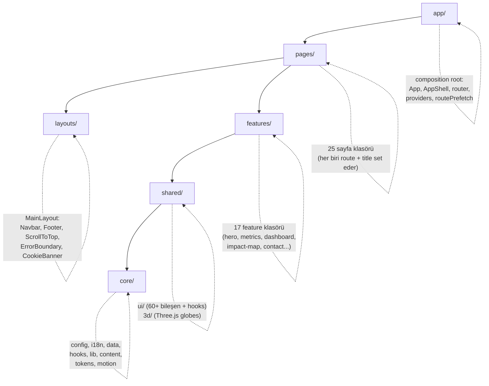
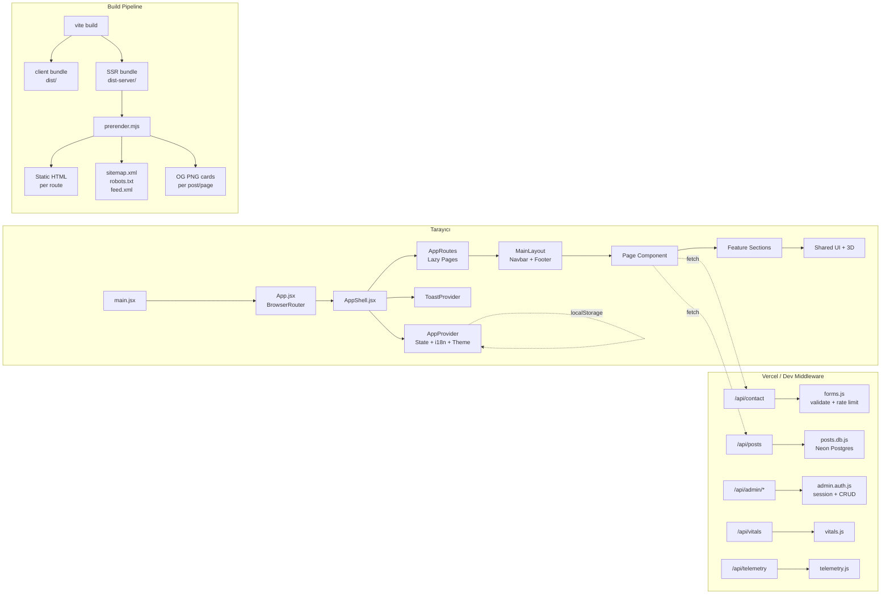
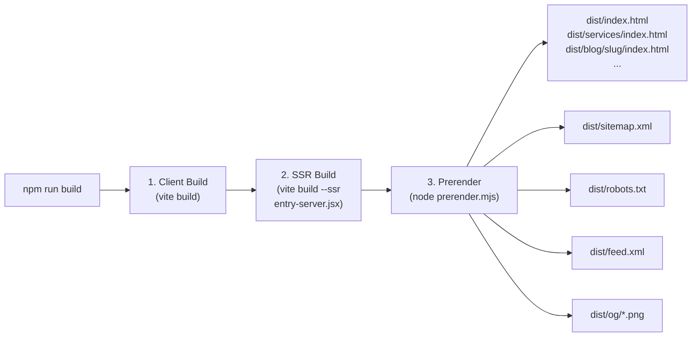

# 01 — Mimari ve Genel Bakış (Architecture Overview)

> Ecozyon Tech'in genel mimarisi, teknoloji yığını, Feature-Sliced Design (FSD)
> katmanları ve build pipeline'ının detaylı açıklaması.

---

## İçindekiler

- [Teknoloji Yığını](#teknoloji-yığını)
- [Proje Amacı](#proje-amacı)
- [Feature-Sliced Design (FSD)](#feature-sliced-design-fsd)
- [Klasör Yapısı](#klasör-yapısı)
- [Veri Akış Diyagramı](#veri-akış-diyagramı)
- [Build Pipeline](#build-pipeline)
- [Entry Points](#entry-points)
- [Chunk Stratejisi](#chunk-stratejisi)
- [İlgili Dokümanlar](#i̇lgili-dokümanlar)

---

## Teknoloji Yığını

| Katman | Teknoloji | Versiyon | Açıklama |
|--------|-----------|----------|----------|
| UI Framework | React | 19.2.6 | Automatic JSX runtime, `prerenderToNodeStream` |
| Build Tool | Vite | 8.0.13 | Dev server + HMR + SSR build |
| CSS | Tailwind CSS | 3.4.19 | `darkMode: 'class'`, token-driven |
| Routing | React Router | 7.15.1 | `BrowserRouter` (client) / `StaticRouter` (SSR) |
| 3D | Three.js | r184 | İki globe: EcoGlobe (dekoratif) + WorldGlobe (veri) |
| Backend | Vercel Serverless | — | `/api/*` fonksiyonları, dev middleware ile lokal çalışır |
| Database | Neon Postgres | — | `@neondatabase/serverless`, DB-optional mimari |
| Test | Vitest + Playwright | 3.2.4 / 1.60 | Unit + e2e + visual regression |
| Lint | ESLint 9 | flat config | React hooks/refresh plugin'leri |
| Telemetry | Web Vitals | 5.2.0 | Cookieless, DNT-aware |
| Fonts | Inter + Space Grotesk | — | Self-hosted woff2 (preloaded) |

## Proje Amacı

Ecozyon Tech, **gerçek bir ürün değildir** — uçtan uca mühendislik kalitesini
sergilemek için inşa edilmiş bir kurumsal **portfolio/demo** sitesidir.
AI + sürdürülebilirlik + giyilebilir teknoloji temalıdır. İki dilli (TR/EN),
statik olarak önceden render edilir (SSG), Vercel üzerinde deploy edilir.

## Feature-Sliced Design (FSD)

Proje, FSD (Feature-Sliced Design) mimari metodolojisini takip eder. Katmanlar
üstten alta doğru:



### Katman Kuralları

1. **app/** — Composition root. Router, providers, entry point'ler burada yaşar. Sadece alt katmanları birleştirir.
2. **pages/** — Her route için bir klasör. Feature section'ları compose eder, `useDocumentMeta` ile `<title>` set eder.
3. **layouts/** — Kalıcı kabuk. Navbar, Footer, ErrorBoundary, ScrollProgress, overlay'ler (CommandPalette, OnboardingTour).
4. **features/** — Bağımsız, kendi kendine yeten UI bölümleri (hero, metrics, dashboard vb.). Birbirine bağımlı değildir.
5. **shared/** — Yeniden kullanılabilir primitivler, hook'lar, Three.js globe bileşenleri. Feature'lardan bağımsız.
6. **core/** — Sıfır UI kodu. Konfigürasyon, i18n, veri modülleri, saf yardımcı kütüphaneler, hook'lar.

## Klasör Yapısı

```
ecozyon-tech/
├── api/                          # Vercel serverless fonksiyonlar
│   ├── _lib/                     # Paylaşılan saf mantık (unit-tested)
│   │   ├── auth/                 # Admin oturum yönetimi
│   │   │   ├── admin.auth.js     # E-posta/şifre login handler'ları
│   │   │   └── session.js        # HMAC-signed httpOnly cookie
│   │   ├── db/                   # Veritabanı katmanı (Neon Postgres)
│   │   │   ├── posts.db.js       # Blog CRUD + listPublished
│   │   │   ├── contacts.db.js    # İletişim formu kayıtları
│   │   │   ├── careers.db.js     # İş başvuruları
│   │   │   ├── newsletter.db.js  # Bülten abonelikleri
│   │   │   └── jobs.db.js        # İş ilanları CRUD
│   │   └── handlers/             # HTTP handler'ları
│   │       ├── forms.js          # contact/newsletter/apply (rate limit + honeypot)
│   │       ├── admin-posts.js    # Admin post CRUD
│   │       ├── admin-contacts.js # Admin iletişim yönetimi
│   │       ├── admin-careers.js  # Admin kariyer yönetimi
│   │       ├── admin-newsletter.js
│   │       ├── social.js         # LinkedIn yayınlama
│   │       ├── telemetry.js      # Event ingestion
│   │       └── vitals.js         # Web Vitals ingestion
│   ├── admin/                    # Admin API route dosyaları
│   │   ├── _send.js              # applyResult + originOf yardımcıları
│   │   ├── login.js, logout.js, me.js, callback.js
│   │   ├── posts.js, posts/      # Dinamik post route'ları
│   │   └── jobs.js, jobs/        # Dinamik job route'ları
│   ├── contact.js                # POST /api/contact
│   ├── newsletter.js             # POST /api/newsletter
│   ├── apply.js                  # POST /api/apply
│   ├── posts.js                  # GET /api/posts
│   ├── vitals.js                 # POST /api/vitals
│   ├── telemetry.js              # POST /api/telemetry
│   └── jobs.js                   # GET /api/jobs
│
├── src/
│   ├── app/                      # Composition root
│   │   ├── App.jsx               # BrowserRouter > AppShell
│   │   ├── AppShell.jsx          # AppProvider > ToastProvider > CustomCursor > AppRoutes
│   │   ├── router.jsx            # Route elements (lazy + Suspense)
│   │   ├── routes.js             # path → lazy import thunk tablosu
│   │   ├── routePrefetch.js      # Hover/focus chunk ısıtma
│   │   └── providers/
│   │       └── AppProvider.jsx   # Paylaşılan state (lang/theme/fonts/accents)
│   │
│   ├── pages/                    # 25 sayfa klasörü
│   │   ├── Home/, Services/, Impact/, About/, Contact/
│   │   ├── Blog/, BlogPost/, BlogTag/
│   │   ├── Careers/, Cases/, CaseStudy/
│   │   ├── Legal/, Pricing/, NotFound/
│   │   ├── Help/, Glossary/, Developers/, Changelog/
│   │   ├── Press/, Search/, Sitemap/, Styleguide/
│   │   ├── Roi/, Assessment/, Accessibility/
│   │   └── Admin/                # Kasıtlı olarak ROUTES dışı
│   │
│   ├── layouts/Main/             # Kalıcı sayfa kabuğu
│   │   ├── index.jsx             # MainLayout (Navbar + Outlet + Footer + overlays)
│   │   ├── Navbar.jsx            # Mega-menu, dil/tema toggle
│   │   ├── Footer.jsx            # Sütunlu footer
│   │   └── CookieBanner.jsx      # KVKK uyumlu çerez bildirimi
│   │
│   ├── features/                 # 17 feature section
│   │   ├── hero/                 # Ana sayfa hero section
│   │   ├── metrics/              # Animasyonlu sayı kartları
│   │   ├── tech-ecosystem/       # Teknoloji stack gösterimi
│   │   ├── use-cases/            # Kullanım senaryoları
│   │   ├── how-it-works/         # Nasıl çalışır adımları
│   │   ├── dashboard/            # Canlı dashboard demo
│   │   ├── impact-map/           # 3D etki haritası
│   │   ├── about/                # Hakkımızda section'ları
│   │   ├── contact/              # İletişim formu
│   │   ├── calculator/           # ROI hesaplayıcı
│   │   ├── faq/                  # SSS accordion
│   │   ├── testimonials/         # Referanslar carousel
│   │   ├── newsletter-block/     # Bülten CTA
│   │   ├── process-timeline/     # Süreç zaman çizelgesi
│   │   ├── home-extras/          # Ana sayfa ek bölümleri
│   │   ├── culture-grid/         # Kültür grid gösterimi
│   │   └── dev-tweaks/           # DEV-only tasarım paneli (ship edilmez)
│   │
│   ├── shared/
│   │   ├── ui/                   # 60+ paylaşılan bileşen + hook
│   │   │   ├── primitives.jsx    # PageHeader, SectionHeader, Tag, vb.
│   │   │   ├── Modal.jsx, Toast.jsx, Tooltip.jsx
│   │   │   ├── CommandPalette.jsx, OnboardingTour.jsx
│   │   │   ├── charts/           # BarChart, PieChart, geometry.js
│   │   │   ├── useInView.js, useReveal.jsx, useFocusTrap.js
│   │   │   └── ... (60+ dosya)
│   │   └── 3d/                   # Three.js globe bileşenleri
│   │       ├── EcoGlobe.jsx      # Dekoratif AI motifli globe (Home)
│   │       ├── WorldGlobe.jsx    # Veri odaklı coğrafi globe
│   │       └── LazyGlobes.jsx    # Lazy Suspense wrapper
│   │
│   ├── core/
│   │   ├── config/site.js        # SITE, ROUTES, NAV_GROUPS, FOOTER_GROUPS
│   │   ├── i18n/                 # Sözlük sistemi
│   │   │   ├── dictionary.js     # import.meta.glob ile otomatik assembly
│   │   │   └── ns/               # 40 namespace dosyası
│   │   ├── data/                 # Veri modülleri (posts, cities, jobs, geo...)
│   │   ├── lib/                  # Saf yardımcı kütüphaneler
│   │   ├── content/registry.js   # İçerik arama kaydı
│   │   ├── hooks/                # useDocumentMeta, useAllPosts, useAllJobs
│   │   ├── tokens.js             # BRAND, SEMANTIC, GRADIENTS
│   │   └── motion.js             # EASING, DURATION, prefersReducedMotion
│   │
│   ├── test/                     # Vitest setup + cross-cutting testler
│   ├── index.css                 # Global stiller, CSS vars, @font-face
│   ├── main.jsx                  # Client entry (hydrate veya render)
│   └── entry-server.jsx          # SSR entry (prerenderToNodeStream)
│
├── scripts/
│   ├── prerender.mjs             # Post-build SSG (HTML + sitemap + OG cards)
│   ├── build-geo.mjs             # Natural Earth → JSON coğrafi veri
│   ├── check-bundle.mjs          # Bundle boyut bütçesi kontrolü
│   └── seed-posts.mjs            # Statik postları DB'ye aktarma
│
├── public/                       # Statik varlıklar
│   ├── sw.js                     # Service worker (hand-rolled)
│   ├── offline.html              # Çevrimdışı fallback
│   ├── manifest.webmanifest      # PWA manifest
│   └── fonts/                    # Self-hosted woff2 fontlar
│
├── e2e/                          # Playwright e2e testleri (7 spec)
├── data-src/                     # Ham coğrafi veri (gitignored)
├── index.html                    # HTML template (SSR placeholder'ları)
├── vite.config.js                # Vite + React + dev API middleware
├── tailwind.config.js            # Token-driven Tailwind config
├── vercel.json                   # CSP, HSTS, cache, rewrite kuralları
├── eslint.config.js              # ESLint 9 flat config
├── playwright.config.js          # E2E test config
├── jsconfig.json                 # @/ → src/ alias
└── package.json                  # Scripts + dependencies
```

## Veri Akış Diyagramı



## Build Pipeline

Build süreci üç aşamalıdır:



1. **Client Build** — Vite, React uygulamasını client tarafı chunk'lara böler. `manualChunks` ile Three.js (`three`) ve React/ReactDOM/Router (`vendor`) ayrı chunk'lara ayrılır.
2. **SSR Build** — `entry-server.jsx` Node.js için derlenir. `prerenderToNodeStream` + `StaticRouter` kullanır.
3. **Prerender** — `scripts/prerender.mjs` her route için statik HTML üretir. Per-route `<title>`, `<meta>`, canonical, hreflang, JSON-LD enjekte eder. OG kartlarını SVG → PNG olarak rasterize eder.

## Entry Points

| Entry | Dosya | Açıklama |
|-------|-------|----------|
| Client | `src/main.jsx` | `hydrateRoot` (prod) veya `createRoot` (dev). Web Vitals + SW kaydı. |
| Server | `src/entry-server.jsx` | `prerenderToNodeStream` → HTML string. Sadece build-time. |
| HTML | `index.html` | Template. `<!--ssr-head-->` ve `<!--ssr-outlet-->` placeholder'ları. |

### Hidrasyon Stratejisi

```javascript
// main.jsx — prerendered HTML varsa hydrate, yoksa render
const root = document.getElementById('root');
if (root.firstElementChild) {
  hydrateRoot(root, tree);  // Production: SSG HTML var
} else {
  createRoot(root).render(tree);  // Dev: boş root
}
```

## Chunk Stratejisi

Vite'ın `manualChunks` yapılandırması:

| Chunk | İçerik | Boyut (gz) |
|-------|--------|------------|
| `entry` | App, AppShell, router, providers, MainLayout | ~38 kB |
| `vendor` | React, ReactDOM, React Router | ayrı chunk |
| `three` | Three.js kütüphanesi | ayrı chunk (lazy) |
| `page-*` | Her lazy-loaded sayfa | ayrı chunk |
| `CommandPalette` | ⌘K palette + content registry | idle-mount lazy chunk |
| `OnboardingTour` | İlk ziyaret turu | idle-mount lazy chunk |

**Budget:** Entry chunk ≤ 48 kB (gz), `scripts/check-bundle.mjs` ile CI'da kontrol edilir.

---

## İlgili Dokümanlar

- [02 — Routing and Pages](./02-routing-and-pages.md)
- [03 — State Management](./03-state-management.md)
- [05 — Design Tokens](./05-design-tokens.md)
- [10 — SEO & Prerender](./10-seo-prerender.md)
- [12 — CI/CD & Deployment](./12-ci-cd-deployment.md)
