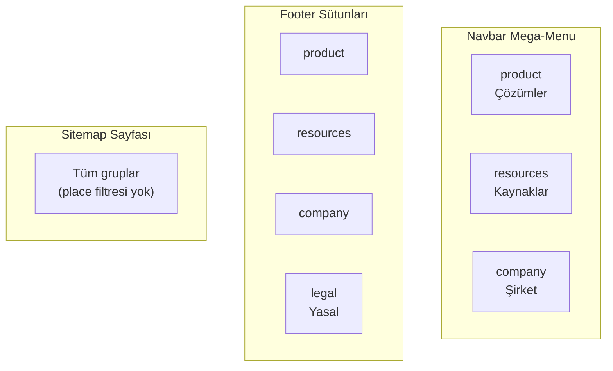
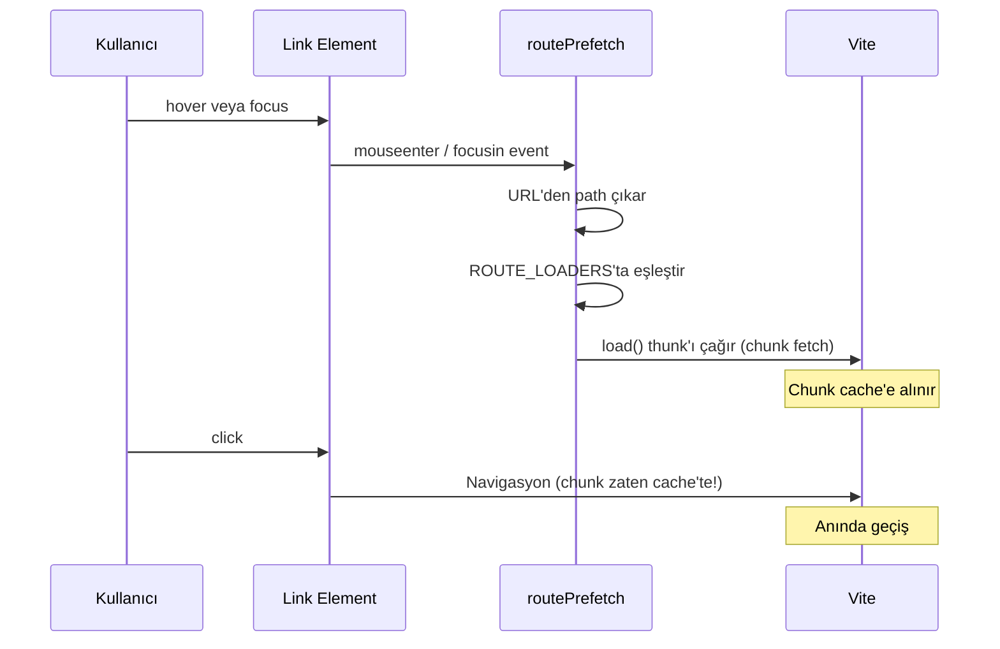

# 02 — Sayfa ve Rota Haritası (Routing & Pages)

> Tüm sayfaların detaylı açıklaması, route tablosu, lazy loading mekanizması,
> prefetch stratejisi ve navigasyon bilgi mimarisi.

---

## İçindekiler

- [Route Mimarisi](#route-mimarisi)
- [Sayfa Tablosu](#sayfa-tablosu)
- [Navigasyon Bilgi Mimarisi (IA)](#navigasyon-bilgi-mimarisi-ia)
- [Lazy Loading ve Suspense](#lazy-loading-ve-suspense)
- [Route Prefetch](#route-prefetch)
- [Sayfa Yapısı Kuralları](#sayfa-yapısı-kuralları)
- [Admin Route](#admin-route)
- [İlgili Dokümanlar](#i̇lgili-dokümanlar)

---

## Route Mimarisi

Route yönetimi iki dosya arasında bölünmüştür:

| Dosya | Sorumluluk |
|-------|-----------|
| `src/app/routes.js` | `path → lazy import` thunk tablosu. Component import'u yok, döngü riski yok. |
| `src/core/config/site.js` | Her route'un meta verisi: title, description, group, place, featured. |

### Ayrım Nedeni

`routes.js` kasıtlı olarak component-free tutulur. Hem `router.jsx` hem
`routePrefetch.js` buradan import yapar — eğer `MainLayout` import edilseydi
döngüsel bağımlılık (circular dependency) oluşurdu.

```
routes.js ←── router.jsx (lazy elements oluşturur)
    ↑
    └──── routePrefetch.js (hover/focus ile chunk ısıtır)
```

## Sayfa Tablosu

### Product Grubu

| Path | Key | Sayfa | Açıklama |
|------|-----|-------|----------|
| `/` | home | Home | Hero + Metrics + EcoGlobe (dekoratif 3D globe) |
| `/services` | services | Services | How It Works · Tech Ecosystem · Use Cases · Dashboard (compact globe) |
| `/impact` | impact | Impact | İnteraktif 3D etki haritası (gerçek coğrafya, WorldGlobe full mode) |
| `/roi` | roi | Roi | Kurumsal ROI hesaplayıcı (çalışan sayısı → tasarruf/emisyon/geri dönüş) |
| `/assessment` | assessment | Assessment | Sürdürülebilirlik olgunluk değerlendirme anketi |

### Resources Grubu

| Path | Key | Sayfa | Açıklama |
|------|-----|-------|----------|
| `/blog` | blog | Blog | Veri odaklı makale listesi (DB + static merge) |
| `/blog/:slug` | — | BlogPost | Bireysel blog yazısı (structured body, related posts) |
| `/blog/tag/:tag` | — | BlogTag | Etiket filtrelenmiş blog listesi |
| `/cases` | cases | Cases | Vaka çalışmaları listesi |
| `/cases/:slug` | — | CaseStudy | Bireysel vaka çalışması detayı |
| `/glossary` | glossary | Glossary | Sürdürülebilirlik terimleri sözlüğü (aranabilir, filtrelenebilir) |
| `/help` | help | Help | SSS / Yardım merkezi (accordion formatında) |
| `/developers` | developers | Developers | API referans dokümantasyonu |
| `/changelog` | changelog | Changelog | Sürüm notları zaman çizelgesi |

### Company Grubu

| Path | Key | Sayfa | Açıklama |
|------|-----|-------|----------|
| `/about` | about | About | Misyon / vizyon / değerler / ekip |
| `/careers` | careers | Careers | Açık pozisyonlar + başvuru modalı |
| `/press` | press | Press | Basın bültenleri + medya varlıkları |
| `/contact` | contact | Contact | Gerçek form → `/api/contact` serverless endpoint |

### Legal / Utility Grubu

| Path | Key | Sayfa | Açıklama |
|------|-----|-------|----------|
| `/legal` | legal | Legal | Gizlilik (KVKK) + Kullanım şartları (`#privacy` / `#terms`) |
| `/accessibility` | accessibility | Accessibility | Erişilebilirlik beyanı (WCAG uyumu) |
| `/sitemap` | sitemap | Sitemap | Tüm sayfaların görsel haritası |
| `/styleguide` | styleguide | Styleguide | Tasarım sistemi vitrine sayfası |
| `/search` | search | Search | Tam sayfa arama (⌘K'nın dedicated versiyonu) |

### Özel Route'lar

| Path | Key | Sayfa | Açıklama |
|------|-----|-------|----------|
| `/admin` | — | Admin | CMS paneli. **ROUTES'ta yok** → prerender edilmez, sitemap'te yok, robots-disallowed. |
| `*` | — | NotFound | Gerçek iki dilli 404 sayfası (popüler sayfa chip'leri ile) |

## Navigasyon Bilgi Mimarisi (IA)

Her route bir `group` ve bir `place` taşır:

```javascript
// src/core/config/site.js
{
  path: '/services',
  key: 'services',
  group: 'product',      // IA bucket
  place: 'nav',          // 'nav' | 'footer' | 'none'
  featured: true,         // NotFound "popüler sayfalar" chip'lerinde gösterilir
  nav: { tr: 'Hizmetler', en: 'Services' },
  title: { tr: '...', en: '...' },
  description: { tr: '...', en: '...' },
}
```

### Gruplar



### Türetme Mekanizması

Navbar, Footer ve Sitemap **tek bir kaynak**tan türetilir:

```javascript
// NAV_GROUPS → Navbar mega-menu
export const NAV_GROUPS = [
  { id: 'product', label: { tr: 'Çözümler', en: 'Solutions' } },
  { id: 'resources', label: { tr: 'Kaynaklar', en: 'Resources' } },
  { id: 'company', label: { tr: 'Şirket', en: 'Company' } },
];

// FOOTER_GROUPS → Footer sütunları (NAV_GROUPS + legal)
export const FOOTER_GROUPS = [
  ...NAV_GROUPS,
  { id: 'legal', label: { tr: 'Yasal', en: 'Legal' } },
];

// routesInGroup(groupId, places?) → belirli gruptaki route'lar
routesInGroup('product', ['nav']);  // Navbar'da görünen product route'ları
routesInGroup('legal');            // Legal grubundaki tüm route'lar (sitemap)

// NAV_ITEMS → featured: true olan route'lar (NotFound chip'leri)
export const NAV_ITEMS = ROUTES.filter((r) => r.featured);
```

### Place Değerleri

| Place | Navbar | Footer | Sitemap |
|-------|--------|--------|---------|
| `nav` | ✅ | ✅ | ✅ |
| `footer` | ❌ | ✅ | ✅ |
| `none` | ❌ | ❌ | ✅ |

## Lazy Loading ve Suspense

Her sayfa `React.lazy()` ile yüklenir:

```javascript
// src/app/routes.js — thunk tablosu
export const ROUTE_LOADERS = [
  { index: true, load: () => import('@/pages/Home') },
  { path: 'services', load: () => import('@/pages/Services') },
  // ...
];

// src/app/router.jsx — lazy element'leri oluşturur
const ROUTE_ELEMENTS = ROUTE_LOADERS.map((r) => ({
  ...r,
  Comp: lazy(r.load),  // modül yükleme anında bir kez oluşturulur
}));
```

### Suspense Fallback

Sayfa chunk'ı yüklenirken yapısal bir iskelet gösterilir:

```jsx
// router.jsx — PageFallback
function PageFallback() {
  return (
    <div className="mx-auto max-w-6xl px-6 py-20 lg:py-28" aria-busy="true">
      {/* Eyebrow + başlık + giriş paragrafı iskeleti */}
      <Skeleton className="h-4 w-24" />
      <Skeleton className="h-10 w-3/4" />
      <Skeleton className="h-4 w-full" />
      {/* 3'lü kart grid iskeleti */}
      <CardSkeleton /> <CardSkeleton /> <CardSkeleton />
    </div>
  );
}
```

## Route Prefetch

`src/app/routePrefetch.js` — dahili linklere hover/focus yapıldığında ilgili
chunk'ı önceden yükler. Navigasyon anında geçiş anında olur.



### Save-Data Awareness

`routePrefetch.js`, `navigator.connection.saveData` kontrolü yapar. Save-Data
aktifse prefetch devre dışı kalır — kullanıcının bant genişliğine saygı gösterilir.

## Sayfa Yapısı Kuralları

1. **Tek `<h1>` kuralı** — Her route sayfası tam olarak bir `<h1>` içermelidir. Bu, `src/test/headers.test.js` tarafından test-enforced'dur.
2. **`useDocumentMeta`** — Her sayfa `document.title`'ı `site.js`'teki tanıma göre set eder.
3. **`t` prop pattern** — Sayfalar `useApp()` ile aldıkları `t` (translation dictionary) prop'unu feature section'lara iletir.
4. **Feature section composition** — Sayfalar doğrudan UI yazmaz, feature section bileşenlerini compose eder.

## Admin Route

`/admin` route'u **kasıtlı olarak** normal route akışının dışındadır:

- `routes.js`'te var (lazy chunk olarak yüklenir)
- `site.js` `ROUTES`'ta **yok** → prerender edilmez
- `sitemap.xml`'de **yok**
- Navbar/Footer'da **yok**
- `robots.txt`'de `Disallow: /admin`
- Kendi lazy chunk'ı ile entry bundle'ı büyütmez

---

## İlgili Dokümanlar

- [01 — Architecture Overview](./01-architecture-overview.md)
- [03 — State Management](./03-state-management.md)
- [10 — SEO & Prerender](./10-seo-prerender.md)
- [14 — Accessibility](./14-accessibility.md)
