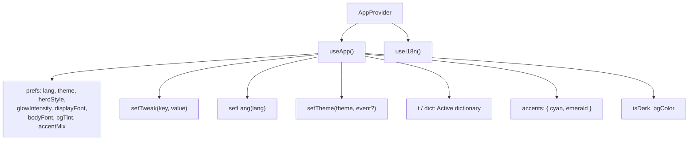
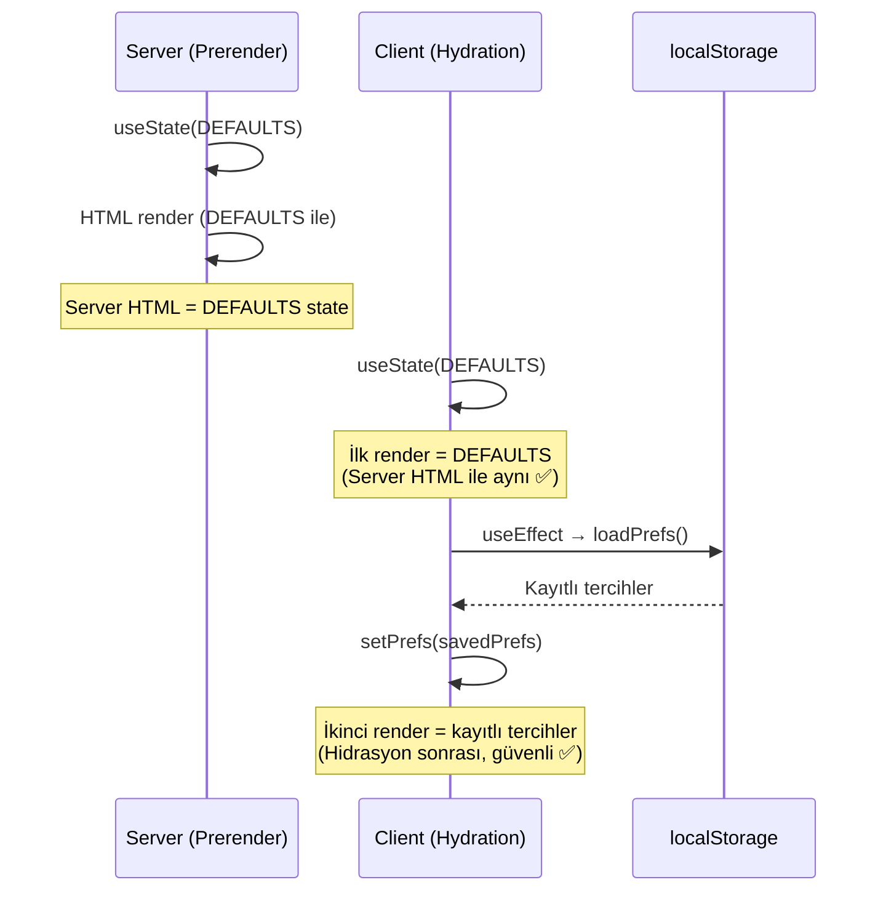
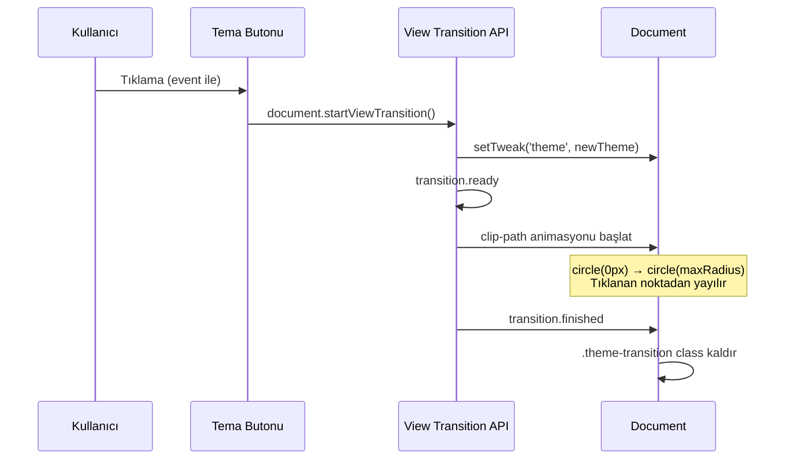

# 03 — State Yönetimi (State Management)

> AppProvider, useApp/useI18n hook'ları, tema geçişi (View Transition API),
> accent palette sistemi, localStorage kalıcılığı ve hidrasyon güvenliği.

---

## İçindekiler

- [Genel Bakış](#genel-bakış)
- [AppProvider](#appprovider)
- [State Yapısı (Prefs)](#state-yapısı-prefs)
- [Hidrasyon Güvenliği](#hidrasyon-güvenliği)
- [Tema Geçişi (View Transition API)](#tema-geçişi-view-transition-api)
- [Accent Palette Sistemi](#accent-palette-sistemi)
- [Background Tint](#background-tint)
- [Font Sistemi](#font-sistemi)
- [i18n Entegrasyonu](#i18n-entegrasyonu)
- [Kalıcılık (Persistence)](#kalıcılık-persistence)
- [Hook'lar](#hooklar)
- [CSS Değişkenleri](#css-değişkenleri)
- [İlgili Dokümanlar](#i̇lgili-dokümanlar)

---

## Genel Bakış

Uygulama state'i **tek bir Context** ile yönetilir — üçüncü parti state
kütüphanesi yoktur. `AppProvider` tüm kullanıcı tercihlerini (dil, tema,
fontlar, accent renkleri, arkaplan tonu) tutar, `localStorage`'a persist eder
ve CSS değişkenlerine yansıtır.



## AppProvider

**Dosya:** `src/app/providers/AppProvider.jsx`

```jsx
export function AppProvider({ children }) {
  const [prefs, setPrefs] = useState(DEFAULTS);
  // ... effects, memoized value
  return <AppContext.Provider value={value}>{children}</AppContext.Provider>;
}
```

### Bileşen Ağacındaki Yeri

```
App.jsx
└── BrowserRouter
    └── AppShell.jsx
        └── AppProvider          ← TÜM state burada
            └── ToastProvider
                └── CustomCursor
                    └── AppRoutes
                        └── MainLayout
                            └── Page → Feature Sections
```

## State Yapısı (Prefs)

```javascript
const DEFAULTS = {
  lang: 'tr',                    // Aktif dil: 'tr' | 'en'
  theme: 'light',               // Tema: 'light' | 'dark'
  heroStyle: 'globe',           // Hero stili (gelecek kullanım)
  glowIntensity: 1,             // Glow efekt yoğunluğu
  displayFont: 'Space Grotesk', // Başlık fontu
  bodyFont: 'Inter',            // Gövde fontu
  bgTint: 'slate',              // Arkaplan tonu
  accentMix: 'cyan-emerald',    // Accent renk paleti
};
```

## Hidrasyon Güvenliği

SSR prerender sırasında server HTML'i ile client'ın ilk render'ı **aynı olmalıdır**.
Bu nedenle `AppProvider` kritik bir strateji izler:



```javascript
useEffect(() => {
  // Post-hydration sync: DEFAULTS ile başla, sonra kayıtlı prefs uygula.
  let next = loadPrefs();
  // ?lang=tr|en query param override
  const q = new URLSearchParams(window.location.search).get('lang');
  if (q === 'tr' || q === 'en') next = { ...next, lang: q };
  // eslint-disable-next-line react-hooks/set-state-in-effect
  if (next !== DEFAULTS) setPrefs(next);
}, []);
```

> **Neden `set-state-in-effect` lint suppress?** Bu kasıtlı bir tek seferlik
> hidrasyon sonrası senkronizasyondur. Effect içinde setState normalde kötü
> pratiktir ama burada server-client uyumu sağlamak için zorunludur.

## Tema Geçişi (View Transition API)

Tema değiştirme, modern tarayıcılarda **View Transition API** ile akıcı bir
clip-path animasyonu çalıştırır:



```javascript
setTheme: (v, e) => {
  // Reduced-motion veya API yoksa düz geçiş
  if (!document.startViewTransition || 
      window.matchMedia('(prefers-reduced-motion: reduce)').matches) {
    setTweak('theme', v);
    return;
  }

  document.documentElement.classList.add('theme-transition');
  const transition = document.startViewTransition(() => setTweak('theme', v));

  transition.ready.then(() => {
    const x = e.clientX || window.innerWidth / 2;
    const y = e.clientY || window.innerHeight / 2;
    const endRadius = Math.hypot(
      Math.max(x, window.innerWidth - x),
      Math.max(y, window.innerHeight - y)
    );
    document.documentElement.animate(
      { clipPath: [`circle(0px at ${x}px ${y}px)`, `circle(${endRadius}px at ${x}px ${y}px)`] },
      { duration: 500, easing: 'ease-in-out', pseudoElement: '::view-transition-new(root)' }
    );
  });
},
```

## Accent Palette Sistemi

Dört önceden tanımlı accent paleti:

| Anahtar | Cyan | Emerald | Görünüm |
|---------|------|---------|---------|
| `cyan-emerald` | `#0EA5E9` | `#10B981` | Marka varsayılanı (okyanus + yeşil) |
| `blue-violet` | `#2563EB` | `#7C3AED` | Kurumsal (mavi + mor) |
| `teal-lime` | `#0D9488` | `#65A30D` | Doğa (teal + lime) |
| `sky-rose` | `#0284C7` | `#E11D48` | Enerjik (gök mavi + gül) |

Accent renkler CSS değişkenlerine (`--ec-cyan`, `--ec-emerald`) yansıtılır ve
gradient'ler, 3D globe'lar, chart'lar ve UI bileşenleri tarafından tüketilir.

## Background Tint

Her tema modu için dört arkaplan tonu:

```javascript
export const BG_TINTS = {
  light: {
    slate: '#F8FAFC',  // Varsayılan: soğuk gri
    mint:  '#F4F7F6',  // Nane
    cream: '#F8F6F2',  // Krem
    sky:   '#F4F8FC',  // Gök
  },
  dark: {
    slate: '#0B1220',  // Varsayılan: derin lacivert
    mint:  '#0B1410',  // Koyu nane
    cream: '#13110D',  // Koyu krem
    sky:   '#0A101C',  // Koyu gök
  },
};
```

## Font Sistemi

İki font ekseni bağımsız olarak ayarlanabilir:

| Eksen | CSS Variable | Seçenekler |
|-------|-------------|------------|
| Display (Başlık) | `--font-display` | Space Grotesk, Syne, Sora, DM Sans |
| Body (Gövde) | `--font-body` | Inter, Plus Jakarta Sans, DM Sans, Manrope |

Font değişikliği `AppProvider`'ın `useEffect`'i ile `<html>` elementine CSS
variable olarak uygulanır. Tailwind'in `fontFamily` tanımları bu variable'ları
tüketir.

## i18n Entegrasyonu

`AppProvider`, aktif dile göre sözlüğü seçer:

```javascript
const lang = prefs.lang;
const dict = ECO_I18N[lang] || ECO_I18N.tr;
```

Sözlük, context value'da hem `dict` hem `t` olarak sunulur (kısayol).
Sayfalar `t` prop'unu feature section'lara iletir:

```jsx
// Bir sayfa bileşeni
function ServicesPage() {
  const { t } = useApp();
  return (
    <>
      <HowItWorks t={t} />
      <TechEcosystem t={t} />
      <UseCases t={t} />
      <Dashboard t={t} />
    </>
  );
}
```

## Kalıcılık (Persistence)

Tercihler `localStorage` key'i `ecozyon.prefs` altında JSON olarak saklanır:

```javascript
const STORAGE_KEY = 'ecozyon.prefs';

// Yazma (setTweak içinde)
window.localStorage.setItem(STORAGE_KEY, JSON.stringify(next));

// Okuma (loadPrefs)
const raw = window.localStorage.getItem(STORAGE_KEY);
return raw ? { ...DEFAULTS, ...JSON.parse(raw) } : DEFAULTS;
```

**Güvenlik:** `try/catch` ile sarılıdır — incognito modda veya storage dolu
olduğunda sessizce devam eder.

## Hook'lar

| Hook | Dönüş | Kullanım |
|------|-------|----------|
| `useApp()` | `{ prefs, setTweak, lang, setLang, theme, setTheme, t, dict, accents, isDark, bgColor }` | Tam state erişimi |
| `useI18n()` | `dict` (aktif dil sözlüğü) | Sadece çeviri gerektiğinde |

```javascript
// useApp — tam erişim
export function useApp() {
  const ctx = useContext(AppContext);
  if (!ctx) throw new Error('useApp must be used within <AppProvider>');
  return ctx;
}

// useI18n — sadece sözlük
export function useI18n() {
  return useApp().dict;
}
```

## CSS Değişkenleri

`AppProvider`'ın `useEffect`'i şu CSS değişkenlerini `<html>` elementine yazar:

| CSS Variable | Kaynak | Tüketici |
|-------------|--------|----------|
| `--bg` | `BG_TINTS[theme][bgTint]` | `MainLayout` background |
| `--font-display` | `prefs.displayFont` | Tailwind `font-display` |
| `--font-body` | `prefs.bodyFont` | Tailwind `font-sans`, `font-body` |
| `--ec-cyan` | `ACCENT_PALETTES[accentMix].cyan` | Gradient'ler, globe, chart |
| `--ec-emerald` | `ACCENT_PALETTES[accentMix].emerald` | Gradient'ler, globe, chart |

Ek olarak `<html>` elementine:
- `class="dark"` toggle (Tailwind dark mode)
- `lang="tr"` veya `lang="en"` attribute

---

## İlgili Dokümanlar

- [01 — Architecture Overview](./01-architecture-overview.md)
- [04 — Internationalization](./04-internationalization.md)
- [05 — Design Tokens](./05-design-tokens.md)
- [06 — UI Components](./06-ui-components.md)
