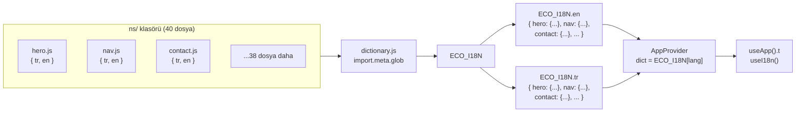

# 04 — Uluslararasılaştırma (Internationalization — i18n)

> İki dilli (TR/EN) sözlük sistemi, namespace mimarisi, `import.meta.glob` ile
> otomatik keşif ve test-enforced key parity.

---

## İçindekiler

- [Genel Bakış](#genel-bakış)
- [Sözlük Mimarisi](#sözlük-mimarisi)
- [Namespace Dosyaları](#namespace-dosyaları)
- [Otomatik Keşif (import.meta.glob)](#otomatik-keşif-importmetaglob)
- [Kullanım Kalıpları](#kullanım-kalıpları)
- [Key Parity Testi](#key-parity-testi)
- [Yeni Namespace Ekleme](#yeni-namespace-ekleme)
- [Hreflang ve Dil Değiştirme](#hreflang-ve-dil-değiştirme)
- [İlgili Dokümanlar](#i̇lgili-dokümanlar)

---

## Genel Bakış

Ecozyon Tech, kendi üretimi (framework'süz) bir i18n sistemi kullanır:

- İki dil desteklenir: **Türkçe (TR)** ve **İngilizce (EN)**
- Çeviriler namespace bazlı dosyalarda yaşar
- `import.meta.glob` ile otomatik keşfedilir (yeni dosya = yeni namespace)
- TR/EN key eşliği (deep nested dahil) test ile zorunlu tutulur
- Üçüncü parti i18n kütüphanesi **yoktur**

## Sözlük Mimarisi



## Namespace Dosyaları

Her namespace dosyası `src/core/i18n/ns/` altında yaşar ve `{ tr, en }` objesi
default export eder:

```javascript
// src/core/i18n/ns/hero.js
export default {
  tr: {
    eyebrow: 'AI + Sürdürülebilirlik + Giyilebilir Teknoloji',
    headline: 'Sürdürülebilir geleceği\nbugünden inşa edin',
    subtext: 'Ecozyon Tech, giyilebilir sensörler ve akıllı AI ile...',
    cta: 'Keşfet',
    ctaSecondary: 'Nasıl Çalışır?',
  },
  en: {
    eyebrow: 'AI + Sustainability + Wearable Technology',
    headline: 'Build a sustainable\nfuture today',
    subtext: 'Ecozyon Tech turns individual and corporate sustainability...',
    cta: 'Explore',
    ctaSecondary: 'How It Works',
  },
};
```

### Tam Namespace Listesi (40 adet)

| Namespace | İçerik | Yaklaşık Anahtar Sayısı |
|-----------|--------|------------------------|
| `a11y` | Erişilebilirlik etiketleri (skip link, back to top) | ~5 |
| `about` | Hakkımızda sayfası (misyon, vizyon, ekip) | ~50+ |
| `accessibility` | Erişilebilirlik beyanı | ~10 |
| `admin` | Admin paneli (login, editor, list) | ~40 |
| `assessment` | Sürdürülebilirlik değerlendirme anketi | ~30 |
| `blog` | Blog listesi ve post sayfası | ~15 |
| `calc` | ROI hesaplayıcı etiketleri | ~15 |
| `careers` | Kariyer sayfası (başvuru, filtre) | ~15 |
| `cases` | Vaka çalışmaları | ~15 |
| `changelog` | Sürüm notları | ~5 |
| `cmd` | Command palette etiketleri (⌘K) | ~10 |
| `compare` | Fiyat karşılaştırma tablosu | ~15 |
| `contact` | İletişim formu (alanlar, hata mesajları) | ~40+ |
| `cookies` | Çerez banner metinleri | ~5 |
| `dash` | Dashboard bölümü etiketleri | ~10 |
| `developers` | API referans sayfası | ~10 |
| `faq` | SSS bölümü | ~15 |
| `footer` | Footer etiketleri | ~10 |
| `glossary` | Sözlük sayfası filtreleri | ~10 |
| `help` | Yardım merkezi | ~10 |
| `hero` | Ana sayfa hero section | ~10 |
| `home` | Ana sayfa ek bölümleri | ~15 |
| `howItWorks` | Nasıl çalışır adımları | ~20 |
| `impactMap` | 3D etki haritası etiketleri | ~25 |
| `integrations` | Entegrasyon sayfası | ~15 |
| `leaderboard` | Liderlik tablosu | ~15 |
| `metrics` | Metrik kartları (sayılar + açıklamalar) | ~20 |
| `nav` | Navigasyon etiketleri | ~5 |
| `press` | Basın odası | ~10 |
| `related` | İlgili içerikler bölümü | ~5 |
| `resources` | Kaynak sayfaları ortak etiketleri | ~20 |
| `roi` | ROI hesaplayıcı sonuçları | ~15 |
| `search` | Arama sayfası etiketleri | ~10 |
| `sitemap` | Site haritası | ~5 |
| `status` | Durum sayfası | ~10 |
| `styleguide` | Tasarım sistemi etiketleri | ~25 |
| `tech` | Teknoloji ekosistemi bölümü | ~30 |
| `testimonials` | Referanslar carousel | ~10 |
| `tour` | Onboarding turu adımları | ~10 |
| `useCases` | Kullanım senaryoları | ~30 |

## Otomatik Keşif (import.meta.glob)

```javascript
// src/core/i18n/dictionary.js
const modules = import.meta.glob('./ns/*.js', { eager: true });

const tr = {};
const en = {};
for (const [path, mod] of Object.entries(modules)) {
  const name = path.slice(path.lastIndexOf('/') + 1, -3);
  tr[name] = mod.default.tr;
  en[name] = mod.default.en;
}

export const ECO_I18N = { tr, en };
```

**Avantaj:** Yeni bir namespace eklemek için sadece `ns/` altına dosya bırakmak
yeterlidir. `dictionary.js` dosyasında hiçbir düzenleme gerekmez.

## Kullanım Kalıpları

### Sayfa Bileşeninde

```jsx
function ServicesPage() {
  const { t } = useApp();
  return (
    <>
      <PageHeader
        eyebrow={t.tech.eyebrow}
        title={t.tech.heading}
        intro={t.tech.intro}
      />
      <HowItWorks t={t} />
    </>
  );
}
```

### Feature Section'da

```jsx
function HowItWorks({ t }) {
  return (
    <section>
      <SectionHeader title={t.howItWorks.title} />
      {t.howItWorks.steps.map((step, i) => (
        <StepCard key={i} title={step.title} desc={step.desc} />
      ))}
    </section>
  );
}
```

### İç İçe (Nested) Anahtarlar

Namespace dosyaları nested objeler içerebilir:

```javascript
// ns/contact.js
export default {
  tr: {
    form: {
      name: { label: 'Ad Soyad', placeholder: 'Adınızı girin', error: 'Gerekli' },
      email: { label: 'E-posta', placeholder: 'ornek@sirket.com', error: 'Geçersiz' },
    },
    success: { title: 'Mesajınız alındı!', body: '24 saat içinde dönüş yapacağız.' },
  },
  en: { /* aynı yapı */ },
};
```

## Key Parity Testi

`src/core/i18n/dictionary.test.js` **deep** key parity zorunlu kılar:

```javascript
// Her TR anahtarı EN'de de olmalı ve tersi.
// Nested key'ler dahil (ör. contact.form.name.label)
```

Bu test, bir dile çeviri eklenip diğerine eklenmesinin unutulmasını engeller.
CI pipeline'da çalışır — eksik key varsa build kırılır.

## Yeni Namespace Ekleme

1. `src/core/i18n/ns/` altına yeni bir dosya oluştur (ör. `myFeature.js`)
2. `{ tr, en }` objesi default export et
3. **Otomatik:** `dictionary.js` glob ile yeni dosyayı bulur
4. **Otomatik:** `dictionary.test.js` key parity'yi doğrular
5. Bileşende `t.myFeature.someKey` ile kullan

**Ekleme adımında düzenlenmesi gereken dosya: SIFIR.**

## Hreflang ve Dil Değiştirme

### URL-based Dil Override

`?lang=en` query parametresi, kaydedilmiş dili geçersiz kılar:

```javascript
// AppProvider useEffect (hidrasyon sonrası)
const q = new URLSearchParams(window.location.search).get('lang');
if (q === 'tr' || q === 'en') next = { ...next, lang: q };
```

### Hreflang Etiketleri

Prerender, her route için TR/EN/x-default hreflang etiketleri yazar:

```html
<link rel="alternate" hreflang="tr" href="https://ecozyon.tech/services" />
<link rel="alternate" hreflang="en" href="https://ecozyon.tech/services?lang=en" />
<link rel="alternate" hreflang="x-default" href="https://ecozyon.tech/services" />
```

Aynı yapı `sitemap.xml`'de de tekrarlanır.

---

## İlgili Dokümanlar

- [03 — State Management](./03-state-management.md)
- [10 — SEO & Prerender](./10-seo-prerender.md)
- [11 — Testing Strategy](./11-testing-strategy.md)
