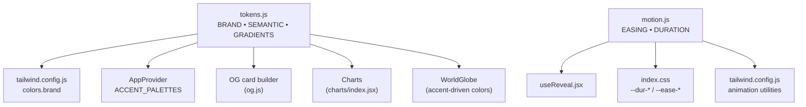

# 05 — Design Token Sistemi (Design Tokens)

> Renk, tipografi, motion, gradient token'ları ve CSS değişkenleriyle
> entegrasyonunun detaylı açıklaması.

---

## İçindekiler

- [Genel Bakış](#genel-bakış)
- [Renk Token'ları (tokens.js)](#renk-tokenları-tokensjs)
- [Motion Token'ları (motion.js)](#motion-tokenları-motionjs)
- [CSS Custom Properties](#css-custom-properties)
- [Tailwind Entegrasyonu](#tailwind-entegrasyonu)
- [Gradient Sistemi](#gradient-sistemi)
- [Token Akışı](#token-akışı)
- [İlgili Dokümanlar](#i̇lgili-dokümanlar)

---

## Genel Bakış

Ecozyon Tech, tasarım değerlerini **tek bir kaynaktan** (single source of truth)
yönetir. Token'lar JS modülleri olarak tanımlanır ve hem Tailwind hem CSS
custom properties hem de runtime JS (globe, chart, OG card) tarafından tüketilir.



## Renk Token'ları (tokens.js)

**Dosya:** `src/core/tokens.js`

### BRAND — Marka Accent Renkleri

```javascript
export const BRAND = {
  cyan:    '#0EA5E9',  // Ana marka accent (okyanus mavisi)
  emerald: '#10B981',  // İkincil marka accent (yeşil)
};
```

Bu iki renk tüm marka görselliğinin temelidir. Gradient'ler, globe renkleri,
chart vurguları ve OG card arka planları buradan türetilir.

### SEMANTIC — Sabit Anlamsal Renkler

```javascript
export const SEMANTIC = {
  amber:    '#F59E0B',  // Uyarı / sarı vurgu
  rose:     '#E11D48',  // Hata / kırmızı vurgu
  violet:   '#7C3AED',  // Mor vurgu
  slate900: '#0F172A',  // Koyu metin
  slate400: '#94A3B8',  // Soluk metin
};
```

Semantic renkler accent değişikliklerinden **bağımsızdır** — accent palette
değiştirildiğinde bile bu renkler sabit kalır.

### GRADIENTS — Kanonik Gradient'ler

```javascript
export const GRADIENTS = {
  // Başlık text gradient (.eco-gradient-text CSS utility)
  brand: `linear-gradient(110deg, ${BRAND.cyan} 0%, ${BRAND.emerald} 100%)`,
  // CTA buton dolgusu (farklı açı)
  cta:   `linear-gradient(120deg, ${BRAND.cyan} 0%, ${BRAND.emerald} 100%)`,
  // Panel arkaplanı (düşük opaklık)
  panel: 'linear-gradient(120deg, rgba(14,165,233,.08), rgba(16,185,129,.08))',
};
```

> **Kural:** Inline `linear-gradient()` kullanmak yasaktır — her zaman
> `GRADIENTS.cta`, `GRADIENTS.panel` veya `.eco-gradient-text` kullanılmalıdır.

## Motion Token'ları (motion.js)

**Dosya:** `src/core/motion.js`

### EASING — Hareket Eğrileri

```javascript
export const EASING = {
  out:   'cubic-bezier(.16, 1, .3, 1)',   // Yavaşlayan — reveal / enter
  inOut: 'cubic-bezier(.65, 0, .35, 1)',  // Simetrik — move / toggle
};
```

### DURATION — Süre Token'ları

```javascript
export const DURATION = {
  fast:   180,  // Hızlı UI geçişleri (ms)
  base:   280,  // Standart geçişler
  slow:   480,  // Yavaş geçişler
  reveal: 700,  // Scroll-in reveal animasyonları
};
```

### prefersReducedMotion()

SSR-güvenli, tek seferlik azaltılmış hareket kontrolü:

```javascript
export function prefersReducedMotion() {
  if (typeof window === 'undefined' || !window.matchMedia) return false;
  return window.matchMedia('(prefers-reduced-motion: reduce)')?.matches ?? false;
}
```

OS ayarı değişikliklerine reaktif bir alternatif: `useReducedMotion()` hook'u
(`src/shared/ui/useReducedMotion.js`).

## CSS Custom Properties

Token'lar `src/index.css` `:root`'ta CSS custom properties olarak yansıtılır:

```css
:root {
  --dur-fast: 180ms;
  --dur-base: 280ms;
  --dur-slow: 480ms;
  --dur-reveal: 700ms;
  --ease-out: cubic-bezier(.16, 1, .3, 1);
  --ease-in-out: cubic-bezier(.65, 0, .35, 1);
}
```

**Runtime'da `AppProvider` tarafından yazılan ek CSS variables:**

| Variable | Kaynak | Açıklama |
|----------|--------|----------|
| `--bg` | `BG_TINTS[theme][bgTint]` | Sayfa arkaplan rengi |
| `--font-display` | `prefs.displayFont` | Başlık font ailesi |
| `--font-body` | `prefs.bodyFont` | Gövde font ailesi |
| `--ec-cyan` | `ACCENT_PALETTES[mix].cyan` | Aktif accent cyan |
| `--ec-emerald` | `ACCENT_PALETTES[mix].emerald` | Aktif accent emerald |

## Tailwind Entegrasyonu

`tailwind.config.js` token'ları doğrudan import eder:

```javascript
import { BRAND } from './src/core/tokens.js';

export default {
  theme: {
    extend: {
      colors: {
        brand: { cyan: BRAND.cyan, emerald: BRAND.emerald },
        background: 'var(--background)',
        foreground: 'var(--foreground)',
      },
      fontFamily: {
        sans:    ['var(--font-body)', 'Inter', ...],
        display: ['var(--font-display)', '"Space Grotesk"', ...],
      },
      animation: {
        enter:       'fadeUp var(--dur-base) var(--ease-out) both',
        'enter-fast': 'fadeUp var(--dur-fast) var(--ease-out) both',
        drawCheck:   'drawCheck 420ms var(--ease-out) forwards',
        leave:       'leave var(--dur-fast) var(--ease-out) both',
        countdown:   'countdown 4s linear forwards',
      },
    },
  },
};
```

### Keyframe'ler

| Keyframe | Kullanım |
|----------|----------|
| `fadeUp` | Genel giriş animasyonu (8px yukarı + fade) |
| `float` | Yüzen element efekti (6s cycle) |
| `marquee` | Yatay kayan metin (42s) |
| `shake` | Form hata titreşimi (320ms) |
| `drawCheck` | Başarı onay çizimi (stroke-dashoffset) |
| `leave` | Toast çıkış (sağa kayar + solma) |
| `countdown` | Toast auto-dismiss ilerleme çubuğu |

## Gradient Sistemi

### .eco-gradient-text

CSS utility, accent-var odaklı başlık gradient'i:

```css
.eco-gradient-text {
  background: linear-gradient(110deg, var(--ec-cyan) 0%, var(--ec-emerald) 100%);
  -webkit-background-clip: text;
  -webkit-text-fill-color: transparent;
  background-clip: text;
}
```

Accent palette değiştiğinde gradient de otomatik güncellenir (CSS var'lar üzerinden).

## Token Akışı

```mermaid
flowchart TD
    A["tokens.js<br/>BRAND.cyan = #0EA5E9"] -->|import| B["tailwind.config.js<br/>colors.brand.cyan"]
    A -->|import| C["AppProvider<br/>ACCENT_PALETTES"]
    C -->|CSS var| D["--ec-cyan"]
    D -->|var()| E[".eco-gradient-text"]
    D -->|var()| F["Tailwind utilities"]
    D -->|getComputedStyle| G["WorldGlobe<br/>accent renkleri"]
    A -->|import| H["og.js<br/>OG card arka plan"]

    I["motion.js<br/>DURATION.base = 280"] -->|literal| J["index.css<br/>--dur-base: 280ms"]
    I -->|import| K["useReveal.jsx<br/>IntersectionObserver"]
    J -->|var()| L["Tailwind animate-enter"]
```

---

## İlgili Dokümanlar

- [03 — State Management](./03-state-management.md)
- [06 — UI Components](./06-ui-components.md)
- [07 — 3D Globe Engine](./07-3d-globe-engine.md)
