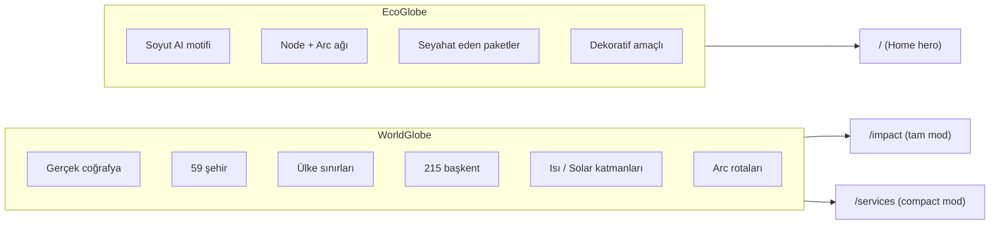
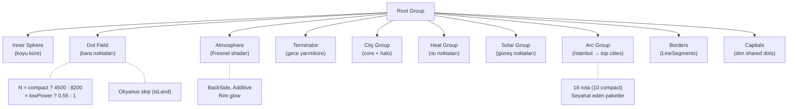
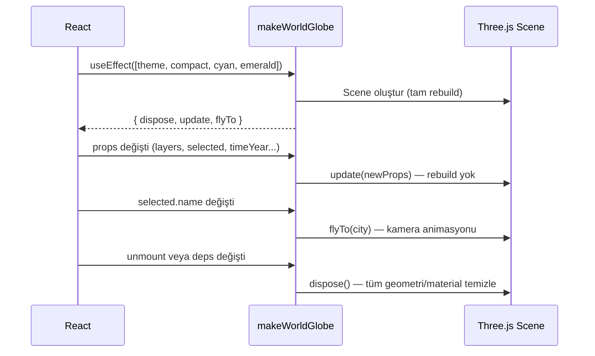
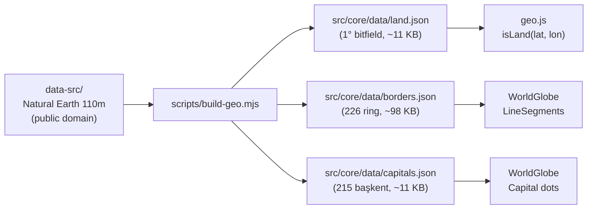

# 07 — 3D Globe Engine

> Three.js tabanlı iki ayrı globe bileşeni: EcoGlobe (dekoratif) ve WorldGlobe
> (veri odaklı). Scene graph, performans optimizasyonları, coğrafi veri pipeline.

---

## İçindekiler

- [Genel Bakış](#genel-bakış)
- [İki Globe Ayrımı](#i̇ki-globe-ayrımı)
- [WorldGlobe](#worldglobe)
  - [Props Sözleşmesi](#props-sözleşmesi)
  - [Scene Graph](#scene-graph)
  - [Yaşam Döngüsü](#yaşam-döngüsü)
  - [İki Kullanım Modu](#i̇ki-kullanım-modu)
- [EcoGlobe](#ecoglobe)
- [Lazy Loading (LazyGlobes)](#lazy-loading-lazyglobes)
- [Performans Optimizasyonları](#performans-optimizasyonları)
- [Coğrafi Veri Pipeline](#coğrafi-veri-pipeline)
- [Erişilebilirlik](#erişilebilirlik)
- [Invariant'lar](#invariantlar)
- [İlgili Dokümanlar](#i̇lgili-dokümanlar)

---

## Genel Bakış

3D katman tamamen Three.js ile imperatif olarak yazılmıştır. React bileşeni
wrapper görevi görür, asıl render Three.js scene'inde gerçekleşir.

**Dosyalar:**

| Dosya | Boyut | Açıklama |
|-------|-------|----------|
| `src/shared/3d/WorldGlobe.jsx` | ~34 KB | Coğrafi veri globe'u |
| `src/shared/3d/EcoGlobe.jsx` | ~8.4 KB | Dekoratif AI motifli globe |
| `src/shared/3d/LazyGlobes.jsx` | ~1 KB | Lazy Suspense wrapper |

## İki Globe Ayrımı



> **ÖNEMLİ:** İki globe kasıtlı olarak ayrı tutulur. Ortak kod paylaşmazlar.
> WorldGlobe üzerinde çalışırken EcoGlobe'a dokunulmamalıdır ve tersi.

## WorldGlobe

### Props Sözleşmesi

```javascript
// WorldGlobe bileşeninin kabul ettiği prop'lar:
{
  // Görünür katmanlar
  layers: {
    active: true,      // Aktif şehir noktaları
    partners: true,    // Partner şehir noktaları
    arcs: true,        // HQ → şehir arc hatları
    heat: false,       // Isı haritası katmanı
    solar: false,      // Solar enerji katmanı
    borders: true,     // Ülke sınırları
    capitals: true,    // 215 başkent noktaları
  },

  // Etkileşim callback'leri
  onHover: (city, screenPos) => {},  // Şehir üzerine gelme
  onSelect: (city) => {},            // Şehir seçme

  // Durum
  selected: cityObject,              // Seçili şehir (flyTo tetikler)
  timeYear: 2025,                    // Zaman kayma çubuğu (2024-2026)
  showTerminator: false,             // Gece/gündüz sınırı

  // Görünüm
  compact: false,                    // true = dashboard mini-globe
  theme: 'light',                    // 'light' | 'dark'
  cyan: '#0EA5E9',                   // Accent renk A
  emerald: '#10B981',                // Accent renk B
}
```

### Scene Graph



### Dot Field (Kara Noktaları)

Globe yüzeyindeki nokta alanı gerçek coğrafyayı yansıtır:

- `land.json` 1° çözünürlüklü bitfield → `isLand(lat, lon)` O(1) kontrolü
- Okyanus noktaları atlanır → sadece kara üzerinde nokta
- Renk rampası: `accentA → accentB` (cyan → emerald gradient)
- `lowPower` modda %55 daha az nokta

### Fresnel Atmosphere

```javascript
// Fresnel ShaderMaterial — kenar parlama efekti
// BackSide render + Additive blending
const atmosphereMaterial = new THREE.ShaderMaterial({
  uniforms: { color: { value: new THREE.Color(accentA) } },
  vertexShader: /* fresnel vertex */,
  fragmentShader: /* fresnel fragment */,
  side: THREE.BackSide,
  blending: THREE.AdditiveBlending,
  transparent: true,
});
```

### Yaşam Döngüsü



**Rebuild tetikleyiciler** (effect deps): `theme`, `compact`, `cyan`, `emerald` — bu değişiklikler nadir olduğu için tam rebuild kabul edilebilir.

**Hafif güncelleme** (`update()`): `layers`, `selected`, `timeYear`, `showTerminator` — rebuild olmadan güncellenir.

### İki Kullanım Modu

| Özellik | `/impact` (ImpactMap) | `/services` (Dashboard) |
|---------|----------------------|------------------------|
| `compact` | `false` | `true` |
| Katmanlar | Tümü | `active`, `partners`, `arcs` |
| `onHover` | ✅ (tooltip gösterir) | ❌ |
| `onSelect` | ✅ (flyTo + side panel) | ❌ |
| Zoom (wheel) | ✅ | ❌ (scroll hijack engeli) |
| Arc sayısı | 16 | 10 |
| Nokta sayısı | 8200 | 4500 |
| Accent renkleri | Props'tan | Varsayılan |

## EcoGlobe

**Dosya:** `src/shared/3d/EcoGlobe.jsx` — Sadece Home sayfasında kullanılır.

Soyut, dekoratif bir AI motifi globe'u:
- Node + arc ağı (veri noktaları yok)
- Seyahat eden paketler (arc üzerinde hareket eden noktalar)
- WorldGlobe ile **ortak kod paylaşmaz**
- Aynı performans hijyenini paylaşır:
  - IntersectionObserver ile offscreen pause
  - `visibilitychange` ile tab-hidden pause
  - `prefers-reduced-motion` handling
  - Tam `dispose()` cleanup

> **Kural:** EcoGlobe bağımsızdır. WorldGlobe çalışması sırasında dokunulmamalıdır.

## Lazy Loading (LazyGlobes)

Globe'lar Three.js'i kendi lazy chunk'larına çeker:

```jsx
// src/shared/3d/LazyGlobes.jsx
import { lazy, Suspense } from 'react';

export const LazyWorldGlobe = lazy(() => import('./WorldGlobe'));
export const LazyEcoGlobe = lazy(() => import('./EcoGlobe'));

export function GlobeFallback() {
  return <div className="globe-placeholder" aria-busy="true" />;
}
```

Three.js chunk boyutu: **~47 KB gzip** (kod + coğrafi veri dahil).

## Performans Optimizasyonları

### E1 — Offscreen/Tab Pause

```javascript
// IntersectionObserver — görünüm dışında rAF durur
const io = new IntersectionObserver(([entry]) => {
  if (entry.isIntersecting) resume();
  else pause();
});
io.observe(container);

// visibilitychange — sekme arka planda rAF durur
document.addEventListener('visibilitychange', () => {
  document.hidden ? pause() : resume();
});
```

### E1 — Reduced Motion

```javascript
const reduceMotion = prefersReducedMotion();
// reduceMotion === true ise:
// - Auto-rotate hızı = 0
// - Pulse animasyonları = 0
// - Arc seyahat hızı = 0
// - Terminator rotasyonu = 0
```

### E1 — Low Power Tier

```javascript
const lowPower = (navigator.deviceMemory ?? 8) <= 4 || Math.min(w, h) < 420;
// lowPower === true ise:
// - Nokta sayısı × 0.55
// - pixelRatio cap = 1.5
// - Antialiasing kapalı
```

### E1 — Tam Dispose

```javascript
dispose() {
  // Scene traversal — tüm geometri + material free
  scene.traverse((obj) => {
    obj.geometry?.dispose();
    if (obj.material) {
      (Array.isArray(obj.material) ? obj.material : [obj.material])
        .forEach((m) => m.dispose());
    }
  });
  renderer.dispose();
  // IO + visibility listener'ları detach
}
```

## Coğrafi Veri Pipeline



### Veri Dosyaları

| Dosya | Açıklama | Boyut |
|-------|----------|-------|
| `land.json` | 1° çözünürlüklü packed bitfield. `isLand()` O(1) lookup. | ~11 KB |
| `borders.json` | 226 ülke sınır halkası, 0.2° quantized. | ~98 KB |
| `capitals.json` | 215 Admin-0 başkent (isim + koordinat). | ~11 KB |

### Yeniden Üretim

```bash
npm run build:geo  # data-src/ → src/core/data/*.json
# Ardından üç JSON dosyasını commit edin.
```

- `data-src/` gitignored'dur (ham veri)
- `topojson-client` sadece build-time bağımlılığıdır
- Çıktılar **committed** dosyalardır (CI build zincirinde değildir)

## Erişilebilirlik

### Keyboard Navigation

```javascript
// container tabIndex=0, role="application"
container.setAttribute('tabindex', '0');
container.setAttribute('role', 'application');
container.setAttribute('aria-label', 'Interactive 3D globe');

// Keyboard controls:
// ← → : Yatay rotasyon
// ↑ ↓ : Dikey rotasyon
// + - : Zoom in/out
```

### Hover vs Select

- **Hover:** Mouse raycaster ile şehir tespiti → HoverCard tooltip
- **Başkentler:** Hover edilebilir ama **seçilemez** — ürün şehirleri öncelikli
- **Select:** Tıklama → `flyTo()` animasyonu + side panel

## Invariant'lar

Gelecekteki 3D çalışmaları için korunması gereken kurallar:

1. `/services` compact modu hafif ve scroll-güvenli kalmalıdır
2. `/impact` davranışı bozulmamalıdır
3. Yeni görsel/etkileşim özellikleri opt-gated veya davranış koruyucu olmalıdır
4. Prerender ve testler için deterministik kalmalıdır
5. EcoGlobe ve WorldGlobe bağımsız kalmalıdır

---

## İlgili Dokümanlar

- [01 — Architecture Overview](./01-architecture-overview.md)
- [05 — Design Tokens](./05-design-tokens.md)
- [14 — Accessibility](./14-accessibility.md)
