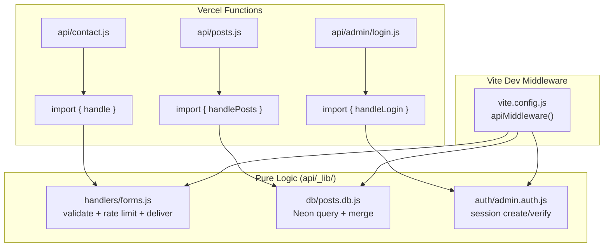
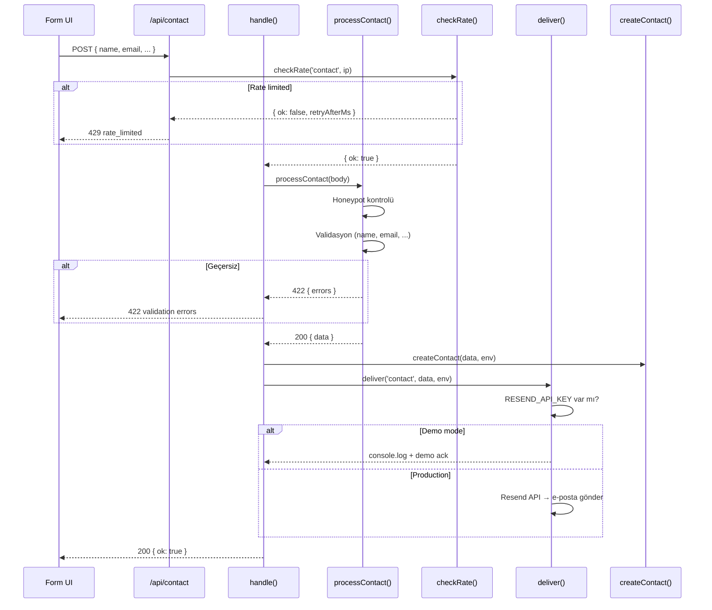

# 08 — Backend API ve Serverless Fonksiyonlar

> Vercel serverless fonksiyonları, Vite dev middleware, handler mimarisi,
> rate limiting, honeypot spam koruması ve demo-mode fallback.

---

## İçindekiler

- [Genel Bakış](#genel-bakış)
- [Endpoint Haritası](#endpoint-haritası)
- [Handler Mimarisi](#handler-mimarisi)
- [Dev Middleware (Vite)](#dev-middleware-vite)
- [Form İşleme](#form-i̇şleme)
- [Rate Limiting](#rate-limiting)
- [Honeypot Spam Koruması](#honeypot-spam-koruması)
- [E-posta Teslimi (Resend)](#e-posta-teslimi-resend)
- [Telemetry ve Web Vitals](#telemetry-ve-web-vitals)
- [Admin API](#admin-api)
- [Ortam Değişkenleri](#ortam-değişkenleri)
- [İlgili Dokümanlar](#i̇lgili-dokümanlar)

---

## Genel Bakış

Backend, **saf mantık** (pure logic) olarak yazılmıştır — framework'a bağımlı
değildir. Aynı handler fonksiyonları hem Vercel serverless adaptörleri hem Vite
dev middleware tarafından çağrılır. Bu sayede:

- Dev ortamda Vercel CLI gerekmez
- Handler'lar doğrudan unit test edilebilir
- Vercel ↔ lokal davranış %100 aynıdır

## Endpoint Haritası

### Public Endpoints

| Method | Path | Handler | Açıklama |
|--------|------|---------|----------|
| POST | `/api/contact` | `handle('contact', ...)` | İletişim formu |
| POST | `/api/newsletter` | `handle('newsletter', ...)` | Bülten aboneliği |
| POST | `/api/apply` | `handle('apply', ...)` | İş başvurusu |
| GET | `/api/posts` | `handlePosts(...)` | Blog yazıları (DB + static) |
| GET | `/api/jobs` | `handleJobs(...)` | İş ilanları |
| POST | `/api/vitals` | `handleVitals(...)` | Web Vitals ingestion |
| POST | `/api/telemetry` | `handleEvent(...)` | Telemetry event ingestion |

### Admin Endpoints

| Method | Path | Handler | Açıklama |
|--------|------|---------|----------|
| POST | `/api/admin/login` | `handleLogin(...)` | E-posta/şifre ile giriş |
| GET | `/api/admin/me` | `handleMe(...)` | Oturum kontrolü |
| POST | `/api/admin/logout` | `handleLogout()` | Çıkış |
| GET/POST | `/api/admin/posts` | `handleAdminPosts(...)` | Post listele / oluştur |
| GET/PUT/DELETE | `/api/admin/posts/:slug` | `handleAdminPost(...)` | Post oku / güncelle / sil |
| GET | `/api/admin/contacts` | `handleAdminContacts(...)` | İletişim kayıtları listesi |
| DELETE | `/api/admin/contacts/:id` | `handleAdminContacts(...)` | İletişim kaydı sil |
| GET | `/api/admin/careers` | `handleAdminCareers(...)` | Başvuru listesi |
| DELETE | `/api/admin/careers/:id` | `handleAdminCareers(...)` | Başvuru sil |
| GET | `/api/admin/newsletter` | `handleAdminNewsletter(...)` | Abone listesi |
| DELETE | `/api/admin/newsletter/:id` | `handleAdminNewsletter(...)` | Abone sil |

## Handler Mimarisi



Her Vercel function dosyası minimal bir adaptördür:

```javascript
// api/contact.js (Vercel function)
import { handle } from './_lib/handlers/forms.js';

export default async function handler(req, res) {
  // ... body parse, IP extract
  const result = await handle('contact', req.method, body, process.env, ip);
  res.status(result.status).json(result.body);
}
```

## Dev Middleware (Vite)

`vite.config.js`'teki `apiMiddleware` fonksiyonu, Vercel function'larının aynı
mantığını lokal olarak çalıştırır:

```javascript
function apiMiddleware(req, res, next) {
  const route = req.url?.split('?')[0];

  // Admin route'ları (redirect + cookie yönetimi)
  if (route?.startsWith('/api/admin/')) {
    // ... body parse → handleLogin/handleMe/handleLogout/...
    applyResult(res, result);
    return;
  }

  // Public form route'ları
  const KINDS = {
    '/api/contact': 'contact',
    '/api/newsletter': 'newsletter',
    '/api/apply': 'apply'
  };
  // ... → handle(kind, method, body, env, ip)
}
```

**İki yerde mount edilir:**
- `configureServer` — dev server
- `configurePreviewServer` — preview server (e2e testlerin çalıştığı ortam)

## Form İşleme

### Akış



### Validasyon

```javascript
// processContact — alan validasyonu
const name = clamp(input.name, 80);      // Max 80 char
const company = clamp(input.company, 120); // Max 120 char
const email = clamp(input.email, 160);     // Max 160 char
const message = clamp(input.message, 2000); // Max 2000 char

if (name.length < 2) errors.name = 'required';
if (company.length < 1) errors.company = 'required';
if (!EMAIL_RE.test(email)) errors.email = 'invalid';
```

## Rate Limiting

Per-IP sliding window rate limiter:

```javascript
const WINDOWS = {
  contact:    { ms: 60_000, max: 5 },   // 60 saniyede max 5
  newsletter: { ms: 60_000, max: 3 },   // 60 saniyede max 3
  apply:      { ms: 60_000, max: 3 },   // 60 saniyede max 3
};
```

- Module-scoped `Map` kullanır (serverless instance ömrü boyunca yaşar)
- Her 1000 kontrolde expired key'ler temizlenir (memory leak önlemi)
- IP `x-forwarded-for` header'ından alınır
- Vercel'de birden fazla instance döndüğü için %100 garanti değildir
  (best-effort, trafi flood'u engeller)

## Honeypot Spam Koruması

Görünmez `company_website` alanı — CSS ile gizlidir, gerçek kullanıcılar
doldurmaz ama bot'lar doldurur:

```javascript
if (input.company_website) return json(200, { ok: true }); // Sessiz ack
```

Bot'a başarı yanıtı döndürülür, gerçek işlem yapılmaz. Bot fark etmez.

## E-posta Teslimi (Resend)

```javascript
export async function deliver(kind, data, env) {
  // Demo mode: secret yoksa sadece log + ack
  if (!env.RESEND_API_KEY || !env.CONTACT_TO) {
    console.log(`[forms:${kind}] demo-mode, payload:`, data);
    return { delivered: false, demo: true };
  }

  // Production: Resend API ile e-posta gönder
  const res = await fetch('https://api.resend.com/emails', {
    method: 'POST',
    headers: { Authorization: `Bearer ${env.RESEND_API_KEY}` },
    body: JSON.stringify({
      from: env.CONTACT_FROM || 'Ecozyon Site <onboarding@resend.dev>',
      to: env.CONTACT_TO,
      subject: `[Ecozyon] ${kind} — ${data.email}`,
      text: JSON.stringify(data, null, 2),
    }),
  });
  return { delivered: res.ok, demo: false };
}
```

## Telemetry ve Web Vitals

### Web Vitals (`/api/vitals`)

`web-vitals` kütüphanesi CLS, FCP, FID, LCP, TTFB metriklerini toplar.
Beacon olarak `/api/vitals`'a gönderilir.

- `VITALS_WEBHOOK_URL` set ise → webhook'a forward
- Set değilse → demo ack

### Telemetry (`/api/telemetry`)

Cookieless, DNT/GPC-aware event takibi:

```javascript
// src/core/lib/telemetry.js
track('page_view', { path: '/services' });
track('cta_click', { label: 'hero_explore' });
```

- `navigator.doNotTrack === '1'` ise → gönderilmez
- `navigator.globalPrivacyControl === true` ise → gönderilmez
- İsim kasıtlı olarak "telemetry" — content blocker'lar "analytics" içeren URL'leri engeller

### Dev HUD'lar

- `VitalsHud` — Dev modda Web Vitals overlay
- `EventsHud` — Dev modda event stream overlay

## Admin API

Admin endpoint'leri `requireAdmin` middleware ile korunur:

```javascript
// Session kontrolü → HMAC-signed httpOnly cookie
const session = readSession(cookieHeader, env);
if (!session) return json(401, { ok: false });
```

Detaylı admin auth ve CMS sistemi → [09 — Database & CMS](./09-database-cms.md)

## Ortam Değişkenleri

Tüm değişkenler **opsiyoneldir** — hiçbiri olmadan site demo modunda çalışır:

| Variable | Açıklama | Yoksa |
|----------|----------|-------|
| `DATABASE_URL` | Neon Postgres connection string | Static fallback |
| `RESEND_API_KEY` | Resend e-posta API key | Demo ack (log only) |
| `CONTACT_TO` | E-posta alıcısı | Demo ack |
| `CONTACT_FROM` | E-posta göndericisi | Varsayılan Resend |
| `VITALS_WEBHOOK_URL` | Vitals webhook URL | Demo ack |
| `SESSION_SECRET` | HMAC session key | Fallback secret |
| `DEPLOY_HOOK_URL` | Vercel deploy hook | Yeniden build tetiklenmez |
| `LINKEDIN_ACCESS_TOKEN` | LinkedIn UGC Posts API | Demo ack |
| `LINKEDIN_AUTHOR_URN` | LinkedIn author URN | Demo ack |

---

## İlgili Dokümanlar

- [09 — Database & CMS](./09-database-cms.md)
- [12 — CI/CD & Deployment](./12-ci-cd-deployment.md)
- [11 — Testing Strategy](./11-testing-strategy.md)
