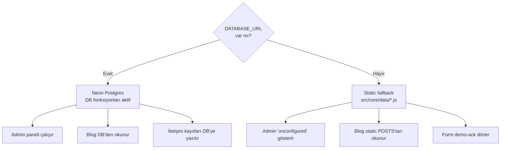
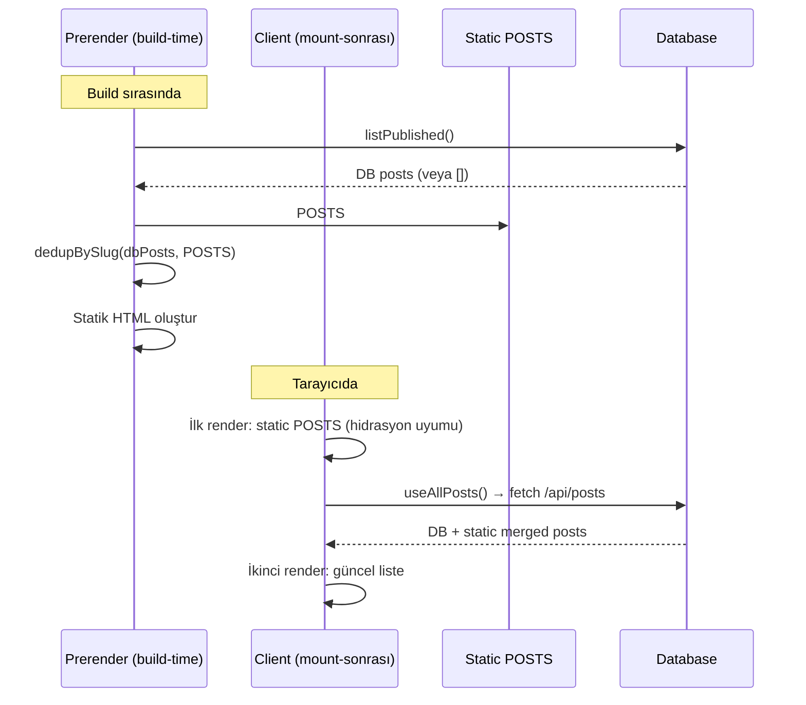

# 09 — Veritabanı ve CMS (Database & Content Management)

> Neon Postgres, DB-optional mimari, admin paneli, blog CMS, oturum yönetimi
> ve sosyal medya paylaşımı.

---

## İçindekiler

- [Genel Bakış](#genel-bakış)
- [DB-Optional Mimari](#db-optional-mimari)
- [Veritabanı Katmanı](#veritabanı-katmanı)
- [Blog CMS](#blog-cms)
- [Oturum Yönetimi (Session)](#oturum-yönetimi-session)
- [Admin Paneli](#admin-paneli)
- [Sosyal Medya Paylaşımı](#sosyal-medya-paylaşımı)
- [Veri Akışı](#veri-akışı)
- [İlgili Dokümanlar](#i̇lgili-dokümanlar)

---

## Genel Bakış

CMS sistemi tamamen **opsiyoneldir**. `DATABASE_URL` environment variable'ı
olmadan site, statik veri dosyalarından (`src/core/data/posts.js`) çalışır.
Veritabanı eklendiğinde ek özellikler aktifleşir ama mevcut davranış
değişmez.



## DB-Optional Mimari

Her veritabanı fonksiyonu `DATABASE_URL` kontrolü yapar:

```javascript
// api/_lib/db/posts.db.js
import { neon } from '@neondatabase/serverless';

function getDb(env = process.env) {
  if (!env.DATABASE_URL) return null;
  return neon(env.DATABASE_URL);
}

export async function listPublished(env) {
  const sql = getDb(env);
  if (!sql) return [];  // DB yok → boş dizi (static fallback)
  const rows = await sql`SELECT * FROM posts WHERE status = 'published' ORDER BY date DESC`;
  return rows.map(mapRow);
}
```

Bu desen tüm DB modüllerinde tutarlıdır:
- `posts.db.js` → `[]` döner
- `contacts.db.js` → sessizce başarısız olur
- `careers.db.js` → sessizce başarısız olur
- `newsletter.db.js` → sessizce başarısız olur

## Veritabanı Katmanı

**Dosyalar:** `api/_lib/db/`

### posts.db.js

| Fonksiyon | Açıklama |
|-----------|----------|
| `listPublished(env)` | Yayınlanmış postları getir |
| `getBySlug(slug, env)` | Slug ile post getir |
| `createPost(data, env)` | Yeni post oluştur |
| `updatePost(slug, data, env)` | Post güncelle |
| `deletePost(slug, env)` | Post sil |
| `dedupBySlug(dbPosts, staticPosts)` | DB + static merge (DB öncelikli) |
| `handlePosts(method, query, env)` | HTTP handler |

**Tablo şeması (posts):**

| Sütun | Tip | Açıklama |
|-------|-----|----------|
| `slug` | text PK | URL slug |
| `status` | text | 'draft' \| 'published' |
| `date` | text | ISO tarih |
| `title` | jsonb | `{ tr: "...", en: "..." }` |
| `excerpt` | jsonb | `{ tr: "...", en: "..." }` |
| `tag` | jsonb | `{ tr: "...", en: "..." }` |
| `author` | jsonb | `{ name: { tr, en }, avatar }` |
| `body` | jsonb | `{ tr: [...blocks], en: [...blocks] }` |
| `terms` | jsonb | İlişkili glossary terim ID'leri |

### contacts.db.js

İletişim formu gönderilerini kaydeder.

### careers.db.js

İş başvurularını kaydeder.

### newsletter.db.js

Bülten abonelerini kaydeder.

### jobs.db.js

İş ilanları CRUD (admin tarafından yönetilir).

## Blog CMS

### Post Body Yapısı

Post body'leri ham HTML değil, **yapılandırılmış blok dizisidir**:

```javascript
body: {
  tr: [
    { h: 'Başlık', id: 'baslik-id' },       // Heading bloku
    'Normal paragraf metni.',                   // String = paragraf
    { h: 'İkinci Başlık', id: 'ikinci' },
    'Başka bir paragraf.',
  ],
  en: [/* aynı yapı */],
}
```

**Neden:** Strict CSP altında raw HTML güvensizdir. Blok yapısı güvenli render sağlar.

### Blog Post Merge Stratejisi



**Hidrasyon güvenliği:** İlk render her zaman static POSTS ile yapılır.
DB verileri mount-sonrası `useAllPosts()` hook'u ile gelir — hidrasyon uyumsuzluğu olmaz.

### Deploy Hook

Bir post yayınlandığında `DEPLOY_HOOK_URL`'ye POST yapılır → Vercel rebuild
tetiklenir → yeni post statik HTML'e bake edilir.

## Oturum Yönetimi (Session)

**Dosya:** `api/_lib/auth/session.js`

HMAC-signed httpOnly cookie tabanlı oturum:

```javascript
// Cookie oluşturma
export function createSession(login, env) {
  const payload = JSON.stringify({ login, ts: Date.now() });
  const signature = hmacSign(payload, env.SESSION_SECRET || FALLBACK);
  return `${payload}.${signature}`;
}

// Cookie doğrulama
export function readSession(cookieHeader, env) {
  const token = parseCookies(cookieHeader)[COOKIE_NAME];
  if (!token) return null;
  const [payload, sig] = token.split('.');
  if (hmacSign(payload, secret) !== sig) return null;  // Geçersiz imza
  return JSON.parse(payload);
}
```

**Özellikler:**
- `httpOnly` — JavaScript erişemez
- HMAC imza — cookie tampering tespiti
- JWT bağımlılığı **yok** — saf crypto
- `SESSION_SECRET` yoksa fallback secret kullanılır (demo mode)

### Admin Auth

**Dosya:** `api/_lib/auth/admin.auth.js`

Basit e-posta/şifre tabanlı giriş:

```javascript
const ADMIN_EMAIL = 'admin@ecozyon.com';
const ADMIN_PASS = 'ecozyon2026';

export function handleLogin(body, env, origin) {
  if (body.email === ADMIN_EMAIL && body.password === ADMIN_PASS) {
    const session = createSession('Ecozyon Admin', env);
    return json(200, { ok: true }, {
      'Set-Cookie': serializeCookie(COOKIE_NAME, session, { maxAge: MAX_AGE })
    });
  }
  return json(401, { ok: false, error: 'invalid_credentials' });
}
```

## Admin Paneli

**Sayfa:** `src/pages/Admin/` (lazy-loaded, ROUTES dışı)

Admin paneli özellikleri:
- E-posta/şifre ile giriş formu
- Blog post listesi (oluştur / düzenle / sil)
- İki dilli blok editör (TR + EN)
- İletişim kayıtları listesi
- Başvuru listesi
- Bülten abone listesi
- İş ilanları yönetimi

**Güvenlik:**
- ROUTES'ta yok → prerender edilmez → SEO'da görünmez
- `robots.txt`'de `Disallow: /admin`
- httpOnly cookie session
- Her admin endpoint `readSession` ile korunur

## Sosyal Medya Paylaşımı

**Dosya:** `api/_lib/handlers/social.js`

### LinkedIn

Post yayınlandığında LinkedIn UGC Posts API üzerinden paylaşım:

```javascript
export async function publishToLinkedIn(post, env) {
  if (!env.LINKEDIN_ACCESS_TOKEN || !env.LINKEDIN_AUTHOR_URN) {
    return { published: false, demo: true };  // Demo ack
  }
  // LinkedIn UGC Posts API → paylaşım oluştur
}
```

### X (Twitter) / Bluesky

Share-intent URL'leri kullanılır (API entegrasyonu yok):

```
https://twitter.com/intent/tweet?url=...&text=...
```

## Veri Akışı

```mermaid
flowchart TD
    subgraph Admin["Admin Paneli"]
        A1["Login"] --> A2["Session Cookie"]
        A2 --> A3["Post Editör"]
        A3 --> A4["POST /api/admin/posts"]
        A4 --> A5["posts.db.js<br/>createPost()"]
        A5 --> A6["Neon Postgres"]
        A4 --> A7["DEPLOY_HOOK_URL<br/>→ Vercel Rebuild"]
    end

    subgraph Public["Public Site"]
        B1["Blog Sayfası"] --> B2["useAllPosts()"]
        B2 --> B3["fetch /api/posts"]
        B3 --> B4["handlePosts()"]
        B4 --> B5["listPublished()"]
        B5 --> B6["Neon Postgres"]
        B4 --> B7["dedupBySlug(db, static)"]
        B7 --> B8["Merged post listesi"]
    end

    subgraph Build["Build Pipeline"]
        C1["prerender.mjs"] --> C2["listPublished()"]
        C2 --> C3["Neon Postgres<br/>(veya [] fallback)"]
        C1 --> C4["dedupBySlug(db, POSTS)"]
        C4 --> C5["Static HTML<br/>per post"]
    end
```



---

## İlgili Dokümanlar

- [08 — Backend API](./08-backend-api.md)
- [10 — SEO & Prerender](./10-seo-prerender.md)
- [12 — CI/CD & Deployment](./12-ci-cd-deployment.md)
