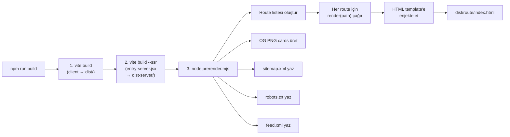

# 10 — SEO ve Prerender (SSG)

> Custom prerender pipeline, OG card rasterizasyonu, JSON-LD structured data,
> sitemap, robots.txt, RSS feed ve hreflang entegrasyonu.

---

## İçindekiler

- [Genel Bakış](#genel-bakış)
- [Prerender Pipeline](#prerender-pipeline)
- [Entry Points ve Hidrasyon](#entry-points-ve-hidrasyon)
- [Per-Route Head Injection](#per-route-head-injection)
- [OG Card Sistemi](#og-card-sistemi)
- [JSON-LD Structured Data](#json-ld-structured-data)
- [Hreflang Alternates](#hreflang-alternates)
- [Sitemap ve Robots](#sitemap-ve-robots)
- [RSS Feed](#rss-feed)
- [SEO Checklist](#seo-checklist)
- [İlgili Dokümanlar](#i̇lgili-dokümanlar)

---

## Genel Bakış

Proje, **custom SSG (Static Site Generation)** sistemi kullanır. `vite-react-ssg`
uyumsuzdu (React Router 7 + Vite 8), bu yüzden kendi prerender pipeline'ı yazıldı.

Her route, build zamanında tam HTML'e render edilir. Crawler'lar JavaScript
çalıştırmadan tam içeriği görür.

## Prerender Pipeline

**Dosya:** `scripts/prerender.mjs` (~330 satır)



### Adımlar

1. **Route listesi** — `ROUTES` + blog slugları + tag sayfaları + vaka çalışmaları + entegrasyonlar
2. **Her route için:**
   - `render(path)` → React 19 `prerenderToNodeStream` + `StaticRouter`
   - Tüm `Suspense` çözülür (lazy page'ler + globe'lar)
   - Template'teki `<!--ssr-outlet-->` yerine app HTML
   - `<!--ssr-head-->` yerine per-route head etiketleri
   - `<title>` ve `<meta description>` replace
3. **OG cards** — Her post, vaka çalışması, entegrasyon ve sayfa için SVG → PNG
4. **Statik dosyalar** — `sitemap.xml`, `robots.txt`, `feed.xml`

### Render Fonksiyonu

```javascript
// src/entry-server.jsx
export async function render(url) {
  const { prelude } = await prerenderToNodeStream(
    <StaticRouter location={url}>
      <AppShell />
    </StaticRouter>,
  );
  return streamToString(prelude);
}
```

`prerenderToNodeStream` tüm Suspense boundary'lerini çözer — lazy page'ler
ve globe'lar dahil — bu sayede emit edilen HTML **tamamen** ve **indekslenebilir**.

## Entry Points ve Hidrasyon

### Server Entry (`entry-server.jsx`)

```
StaticRouter(url) → AppShell → AppProvider(DEFAULTS) → Routes → Page
```

- `StaticRouter` ile URL bazlı routing
- `DEFAULTS` state → server/client uyumu
- Three.js effect'leri çalışmaz (SSR ortamı)

### Client Entry (`main.jsx`)

```javascript
const root = document.getElementById('root');
if (root.firstElementChild) {
  hydrateRoot(root, tree);   // Prerendered HTML var → hydrate
} else {
  createRoot(root).render(tree);  // Dev mode → render
}
```

`firstElementChild` kontrolü, `<!--ssr-outlet-->` yorum node'unun yanlış
pozitif vermesini engeller.

## Per-Route Head Injection

Her route için `headFor()` fonksiyonu şu etiketleri üretir:

```html
<!-- Canonical URL -->
<link rel="canonical" href="https://ecozyon.tech/services" />

<!-- Open Graph -->
<meta property="og:title" content="Çözümler — Ecozyon Tech" />
<meta property="og:description" content="Ecozyon Tech çözümleri..." />
<meta property="og:url" content="https://ecozyon.tech/services" />
<meta property="og:image" content="https://ecozyon.tech/og/route-services.png" />

<!-- Twitter Card -->
<meta name="twitter:card" content="summary_large_image" />
<meta name="twitter:title" content="Çözümler — Ecozyon Tech" />
<meta name="twitter:description" content="Ecozyon Tech çözümleri..." />
<meta name="twitter:image" content="https://ecozyon.tech/og/route-services.png" />

<!-- Hreflang -->
<link rel="alternate" hreflang="tr" href="https://ecozyon.tech/services" />
<link rel="alternate" hreflang="en" href="https://ecozyon.tech/services?lang=en" />
<link rel="alternate" hreflang="x-default" href="https://ecozyon.tech/services" />

<!-- JSON-LD -->
<script type="application/ld+json">[...]</script>
```

## OG Card Sistemi

**Dosya:** `src/core/lib/og.js`

Her içerik türü için markalı OG kart üretilir:

| Tür | Dosya Adı | Motif |
|-----|-----------|-------|
| Blog post | `og/{slug}.png` | Article çizgileri |
| Vaka çalışması | `og/case-{slug}.png` | Impact globe |
| Entegrasyon | `og/integration-{slug}.png` | Node graph |
| Sayfa (route) | `og/route-{key}.png` | Halkalar |
| Varsayılan | `og.png` | Halkalar |

### Rasterizasyon

SVG → PNG dönüşümü `@resvg/resvg-js` ile yapılır:

```javascript
const svgToPng = (svg) =>
  new Resvg(svg, {
    fitTo: { mode: 'width', value: 1200 },
    font: {
      fontFiles: [
        'SpaceGrotesk_700Bold.ttf',
        'Inter_400Regular.ttf',
        'Inter_600SemiBold.ttf'
      ],
      loadSystemFonts: false,
    },
  }).render().asPng();
```

Font dosyaları bundle'dan gelir → her build machine'de aynı çıktı.

## JSON-LD Structured Data

**Dosya:** `src/core/lib/jsonld.js`

Her route türü için schema.org JSON-LD oluşturulur:

| Route | Schema Türü |
|-------|-------------|
| `/` (Home) | `WebSite` + `SearchAction` |
| `/blog/:slug` | `BlogPosting` (Person byline + tag keywords) |
| `/cases/:slug` | `Article` |
| `/pricing` | `Product` (Offer per tier) + `FAQPage` |
| `/help` | `FAQPage` |
| `/glossary` | `DefinedTermSet` |
| `/blog`, `/cases` | `CollectionPage` + `ItemList` |
| Tüm alt sayfalar | `BreadcrumbList` |

### Builder Fonksiyonları

```javascript
// Her builder saf bir fonksiyondur (unit-tested)
blogPosting({ post, url, site, image, lang, terms });
article({ headline, description, url, site, image, lang });
website(site, lang);
faqPage(faqItems, lang);
product({ name, description, url, site, offers, currency, lang });
breadcrumbList(crumbs, site);
collectionPage({ name, description, url, items, site, lang });
definedTermSet({ name, description, url, terms, site, lang });
ldScript(nodes);  // Birden fazla node'u tek <script> tag'ine saralar
```

## Hreflang Alternates

Her route TR canonical + EN `?lang=en` alternatif olarak sunulur:

```javascript
function hreflangFor(url) {
  const en = `${url}${url.includes('?') ? '&' : '?'}lang=en`;
  return [
    `<link rel="alternate" hreflang="tr" href="${url}" />`,
    `<link rel="alternate" hreflang="en" href="${en}" />`,
    `<link rel="alternate" hreflang="x-default" href="${url}" />`,
  ];
}
```

Aynı yapı hem `<head>` etiketlerinde hem `sitemap.xml`'de tekrarlanır.

## Sitemap ve Robots

### sitemap.xml

```xml
<?xml version="1.0" encoding="UTF-8"?>
<urlset xmlns="http://www.sitemaps.org/schemas/sitemap/0.9"
        xmlns:xhtml="http://www.w3.org/1999/xhtml">
  <url>
    <loc>https://ecozyon.tech/</loc>
    <lastmod>2026-07-14</lastmod>
    <xhtml:link rel="alternate" hreflang="tr" href="https://ecozyon.tech/"/>
    <xhtml:link rel="alternate" hreflang="en" href="https://ecozyon.tech/?lang=en"/>
    <xhtml:link rel="alternate" hreflang="x-default" href="https://ecozyon.tech/"/>
  </url>
  <!-- ... tüm route'lar + blog slugları + vaka çalışmaları -->
</urlset>
```

### robots.txt

```
User-agent: *
Allow: /
Disallow: /admin

Sitemap: https://ecozyon.tech/sitemap.xml
```

## RSS Feed

**Builder:** `src/core/lib/feed.js`

RSS 2.0 formatında blog feed'i:

```xml
<?xml version="1.0" encoding="UTF-8"?>
<rss version="2.0">
  <channel>
    <title>Ecozyon Tech — Blog</title>
    <link>https://ecozyon.tech/blog</link>
    <item>
      <title>...</title>
      <link>https://ecozyon.tech/blog/slug</link>
      <pubDate>...</pubDate>
      <description>...</description>
    </item>
  </channel>
</rss>
```

`index.html`'de RSS keşif bağlantısı:

```html
<link rel="alternate" type="application/rss+xml"
      title="Ecozyon Tech — Blog" href="/feed.xml" />
```

## SEO Checklist

| Öğe | Durum | Açıklama |
|-----|-------|----------|
| Per-route `<title>` | ✅ | `site.js` ROUTES'tan alınır |
| Per-route `<meta description>` | ✅ | Bilingual, route bazlı |
| Canonical URL | ✅ | Her route'ta `<link rel="canonical">` |
| OG tags | ✅ | title, description, url, image |
| Twitter Card | ✅ | `summary_large_image` |
| Hreflang | ✅ | TR + EN + x-default (head + sitemap) |
| JSON-LD | ✅ | Route türüne göre schema.org |
| Sitemap | ✅ | Tüm route'lar + blog + cases |
| Robots.txt | ✅ | Admin disallow |
| RSS feed | ✅ | Blog posts |
| OG images | ✅ | SVG → PNG, per route/post |
| Breadcrumbs | ✅ | Derin içerik sayfalarında |
| Tek h1 kuralı | ✅ | Test-enforced |
| Semantic HTML | ✅ | `<main>`, `<nav>`, `<article>` |

---

## İlgili Dokümanlar

- [01 — Architecture Overview](./01-architecture-overview.md)
- [02 — Routing and Pages](./02-routing-and-pages.md)
- [04 — Internationalization](./04-internationalization.md)
- [12 — CI/CD & Deployment](./12-ci-cd-deployment.md)
