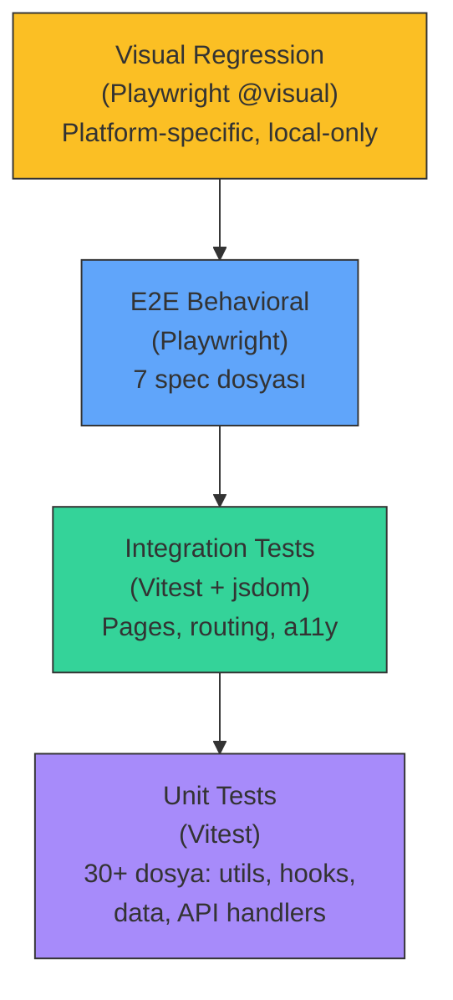

# 11 — Test Stratejisi (Testing Strategy)

> Vitest unit/integration testler, Playwright e2e testler, coverage hedefleri,
> cross-cutting testler ve visual regression.

---

## İçindekiler

- [Genel Bakış](#genel-bakış)
- [Test Piramidi](#test-piramidi)
- [Vitest Yapılandırması](#vitest-yapılandırması)
- [Coverage Hedefleri](#coverage-hedefleri)
- [Cross-Cutting Testler](#cross-cutting-testler)
- [API Testleri](#api-testleri)
- [Playwright E2E](#playwright-e2e)
- [Visual Regression](#visual-regression)
- [Test Dosyaları Envanteri](#test-dosyaları-envanteri)
- [Test Yazma Kuralları](#test-yazma-kuralları)
- [İlgili Dokümanlar](#i̇lgili-dokümanlar)

---

## Genel Bakış

Proje iki test çalıştırıcısı kullanır:

| Araç | Tür | Ortam | Kapsam |
|------|-----|-------|--------|
| **Vitest** | Unit / Integration | jsdom | Bileşenler, hook'lar, util'ler, API handler'ları |
| **Playwright** | E2E / Visual | Chromium | Gerçek tarayıcı, production build üzerinde |

## Test Piramidi



## Vitest Yapılandırması

**Dosya:** `vite.config.js` → `test` bölümü

```javascript
test: {
  environment: 'jsdom',
  globals: true,             // describe, it, expect global
  setupFiles: './src/test/setup.js',
  css: false,                // CSS parse atlanır (hız)
  include: [
    'src/**/*.{test,spec}.{js,jsx}',
    'api/**/*.{test,spec}.js'
  ],
}
```

### Setup Dosyası (`src/test/setup.js`)

```javascript
// @testing-library/jest-dom matchers
import '@testing-library/jest-dom';

// IntersectionObserver mock (jsdom'da yok)
// ResizeObserver mock
// matchMedia mock
// scrollTo mock
```

### JSX Automatic Runtime

```javascript
// vite.config.js
esbuild: { jsx: 'automatic' }
```

Bu ayar, `import React` satırı olmayan dosyaların testlerde çalışmasını sağlar.
**Kaldırılmamalıdır.**

## Coverage Hedefleri

```javascript
coverage: {
  provider: 'v8',
  reporter: ['text', 'html', 'json-summary'],
  thresholds: {
    lines:      88,  // Mevcut: ~89%
    statements: 88,  // Mevcut: ~89%
    functions:  70,  // Mevcut: ~74%
    branches:   73,  // Mevcut: ~78%
  },
}
```

### Coverage Hariç Tutulanlar

| Dışlanan | Neden |
|----------|-------|
| `src/main.jsx` | Entry point, yan etki |
| `src/entry-server.jsx` | SSR entry, build-time only |
| `src/app/App.jsx` | Sadece BrowserRouter wrapper |
| `src/shared/3d/**` | Three.js imperatif, jsdom'da render edilemez |
| `src/features/impact-map/**` | Three.js bağımlı |
| `src/features/dashboard/**` | Three.js bağımlı |
| `src/features/hero/**` | Three.js / visual bileşenler |
| `src/features/dev-tweaks/**` | DEV-only vendored panel |
| `src/core/lib/vitals.js` | Browser-only beacon |
| `src/core/lib/telemetry.js` | Browser-only beacon |
| `src/shared/ui/VitalsHud.jsx` | DEV-only overlay |
| `src/shared/ui/EventsHud.jsx` | DEV-only overlay |

## Cross-Cutting Testler

**Dosya:** `src/test/`

### a11y.test.jsx — Erişilebilirlik

Her sayfa ve navbar mega-menu üzerinde `axe-core` taraması:

```javascript
import { axe } from 'jest-axe';

it('Services sayfası a11y ihlali yok', async () => {
  const { container } = render(<ServicesPage />);
  const results = await axe(container);
  expect(results).toHaveNoViolations();
});
```

### headers.test.js — Tek h1 Kuralı

Her route sayfasında **tam olarak bir `<h1>`** olmasını zorunlu kılar:

```javascript
it('her sayfada tek <h1> var', () => {
  const h1s = container.querySelectorAll('h1');
  expect(h1s.length).toBe(1);
});
```

### pages.test.jsx — Sayfa Render Kontrolü

Tüm sayfaların hatasız render edildiğini doğrular.

### routing.test.jsx — Rota Doğrulama

Route tanımlarının tutarlılığını kontrol eder.

### features.test.jsx — Feature Section Render

Feature section'ların render edildiğini doğrular.

### og-png.test.js — OG Card Doğrulama

OG card SVG builder'larının geçerli SVG ürettiğini test eder.

### pwa.test.js — PWA Doğrulama

Service worker ve manifest yapılandırmasını kontrol eder.

### command-palette.test.jsx

CommandPalette'in açılma/kapanma, arama ve navigasyon işlevlerini test eder.

### contact-form.test.jsx

İletişim formu validasyon ve submission akışını test eder.

### careers-apply.test.jsx

Kariyer başvuru modalı ve form validasyonunu test eder.

## API Testleri

**Dosya:** `api/_lib/` içindeki `*.test.js` dosyaları

| Test Dosyası | Kapsam |
|-------------|--------|
| `forms.test.js` | Validasyon, rate limit, honeypot, deliver |
| `posts-db.test.js` | Blog CRUD, dedupBySlug, mapRow |
| `admin-posts.test.js` | Admin post handler'ları |
| `session.test.js` | HMAC session create/read/verify |
| `social.test.js` | LinkedIn publish + demo fallback |
| `telemetry.test.js` | Event handler |
| `vitals.test.js` | Vitals handler |

## Playwright E2E

**Yapılandırma:** `playwright.config.js`

```javascript
export default defineConfig({
  testDir: './e2e',
  projects: [{ name: 'chromium', use: { ...devices['Desktop Chrome'] } }],
  webServer: {
    command: `npm run preview -- --port 4173`,
    url: `http://localhost:4173`,
  },
});
```

**Hedef:** Production build üzerinde çalışır (`vite preview`). Gerçek client
routing, lazy chunks, service worker, View Transitions test edilir.

### E2E Spec Dosyaları

| Dosya | Kapsam |
|-------|--------|
| `smoke.spec.js` | Temel sayfa yüklenme, navigasyon |
| `forms.spec.js` | İletişim formu gönderimi, validasyon |
| `search.spec.js` | ⌘K palette, /search sayfası |
| `preferences.spec.js` | Tema, dil, accent değiştirme |
| `tools.spec.js` | ROI calculator, assessment |
| `tour.spec.js` | Onboarding turu |
| `visual.spec.js` | Visual regression (@visual tag) |

### Fixtures

```javascript
// e2e/fixtures.js
// Paylaşılan test yardımcıları ve sabitler
```

## Visual Regression

```bash
npm run e2e:visual          # Mevcut baseline ile karşılaştır
npm run e2e:visual:update   # Baseline'ları güncelle
```

- `@visual` tag'i ile işaretlenir
- **Platform-specific:** Font rendering OS'a göre değişir
- **Local-only:** CI'da çalışmaz (snapshot'lar platforma özgü)
- Snapshot'lar `e2e/visual.spec.js-snapshots/` altında

## Test Dosyaları Envanteri

### Unit / Integration (Vitest)

| Kategori | Dosya Sayısı | Konum |
|----------|-------------|-------|
| Cross-cutting | 11 | `src/test/` |
| Shared UI | ~20 | `src/shared/ui/*.test.jsx` |
| Core data | ~15 | `src/core/data/*.test.js` |
| Core lib | ~15 | `src/core/lib/*.test.js` |
| Core config | 1 | `src/core/config/site.test.js` |
| Core tokens | 2 | `src/core/tokens.test.js`, `motion.test.js` |
| Core i18n | 1 | `src/core/i18n/dictionary.test.js` |
| Core content | 1 | `src/core/content/registry.test.js` |
| App | 1 | `src/app/routePrefetch.test.js` |
| API handlers | 7 | `api/_lib/*.test.js` |

### E2E (Playwright)

| Kategori | Dosya Sayısı | Konum |
|----------|-------------|-------|
| Behavioral | 6 | `e2e/*.spec.js` |
| Visual | 1 | `e2e/visual.spec.js` |
| Fixtures | 1 | `e2e/fixtures.js` |

## Test Yazma Kuralları

1. **Her shared UI bileşeninin testi olmalıdır**
2. **Her data modülünün testi olmalıdır**
3. **Her API handler'ın testi olmalıdır**
4. **a11y testleri her yeni sayfa için genişletilmelidir**
5. **Coverage threshold'ları düşürülmemelidir** — sadece yükseltilebilir
6. **Visual regression baseline'ları:** intentional UI değişikliklerinden sonra `e2e:visual:update` ile güncellenmeli

---

## İlgili Dokümanlar

- [12 — CI/CD & Deployment](./12-ci-cd-deployment.md)
- [14 — Accessibility](./14-accessibility.md)
- [08 — Backend API](./08-backend-api.md)
