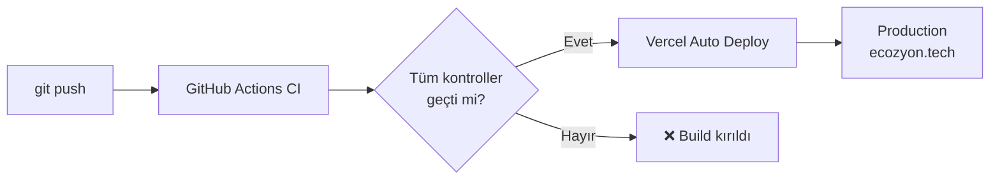

# 12 — CI/CD ve Deployment

> GitHub Actions CI pipeline, Vercel deployment, bundle budget,
> güvenlik header'ları ve ortam değişkenleri.

---

## İçindekiler

- [Genel Bakış](#genel-bakış)
- [CI Pipeline (GitHub Actions)](#ci-pipeline-github-actions)
- [Bundle Budget](#bundle-budget)
- [Vercel Deployment](#vercel-deployment)
- [Güvenlik Header'ları](#güvenlik-headerları)
- [Cache Stratejisi](#cache-stratejisi)
- [SPA Fallback](#spa-fallback)
- [Ortam Değişkenleri](#ortam-değişkenleri)
- [İlgili Dokümanlar](#i̇lgili-dokümanlar)

---

## Genel Bakış

Kod, GitHub'a push edildiğinde CI pipeline otomatik çalışır. Tüm kontroller
geçerse Vercel otomatik deploy eder.



## CI Pipeline (GitHub Actions)

**Dosya:** `.github/workflows/ci.yml`

İki paralel job çalışır:

### Job 1: `verify`

```yaml
steps:
  - uses: actions/checkout@v4
  - uses: actions/setup-node@v4
    with:
      node-version: 20
      cache: npm
  - run: npm ci            # Bağımlılık kurulumu
  - run: npm run lint      # ESLint (flat config)
  - run: npm run test:coverage  # Vitest + coverage thresholds
  - run: npm run build     # Client + SSR + Prerender
  - run: npm run bundle:check   # Bundle boyut bütçesi
```

### Job 2: `e2e`

```yaml
steps:
  - uses: actions/checkout@v4
  - uses: actions/setup-node@v4
    with:
      node-version: 20
      cache: npm
  - run: npm ci
  - run: npx playwright install --with-deps chromium
  - run: npm run build
  - run: npm run e2e       # Playwright behavioral (visual hariç)
```

### Tetikleyiciler

```yaml
on:
  push:
    branches: ['**']     # Tüm branch'lerde
  pull_request:           # PR'larda
```

### Enforced Kontroller

| Kontrol | Komut | Kırılırsa |
|---------|-------|-----------|
| Lint | `npm run lint` | ESLint hatası |
| Test + Coverage | `npm run test:coverage` | Test başarısız veya coverage threshold altı |
| Build | `npm run build` | Build hatası |
| Bundle Budget | `npm run bundle:check` | Entry chunk > 48 kB |
| E2E | `npm run e2e` | Playwright test başarısız |

## Bundle Budget

**Dosya:** `scripts/check-bundle.mjs`

Entry chunk boyutunu kontrol eder:

```javascript
// Budget: entry chunk ≤ 48 kB gzip
const ENTRY_BUDGET_KB = 48;
```

Mevcut entry chunk: ~38 kB gzip. Budget'ın altında kalmak, CommandPalette
ve OnboardingTour'un lazy-load ile entry dışında tutulmasıyla sağlanır.

### Chunk Dağılımı

| Chunk | İçerik | Strateji |
|-------|--------|----------|
| entry | App + Router + MainLayout + Providers | Hemen yüklenir |
| vendor | React + ReactDOM + React Router | Ayrı chunk |
| three | Three.js kütüphanesi | Lazy (LazyGlobes) |
| page-* | Her lazy sayfa | Route navigasyonunda |
| CommandPalette | ⌘K palette + content registry | requestIdleCallback sonrası |
| OnboardingTour | İlk ziyaret turu | requestIdleCallback sonrası |

## Vercel Deployment

**Dosya:** `vercel.json`

```json
{
  "framework": "vite",
  "buildCommand": "npm run build",
  "outputDirectory": "dist"
}
```

### Dosya Sunma Önceliği

1. `dist/services/index.html` → `/services` (prerendered)
2. `dist/blog/slug/index.html` → `/blog/slug` (prerendered)
3. SPA fallback → `dist/index.html` (bilinmeyen route'lar)

## Güvenlik Header'ları

`vercel.json`'da tüm sayfalara uygulanan güvenlik header'ları:

| Header | Değer | Açıklama |
|--------|-------|----------|
| `Content-Security-Policy` | `default-src 'self'; script-src 'self'; style-src 'self' 'unsafe-inline' fonts.googleapis.com; font-src 'self' fonts.gstatic.com; img-src 'self' data: https:; connect-src 'self'; frame-ancestors 'none'; base-uri 'self'; form-action 'self'; object-src 'none'; upgrade-insecure-requests` | XSS koruması |
| `Strict-Transport-Security` | `max-age=63072000; includeSubDomains; preload` | HTTPS zorunluluğu |
| `X-Content-Type-Options` | `nosniff` | MIME sniffing engeli |
| `X-Frame-Options` | `DENY` | Clickjacking koruması |
| `Referrer-Policy` | `strict-origin-when-cross-origin` | Referrer sızıntı kontrolü |
| `Permissions-Policy` | `camera=(), microphone=(), geolocation=(), interest-cohort=()` | API izin kısıtlaması |

## Cache Stratejisi

```json
{
  "source": "/assets/(.*)",
  "headers": [
    { "key": "Cache-Control", "value": "public, max-age=31536000, immutable" }
  ]
}
```

- `/assets/*` → **1 yıl** immutable cache (Vite hash'li dosya adları)
- HTML dosyaları → cache yok (her zaman güncel)

## SPA Fallback

```json
{
  "rewrites": [
    { "source": "/(.*)", "destination": "/index.html" }
  ]
}
```

Vercel, önce dosya sisteminide arar (prerendered HTML), bulamazsa `index.html`'e
yönlendirir (SPA fallback). Bu sayede:

- Bilinen route'lar → prerendered HTML (SEO + hız)
- Bilinmeyen route'lar → client-side routing (404 sayfası)

> **Caveat:** `npm run preview` (Vite) sadece SPA fallback yapar — prerendered
> dosyaları sunmaz. Prerender çıktısını doğrulamak için `npx serve dist` kullanın.

## Ortam Değişkenleri

Tümü opsiyoneldir — yoksa demo modunda çalışır:

| Variable | Kullanım | Yoksa |
|----------|---------|-------|
| `DATABASE_URL` | Neon Postgres bağlantısı | Static data fallback |
| `RESEND_API_KEY` | E-posta gönderimi | Log + demo ack |
| `CONTACT_TO` | E-posta alıcısı | Demo ack |
| `CONTACT_FROM` | E-posta göndericisi | Varsayılan Resend adresi |
| `SESSION_SECRET` | HMAC oturum imzası | Fallback secret |
| `VITALS_WEBHOOK_URL` | Web Vitals forwarding | Demo ack |
| `DEPLOY_HOOK_URL` | Post publish → rebuild | Rebuild tetiklenmez |
| `LINKEDIN_ACCESS_TOKEN` | LinkedIn paylaşımı | Demo ack |
| `LINKEDIN_AUTHOR_URN` | LinkedIn yazar URN | Demo ack |

---

## İlgili Dokümanlar

- [01 — Architecture Overview](./01-architecture-overview.md)
- [08 — Backend API](./08-backend-api.md)
- [10 — SEO & Prerender](./10-seo-prerender.md)
- [11 — Testing Strategy](./11-testing-strategy.md)
