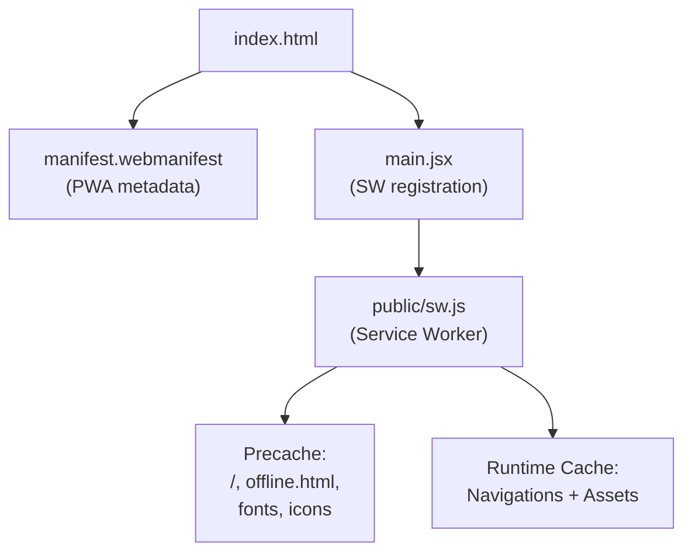
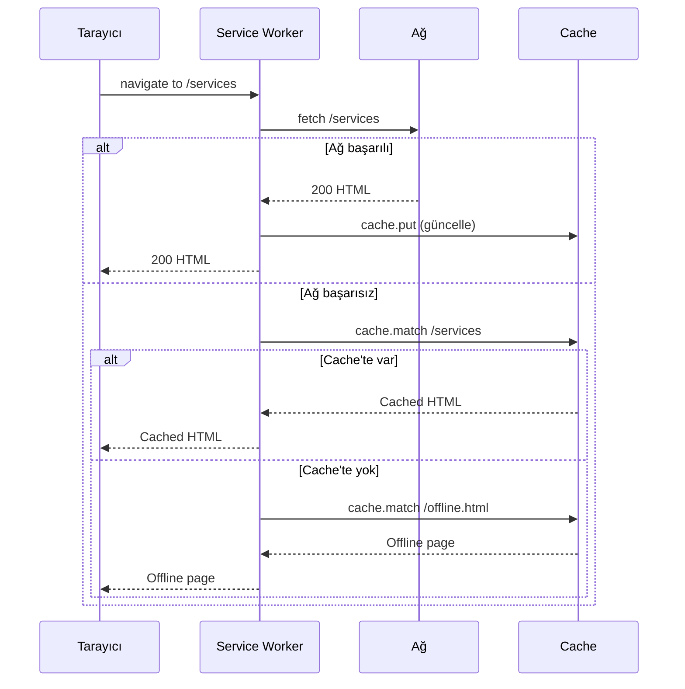
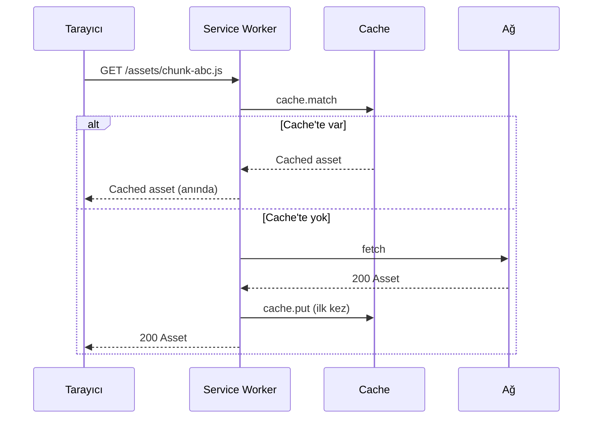

# 13 — PWA ve Offline Destek

> Service worker, manifest, precache stratejisi, offline fallback ve
> production-only registration.

---

## İçindekiler

- [Genel Bakış](#genel-bakış)
- [Manifest](#manifest)
- [Service Worker](#service-worker)
- [Precache Listesi](#precache-listesi)
- [Fetch Stratejileri](#fetch-stratejileri)
- [Cache Versioning](#cache-versioning)
- [Registration](#registration)
- [Offline Fallback](#offline-fallback)
- [İlgili Dokümanlar](#i̇lgili-dokümanlar)

---

## Genel Bakış

Ecozyon Tech, kurulabilir (installable) bir PWA olarak yapılandırılmıştır.
El yazması (hand-rolled) bir service worker kullanılır — Workbox bağımlılığı
yoktur.



## Manifest

**Dosya:** `public/manifest.webmanifest`

```json
{
  "name": "Ecozyon Tech",
  "short_name": "Ecozyon",
  "description": "AI + sustainability + wearables",
  "start_url": "/",
  "display": "standalone",
  "background_color": "#f8fafc",
  "theme_color": "#0EA5E9",
  "icons": [
    { "src": "/assets/logo/logo.jpg", "sizes": "192x192", "type": "image/jpeg" },
    { "src": "/assets/logo/logo.jpg", "sizes": "512x512", "type": "image/jpeg" }
  ]
}
```

### HTML Entegrasyonu

```html
<!-- index.html -->
<link rel="manifest" href="/manifest.webmanifest" />
<link rel="apple-touch-icon" href="/assets/logo/logo.jpg" />
<meta name="mobile-web-app-capable" content="yes" />
<meta name="apple-mobile-web-app-status-bar-style" content="black-translucent" />
<meta name="apple-mobile-web-app-title" content="Ecozyon" />
<meta name="theme-color" media="(prefers-color-scheme: light)" content="#f8fafc" />
<meta name="theme-color" media="(prefers-color-scheme: dark)" content="#0b1220" />
```

## Service Worker

**Dosya:** `public/sw.js` (~72 satır)

### Tasarım Kararları

- **Workbox kullanılmıyor** — basitlik ve kontrol
- **El yazması** — navigasyon ve asset stratejileri açıkça tanımlı
- **Cache versioning** — `CACHE` sabitini artırarak tüm cache invalidate edilir

## Precache Listesi

```javascript
const CACHE = 'ecozyon-v2';
const PRECACHE = [
  '/',                              // Ana sayfa
  '/offline.html',                  // Offline fallback
  '/manifest.webmanifest',          // PWA manifest
  '/icon.svg',                      // Uygulama ikonu
  '/favicon.svg',                   // Favicon
  '/fonts/inter-latin.woff2',       // Body font (latin base)
  '/fonts/space-grotesk-latin.woff2', // Display font (latin base)
];
```

Bu dosyalar SW yüklendiğinde hemen cache'e alınır. Offline durumda bile
marka fontları ve temel shell çalışır.

## Fetch Stratejileri

### Navigasyon: Network-First



### Asset'ler: Cache-First



### Kapsam Dışı

- Cross-origin istekler (analytics, embeds) → **dokunulmaz**
- GET dışı istekler → **dokunulmaz**

## Cache Versioning

```javascript
const CACHE = 'ecozyon-v2';

// activate event: eski cache'leri temizle
self.addEventListener('activate', (event) => {
  event.waitUntil(
    caches.keys().then((keys) =>
      Promise.all(
        keys.filter((k) => k !== CACHE).map((k) => caches.delete(k))
      )
    ).then(() => self.clients.claim()),
  );
});
```

Cache invalidation: `CACHE` sabitini `'ecozyon-v3'` olarak değiştirmek,
bir sonraki activate'te tüm eski cache'leri siler.

## Registration

**Dosya:** `src/main.jsx`

```javascript
// Production-only: dev'de stale cached asset'ler sorun olur
if (import.meta.env.PROD && 'serviceWorker' in navigator) {
  window.addEventListener('load', () => {
    navigator.serviceWorker.register('/sw.js').catch(() => {});
  });
}
```

- **PROD only** — dev modda SW kayıt edilmez
- **Best-effort** — hata sessizce yutulur (SW kritik değil)
- **load event** — ilk paint'i engellemez

## Offline Fallback

**Dosya:** `public/offline.html`

Minimal, bağımsız bir HTML sayfası:
- Harici bağımlılık yok (inline CSS)
- Marka renkleri ve fontu
- "Çevrimdışısınız" mesajı
- "Tekrar dene" butonu

```html
<!-- Sadece ağ başarısız VE hedef sayfa cache'te olmadığında gösterilir -->
<h1>Çevrimdışısınız</h1>
<p>İnternet bağlantınızı kontrol edin.</p>
<button onclick="location.reload()">Tekrar Dene</button>
```

---

## İlgili Dokümanlar

- [01 — Architecture Overview](./01-architecture-overview.md)
- [12 — CI/CD & Deployment](./12-ci-cd-deployment.md)
- [11 — Testing Strategy](./11-testing-strategy.md)
