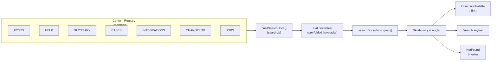
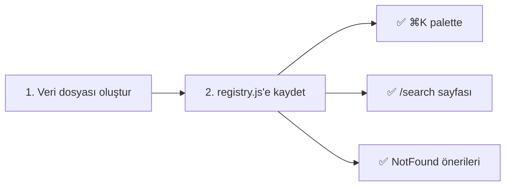

# 15 — İçerik Arama ve Command Palette

> Content registry, arama motoru, ⌘K command palette ve /search sayfası.

---

## İçindekiler

- [Genel Bakış](#genel-bakış)
- [Content Registry](#content-registry)
- [Arama Motoru](#arama-motoru)
- [Command Palette (⌘K)](#command-palette-k)
- [/search Sayfası](#search-sayfası)
- [Highlight Sistemi](#highlight-sistemi)
- [Yeni İçerik Türü Ekleme](#yeni-i̇çerik-türü-ekleme)
- [İlgili Dokümanlar](#i̇lgili-dokümanlar)

---

## Genel Bakış

Proje, tüm içerik türlerinde birleşik arama sağlayan bir içerik kayıt
(registry) sistemi kullanır. Yeni bir içerik türü eklemek "bir kez kaydet"
modelindedir — arama, palette ve 404 sayfası otomatik güncellenir.



## Content Registry

**Dosya:** `src/core/content/registry.js`

Her aranabilir içerik koleksiyonu kendisini burada kayıt eder:

```javascript
export const COLLECTIONS = [
  {
    type: 'post',
    items: POSTS,
    toDoc: (p, pick, lang) => ({
      id: `post:${p.slug}`,
      title: pick(p.title),        // Dile göre seç
      hint: pick(p.tag),           // Kategori ipucu
      body: [pick(p.excerpt), ...body_blocks].join(' '),
      to: `/blog/${p.slug}`,      // Navigasyon hedefi
    }),
  },
  { type: 'help', items: HELP, toDoc: ... },
  { type: 'term', items: GLOSSARY, toDoc: ... },
  { type: 'case', items: CASES, toDoc: ... },
  { type: 'integration', items: INTEGRATIONS, toDoc: ... },
  { type: 'changelog', items: CHANGELOG, toDoc: ... },
  { type: 'job', items: JOBS, toDoc: ... },
];
```

### Kayıtlı Koleksiyonlar

| Type | Kaynak | Aranabilir Alanlar | Hedef |
|------|--------|-------------------|-------|
| `post` | `POSTS` | title, tag, excerpt + body blocks | `/blog/{slug}` |
| `help` | `HELP` | question, category, answer | `/help#{id}` |
| `term` | `GLOSSARY` | term, category, definition | `/glossary#{id}` |
| `case` | `CASES` | client, city, sector, summary, challenge, approach | `/cases/{slug}` |
| `integration` | `INTEGRATIONS` | name, category, tagline, description, features | `/integrations/{slug}` |
| `changelog` | `CHANGELOG` | title (versioned), change texts | `/changelog` |
| `job` | `JOBS` | title, team, responsibilities, requirements, location | `/careers?job={id}` |

### pick() Fonksiyonu

`pick` fonksiyonu aktif dile göre değeri seçer:

```javascript
const pick = (o) => (o ? o[lang] ?? o.en ?? '' : '');
// pick({ tr: 'Merhaba', en: 'Hello' }) → 'Merhaba' (lang=tr)
```

## Arama Motoru

**Dosya:** `src/core/lib/search.js`

Saf (pure), yan etkisiz, deterministik bir arama motoru.

### buildSearchDocs()

Tüm içeriği düz (flat) bir doc listesine dönüştürür:

```javascript
export function buildSearchDocs({
  routes = [],
  collections = COLLECTIONS,
  lang = 'tr'
} = {}) {
  // 1. Sayfalar (routes) → page doc'ları
  // 2. Her koleksiyon → collection doc'ları
  // Her doc pre-folded haystack'ler taşır (title_f, hint_f, body_f)
  return docs;
}
```

### fold() — Normalizasyon

```javascript
export const fold = (s) =>
  String(s ?? '')
    .toLowerCase()
    .normalize('NFD')
    .replace(/[̀-ͯ]/g, '');  // Combining diacritcs kaldır

// fold('İstanbul') → 'istanbul'
// fold('Sürdürülebilirlik') → 'surdurulebilirlik'
```

Diacritic/case-insensitive eşleştirme sağlar. Türkçe İ/ı, ü/Ü, ö/Ö vb.
düzgün çalışır.

### searchDocs() — Sorgulama

```javascript
export function searchDocs(docs, query, { limit = 40 } = {}) {
  const query_f = fold(query).trim();
  if (!query_f) return [];

  const terms = query_f.split(/\s+/);
  const out = [];

  for (const doc of docs) {
    const score = scoreDoc(doc, terms, query_f);
    if (score > 0) out.push({ ...doc, score });
  }

  // Sırala: skor → tür → başlık
  return out.sort(byScoreThenType).slice(0, limit);
}
```

### scoreDoc() — Skorlama

**AND semantiği:** Tüm terimler en az bir alanda bulunmalıdır.
Bulunamazsa skor = 0 (doc elenir).

```javascript
const W_TITLE = 6;   // Başlık eşleşmesi ağırlığı
const W_HINT  = 3;   // Hint/kategori eşleşmesi
const W_BODY  = 1;   // Body eşleşmesi

export function scoreDoc(doc, terms, query_f) {
  let score = 0;
  for (const term of terms) {
    let best = 0;
    if (doc.title_f.includes(term)) best = W_TITLE;
    else if (doc.hint_f.includes(term)) best = W_HINT;
    else if (doc.body_f.includes(term)) best = W_BODY;
    if (best === 0) return 0;  // Terim hiç bulunamadı → drop
    score += best;
  }
  // Başlık tam eşleşme bonusu
  if (query_f && doc.title_f.startsWith(query_f)) score += 4;
  return score;
}
```

### Tür Sıralaması

Eşit skorlarda tür önceliği:

```javascript
const TYPE_RANK = {
  page: 0,          // Sayfalar önce
  post: 1,
  help: 2,
  term: 3,
  case: 4,
  integration: 5,
  changelog: 6,
  job: 7,           // İş ilanları son
};
```

## Command Palette (⌘K)

**Dosya:** `src/shared/ui/CommandPalette.jsx` (~10.5 KB)

### Özellikler

- **Tetikleme:** `⌘K` (Mac) / `Ctrl+K` (Windows)
- **Lazy-loaded:** Entry chunk dışında, `requestIdleCallback` sonrası mount
- **Keyboard-first:** Arrow keys navigasyon, Enter seçim, Escape kapatma
- **Anlık arama:** Her tuşa basımda sonuçlar güncellenir
- **Tüm içerik türlerinde arama** (registry üzerinden)

### Mount Stratejisi

```jsx
// MainLayout
const CommandPalette = lazy(() => import('@/shared/ui/CommandPalette'));

// requestIdleCallback sonrası mount
const [overlaysReady, setOverlaysReady] = useState(false);
useEffect(() => {
  const ric = window.requestIdleCallback || ((cb) => setTimeout(cb, 200));
  const id = ric(() => setOverlaysReady(true));
  return () => cic(id);
}, []);

{overlaysReady && (
  <Suspense fallback={null}>
    <CommandPalette />
  </Suspense>
)}
```

**Neden lazy?** CommandPalette, content registry'den tüm koleksiyonları çeker.
Bu import'lar (POSTS, CASES, GLOSSARY, JOBS vb.) büyük veri dosyalarıdır. Entry
chunk'ta olmaları ~38 kB budget'ı aşardı.

### Komut Tanımları

**Dosya:** `src/shared/ui/commands.js`

```javascript
// Navigasyon komutları
// Tema değiştirme komutları
// Dil değiştirme komutları
```

## /search Sayfası

Command Palette'in tam sayfa versiyonu. Dedicated URL (`/search`) ile
erişilebilir, paylaşılabilir.

Aynı arama motorunu (`searchDocs`) ve content registry'yi kullanır ama:
- Tam sayfa UI ile daha fazla sonuç gösterir
- URL'den query parametresi alabilir
- Sonuç highlight'ı destekler

## Highlight Sistemi

**Dosya:** `src/core/lib/search.js` — `highlightSegments()`

Arama terimlerinin sonuçlardaki eşleşmelerini diacritic-safe olarak vurgular:

```javascript
export function highlightSegments(text, query) {
  // 1. Metni fold et (lowercase + diacritic kaldır)
  // 2. Folded index → original index mapping oluştur
  // 3. Her terimin folded haystack'teki konumlarını bul
  // 4. Original karakter pozisyonlarında hit flag'le
  // 5. Ardışık hit/miss bölgelerini segment'lere ayır

  return segments;
  // [{ text: 'Sür', hit: true }, { text: 'dürülebilirlik', hit: false }]
}
```

React'te render:

```jsx
{segments.map((seg, i) =>
  seg.hit
    ? <mark key={i}>{seg.text}</mark>
    : <span key={i}>{seg.text}</span>
)}
```

## Yeni İçerik Türü Ekleme

Yeni bir aranabilir içerik türü eklemek için:

1. **Veri dosyası** oluştur: `src/core/data/myContent.js`
2. **Registry'ye kaydet:** `src/core/content/registry.js`

```javascript
import { MY_CONTENT } from '@/core/data/myContent';

// COLLECTIONS dizisine ekle:
{
  type: 'myContent',
  items: MY_CONTENT,
  toDoc: (item, pick, lang) => ({
    id: `myContent:${item.id}`,
    title: pick(item.title),
    hint: pick(item.category),
    body: pick(item.description),
    to: `/my-content/${item.slug}`,
  }),
},
```

3. **Tamamlandı!** Aşağıdakiler otomatik güncellenir:
   - ⌘K Command Palette araması
   - `/search` sayfası
   - NotFound önerileri
   - Hiçbir düzenleme gerekmez



---

## İlgili Dokümanlar

- [06 — UI Components](./06-ui-components.md)
- [02 — Routing and Pages](./02-routing-and-pages.md)
- [04 — Internationalization](./04-internationalization.md)
