# Ecozyon Tech — Kapsamlı Proje Dokümantasyonu (All-in-One)

> Bu dosya, projenin tüm teknik dokümantasyonunu tek bir yerde birleştirir.
> Her bölüm ayrı bir doküman olarak da `docs/` klasöründe mevcuttur.

**Toplam:** 15 bölüm · ~4400 satır · ~133 KB

---

## 📑 İçindekiler

| # | Bölüm | Açıklama |
|---|-------|----------|
| 01 | [Mimari ve Genel Bakış](#01--mimari-ve-genel-bakış-architecture-overview) | Tech stack, FSD katmanları, klasör yapısı, build pipeline |
| 02 | [Sayfa ve Rota Haritası](#02--sayfa-ve-rota-haritası-routing--pages) | 25 sayfa, navigasyon IA, lazy loading, prefetch |
| 03 | [State Yönetimi](#03--state-yönetimi-state-management) | AppProvider, tema geçişi, accent palette, persistence |
| 04 | [Uluslararasılaştırma](#04--uluslararasılaştırma-internationalization--i18n) | 40 namespace, auto-discovery, key parity |
| 05 | [Design Token Sistemi](#05--design-token-sistemi-design-tokens) | BRAND/SEMANTIC renk, motion, gradient token'ları |
| 06 | [UI Bileşen Kütüphanesi](#06--ui-bileşen-kütüphanesi-ui-components) | 60+ bileşen kataloğu, primitives, hooks, charts |
| 07 | [3D Globe Engine](#07--3d-globe-engine) | WorldGlobe, EcoGlobe, scene graph, performans |
| 08 | [Backend API](#08--backend-api-ve-serverless-fonksiyonlar) | Serverless, dev middleware, rate limiting, honeypot |
| 09 | [Veritabanı ve CMS](#09--veritabanı-ve-cms-database--content-management) | Neon Postgres, DB-optional, blog CMS, session |
| 10 | [SEO ve Prerender](#10--seo-ve-prerender-ssg) | SSG pipeline, OG cards, JSON-LD, sitemap, RSS |
| 11 | [Test Stratejisi](#11--test-stratejisi-testing-strategy) | Vitest, Playwright, coverage, cross-cutting |
| 12 | [CI/CD ve Deployment](#12--cicd-ve-deployment) | GitHub Actions, Vercel, bundle budget, güvenlik |
| 13 | [PWA ve Offline](#13--pwa-ve-offline-destek) | Service worker, manifest, precache, offline |
| 14 | [Erişilebilirlik](#14--erişilebilirlik-accessibility--a11y) | Skip link, reduced-motion, ARIA, keyboard, axe |
| 15 | [Arama ve Command Palette](#15--i̇çerik-arama-ve-command-palette) | Content registry, search engine, ⌘K palette |

---

# 01 — Mimari ve Genel Bakış (Architecture Overview)

> Ecozyon Tech'in genel mimarisi, teknoloji yığını, Feature-Sliced Design (FSD)
> katmanları ve build pipeline'ının detaylı açıklaması.

---

## İçindekiler

- [Teknoloji Yığını](#teknoloji-yığını)
- [Proje Amacı](#proje-amacı)
- [Feature-Sliced Design (FSD)](#feature-sliced-design-fsd)
- [Klasör Yapısı](#klasör-yapısı)
- [Veri Akış Diyagramı](#veri-akış-diyagramı)
- [Build Pipeline](#build-pipeline)
- [Entry Points](#entry-points)
- [Chunk Stratejisi](#chunk-stratejisi)
- [İlgili Dokümanlar](#i̇lgili-dokümanlar)

---

## Teknoloji Yığını

| Katman | Teknoloji | Versiyon | Açıklama |
|--------|-----------|----------|----------|
| UI Framework | React | 19.2.6 | Automatic JSX runtime, `prerenderToNodeStream` |
| Build Tool | Vite | 8.0.13 | Dev server + HMR + SSR build |
| CSS | Tailwind CSS | 3.4.19 | `darkMode: 'class'`, token-driven |
| Routing | React Router | 7.15.1 | `BrowserRouter` (client) / `StaticRouter` (SSR) |
| 3D | Three.js | r184 | İki globe: EcoGlobe (dekoratif) + WorldGlobe (veri) |
| Backend | Vercel Serverless | — | `/api/*` fonksiyonları, dev middleware ile lokal çalışır |
| Database | Neon Postgres | — | `@neondatabase/serverless`, DB-optional mimari |
| Test | Vitest + Playwright | 3.2.4 / 1.60 | Unit + e2e + visual regression |
| Lint | ESLint 9 | flat config | React hooks/refresh plugin'leri |
| Telemetry | Web Vitals | 5.2.0 | Cookieless, DNT-aware |
| Fonts | Inter + Space Grotesk | — | Self-hosted woff2 (preloaded) |

## Proje Amacı

Ecozyon Tech, **gerçek bir ürün değildir** — uçtan uca mühendislik kalitesini
sergilemek için inşa edilmiş bir kurumsal **portfolio/demo** sitesidir.
AI + sürdürülebilirlik + giyilebilir teknoloji temalıdır. İki dilli (TR/EN),
statik olarak önceden render edilir (SSG), Vercel üzerinde deploy edilir.

## Feature-Sliced Design (FSD)

Proje, FSD (Feature-Sliced Design) mimari metodolojisini takip eder. Katmanlar
üstten alta doğru:

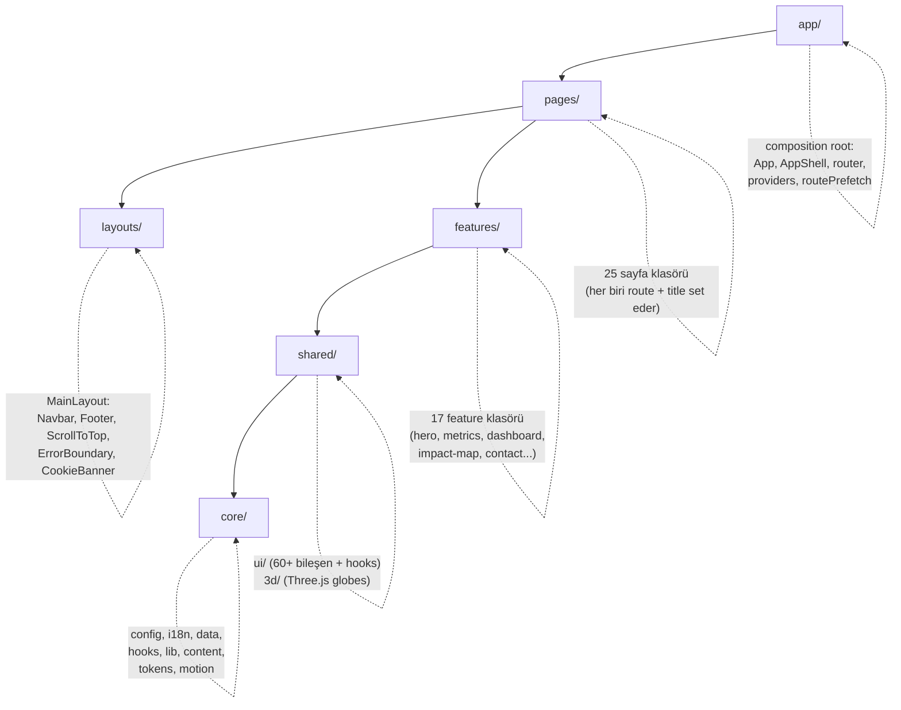

### Katman Kuralları

1. **app/** — Composition root. Router, providers, entry point'ler burada yaşar. Sadece alt katmanları birleştirir.
2. **pages/** — Her route için bir klasör. Feature section'ları compose eder, `useDocumentMeta` ile `<title>` set eder.
3. **layouts/** — Kalıcı kabuk. Navbar, Footer, ErrorBoundary, ScrollProgress, overlay'ler (CommandPalette, OnboardingTour).
4. **features/** — Bağımsız, kendi kendine yeten UI bölümleri (hero, metrics, dashboard vb.). Birbirine bağımlı değildir.
5. **shared/** — Yeniden kullanılabilir primitivler, hook'lar, Three.js globe bileşenleri. Feature'lardan bağımsız.
6. **core/** — Sıfır UI kodu. Konfigürasyon, i18n, veri modülleri, saf yardımcı kütüphaneler, hook'lar.

## Klasör Yapısı

```
ecozyon-tech/
├── api/                          # Vercel serverless fonksiyonlar
│   ├── _lib/                     # Paylaşılan saf mantık (unit-tested)
│   │   ├── auth/                 # Admin oturum yönetimi
│   │   │   ├── admin.auth.js     # E-posta/şifre login handler'ları
│   │   │   └── session.js        # HMAC-signed httpOnly cookie
│   │   ├── db/                   # Veritabanı katmanı (Neon Postgres)
│   │   │   ├── posts.db.js       # Blog CRUD + listPublished
│   │   │   ├── contacts.db.js    # İletişim formu kayıtları
│   │   │   ├── careers.db.js     # İş başvuruları
│   │   │   ├── newsletter.db.js  # Bülten abonelikleri
│   │   │   └── jobs.db.js        # İş ilanları CRUD
│   │   └── handlers/             # HTTP handler'ları
│   │       ├── forms.js          # contact/newsletter/apply (rate limit + honeypot)
│   │       ├── admin-posts.js    # Admin post CRUD
│   │       ├── admin-contacts.js # Admin iletişim yönetimi
│   │       ├── admin-careers.js  # Admin kariyer yönetimi
│   │       ├── admin-newsletter.js
│   │       ├── social.js         # LinkedIn yayınlama
│   │       ├── telemetry.js      # Event ingestion
│   │       └── vitals.js         # Web Vitals ingestion
│   ├── admin/                    # Admin API route dosyaları
│   │   ├── _send.js              # applyResult + originOf yardımcıları
│   │   ├── login.js, logout.js, me.js, callback.js
│   │   ├── posts.js, posts/      # Dinamik post route'ları
│   │   └── jobs.js, jobs/        # Dinamik job route'ları
│   ├── contact.js                # POST /api/contact
│   ├── newsletter.js             # POST /api/newsletter
│   ├── apply.js                  # POST /api/apply
│   ├── posts.js                  # GET /api/posts
│   ├── vitals.js                 # POST /api/vitals
│   ├── telemetry.js              # POST /api/telemetry
│   └── jobs.js                   # GET /api/jobs
│
├── src/
│   ├── app/                      # Composition root
│   │   ├── App.jsx               # BrowserRouter > AppShell
│   │   ├── AppShell.jsx          # AppProvider > ToastProvider > CustomCursor > AppRoutes
│   │   ├── router.jsx            # Route elements (lazy + Suspense)
│   │   ├── routes.js             # path → lazy import thunk tablosu
│   │   ├── routePrefetch.js      # Hover/focus chunk ısıtma
│   │   └── providers/
│   │       └── AppProvider.jsx   # Paylaşılan state (lang/theme/fonts/accents)
│   │
│   ├── pages/                    # 25 sayfa klasörü
│   │   ├── Home/, Services/, Impact/, About/, Contact/
│   │   ├── Blog/, BlogPost/, BlogTag/
│   │   ├── Careers/, Cases/, CaseStudy/
│   │   ├── Legal/, Pricing/, NotFound/
│   │   ├── Help/, Glossary/, Developers/, Changelog/
│   │   ├── Press/, Search/, Sitemap/, Styleguide/
│   │   ├── Roi/, Assessment/, Accessibility/
│   │   └── Admin/                # Kasıtlı olarak ROUTES dışı
│   │
│   ├── layouts/Main/             # Kalıcı sayfa kabuğu
│   │   ├── index.jsx             # MainLayout (Navbar + Outlet + Footer + overlays)
│   │   ├── Navbar.jsx            # Mega-menu, dil/tema toggle
│   │   ├── Footer.jsx            # Sütunlu footer
│   │   └── CookieBanner.jsx      # KVKK uyumlu çerez bildirimi
│   │
│   ├── features/                 # 17 feature section
│   │   ├── hero/                 # Ana sayfa hero section
│   │   ├── metrics/              # Animasyonlu sayı kartları
│   │   ├── tech-ecosystem/       # Teknoloji stack gösterimi
│   │   ├── use-cases/            # Kullanım senaryoları
│   │   ├── how-it-works/         # Nasıl çalışır adımları
│   │   ├── dashboard/            # Canlı dashboard demo
│   │   ├── impact-map/           # 3D etki haritası
│   │   ├── about/                # Hakkımızda section'ları
│   │   ├── contact/              # İletişim formu
│   │   ├── calculator/           # ROI hesaplayıcı
│   │   ├── faq/                  # SSS accordion
│   │   ├── testimonials/         # Referanslar carousel
│   │   ├── newsletter-block/     # Bülten CTA
│   │   ├── process-timeline/     # Süreç zaman çizelgesi
│   │   ├── home-extras/          # Ana sayfa ek bölümleri
│   │   ├── culture-grid/         # Kültür grid gösterimi
│   │   └── dev-tweaks/           # DEV-only tasarım paneli (ship edilmez)
│   │
│   ├── shared/
│   │   ├── ui/                   # 60+ paylaşılan bileşen + hook
│   │   │   ├── primitives.jsx    # PageHeader, SectionHeader, Tag, vb.
│   │   │   ├── Modal.jsx, Toast.jsx, Tooltip.jsx
│   │   │   ├── CommandPalette.jsx, OnboardingTour.jsx
│   │   │   ├── charts/           # BarChart, PieChart, geometry.js
│   │   │   ├── useInView.js, useReveal.jsx, useFocusTrap.js
│   │   │   └── ... (60+ dosya)
│   │   └── 3d/                   # Three.js globe bileşenleri
│   │       ├── EcoGlobe.jsx      # Dekoratif AI motifli globe (Home)
│   │       ├── WorldGlobe.jsx    # Veri odaklı coğrafi globe
│   │       └── LazyGlobes.jsx    # Lazy Suspense wrapper
│   │
│   ├── core/
│   │   ├── config/site.js        # SITE, ROUTES, NAV_GROUPS, FOOTER_GROUPS
│   │   ├── i18n/                 # Sözlük sistemi
│   │   │   ├── dictionary.js     # import.meta.glob ile otomatik assembly
│   │   │   └── ns/               # 40 namespace dosyası
│   │   ├── data/                 # Veri modülleri (posts, cities, jobs, geo...)
│   │   ├── lib/                  # Saf yardımcı kütüphaneler
│   │   ├── content/registry.js   # İçerik arama kaydı
│   │   ├── hooks/                # useDocumentMeta, useAllPosts, useAllJobs
│   │   ├── tokens.js             # BRAND, SEMANTIC, GRADIENTS
│   │   └── motion.js             # EASING, DURATION, prefersReducedMotion
│   │
│   ├── test/                     # Vitest setup + cross-cutting testler
│   ├── index.css                 # Global stiller, CSS vars, @font-face
│   ├── main.jsx                  # Client entry (hydrate veya render)
│   └── entry-server.jsx          # SSR entry (prerenderToNodeStream)
│
├── scripts/
│   ├── prerender.mjs             # Post-build SSG (HTML + sitemap + OG cards)
│   ├── build-geo.mjs             # Natural Earth → JSON coğrafi veri
│   ├── check-bundle.mjs          # Bundle boyut bütçesi kontrolü
│   └── seed-posts.mjs            # Statik postları DB'ye aktarma
│
├── public/                       # Statik varlıklar
│   ├── sw.js                     # Service worker (hand-rolled)
│   ├── offline.html              # Çevrimdışı fallback
│   ├── manifest.webmanifest      # PWA manifest
│   └── fonts/                    # Self-hosted woff2 fontlar
│
├── e2e/                          # Playwright e2e testleri (7 spec)
├── data-src/                     # Ham coğrafi veri (gitignored)
├── index.html                    # HTML template (SSR placeholder'ları)
├── vite.config.js                # Vite + React + dev API middleware
├── tailwind.config.js            # Token-driven Tailwind config
├── vercel.json                   # CSP, HSTS, cache, rewrite kuralları
├── eslint.config.js              # ESLint 9 flat config
├── playwright.config.js          # E2E test config
├── jsconfig.json                 # @/ → src/ alias
└── package.json                  # Scripts + dependencies
```

## Veri Akış Diyagramı

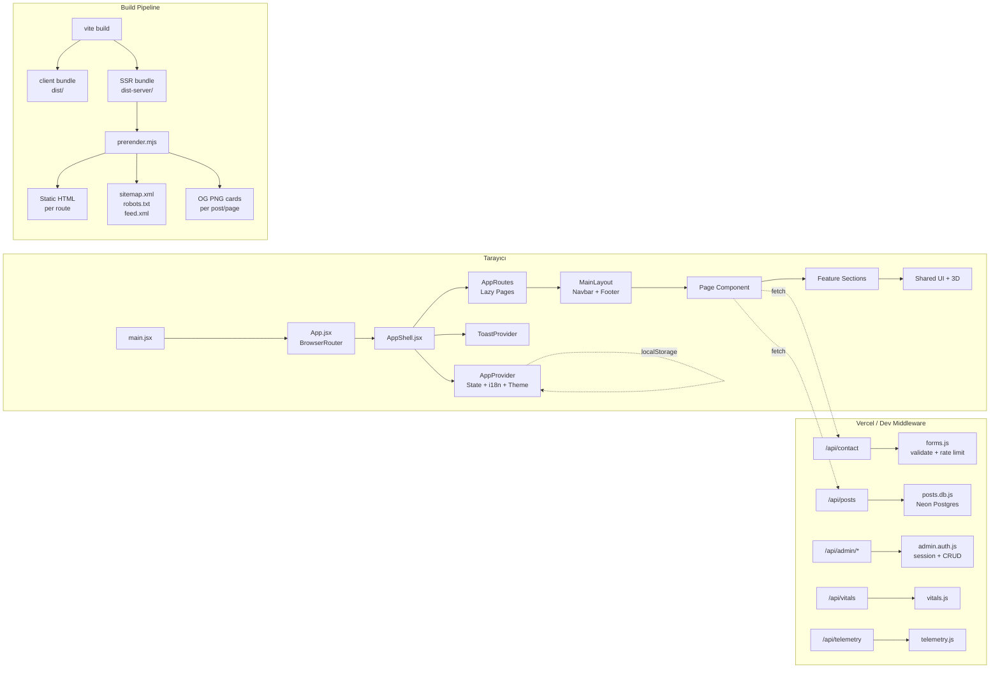

## Build Pipeline

Build süreci üç aşamalıdır:

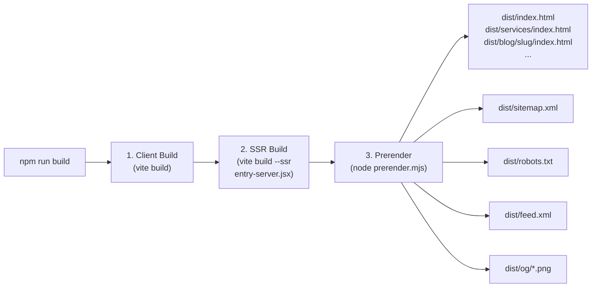

1. **Client Build** — Vite, React uygulamasını client tarafı chunk'lara böler. `manualChunks` ile Three.js (`three`) ve React/ReactDOM/Router (`vendor`) ayrı chunk'lara ayrılır.
2. **SSR Build** — `entry-server.jsx` Node.js için derlenir. `prerenderToNodeStream` + `StaticRouter` kullanır.
3. **Prerender** — `scripts/prerender.mjs` her route için statik HTML üretir. Per-route `<title>`, `<meta>`, canonical, hreflang, JSON-LD enjekte eder. OG kartlarını SVG → PNG olarak rasterize eder.

## Entry Points

| Entry | Dosya | Açıklama |
|-------|-------|----------|
| Client | `src/main.jsx` | `hydrateRoot` (prod) veya `createRoot` (dev). Web Vitals + SW kaydı. |
| Server | `src/entry-server.jsx` | `prerenderToNodeStream` → HTML string. Sadece build-time. |
| HTML | `index.html` | Template. `<!--ssr-head-->` ve `<!--ssr-outlet-->` placeholder'ları. |

### Hidrasyon Stratejisi

```javascript
// main.jsx — prerendered HTML varsa hydrate, yoksa render
const root = document.getElementById('root');
if (root.firstElementChild) {
  hydrateRoot(root, tree);  // Production: SSG HTML var
} else {
  createRoot(root).render(tree);  // Dev: boş root
}
```

## Chunk Stratejisi

Vite'ın `manualChunks` yapılandırması:

| Chunk | İçerik | Boyut (gz) |
|-------|--------|------------|
| `entry` | App, AppShell, router, providers, MainLayout | ~38 kB |
| `vendor` | React, ReactDOM, React Router | ayrı chunk |
| `three` | Three.js kütüphanesi | ayrı chunk (lazy) |
| `page-*` | Her lazy-loaded sayfa | ayrı chunk |
| `CommandPalette` | ⌘K palette + content registry | idle-mount lazy chunk |
| `OnboardingTour` | İlk ziyaret turu | idle-mount lazy chunk |

**Budget:** Entry chunk ≤ 48 kB (gz), `scripts/check-bundle.mjs` ile CI'da kontrol edilir.

---

## İlgili Dokümanlar

- [02 — Routing and Pages](./02-routing-and-pages.md)
- [03 — State Management](./03-state-management.md)
- [05 — Design Tokens](./05-design-tokens.md)
- [10 — SEO & Prerender](./10-seo-prerender.md)
- [12 — CI/CD & Deployment](./12-ci-cd-deployment.md)


---

# 02 — Sayfa ve Rota Haritası (Routing & Pages)

> Tüm sayfaların detaylı açıklaması, route tablosu, lazy loading mekanizması,
> prefetch stratejisi ve navigasyon bilgi mimarisi.

---

## İçindekiler

- [Route Mimarisi](#route-mimarisi)
- [Sayfa Tablosu](#sayfa-tablosu)
- [Navigasyon Bilgi Mimarisi (IA)](#navigasyon-bilgi-mimarisi-ia)
- [Lazy Loading ve Suspense](#lazy-loading-ve-suspense)
- [Route Prefetch](#route-prefetch)
- [Sayfa Yapısı Kuralları](#sayfa-yapısı-kuralları)
- [Admin Route](#admin-route)
- [İlgili Dokümanlar](#i̇lgili-dokümanlar)

---

## Route Mimarisi

Route yönetimi iki dosya arasında bölünmüştür:

| Dosya | Sorumluluk |
|-------|-----------|
| `src/app/routes.js` | `path → lazy import` thunk tablosu. Component import'u yok, döngü riski yok. |
| `src/core/config/site.js` | Her route'un meta verisi: title, description, group, place, featured. |

### Ayrım Nedeni

`routes.js` kasıtlı olarak component-free tutulur. Hem `router.jsx` hem
`routePrefetch.js` buradan import yapar — eğer `MainLayout` import edilseydi
döngüsel bağımlılık (circular dependency) oluşurdu.

```
routes.js ←── router.jsx (lazy elements oluşturur)
    ↑
    └──── routePrefetch.js (hover/focus ile chunk ısıtır)
```

## Sayfa Tablosu

### Product Grubu

| Path | Key | Sayfa | Açıklama |
|------|-----|-------|----------|
| `/` | home | Home | Hero + Metrics + EcoGlobe (dekoratif 3D globe) |
| `/services` | services | Services | How It Works · Tech Ecosystem · Use Cases · Dashboard (compact globe) |
| `/impact` | impact | Impact | İnteraktif 3D etki haritası (gerçek coğrafya, WorldGlobe full mode) |
| `/roi` | roi | Roi | Kurumsal ROI hesaplayıcı (çalışan sayısı → tasarruf/emisyon/geri dönüş) |
| `/assessment` | assessment | Assessment | Sürdürülebilirlik olgunluk değerlendirme anketi |

### Resources Grubu

| Path | Key | Sayfa | Açıklama |
|------|-----|-------|----------|
| `/blog` | blog | Blog | Veri odaklı makale listesi (DB + static merge) |
| `/blog/:slug` | — | BlogPost | Bireysel blog yazısı (structured body, related posts) |
| `/blog/tag/:tag` | — | BlogTag | Etiket filtrelenmiş blog listesi |
| `/cases` | cases | Cases | Vaka çalışmaları listesi |
| `/cases/:slug` | — | CaseStudy | Bireysel vaka çalışması detayı |
| `/glossary` | glossary | Glossary | Sürdürülebilirlik terimleri sözlüğü (aranabilir, filtrelenebilir) |
| `/help` | help | Help | SSS / Yardım merkezi (accordion formatında) |
| `/developers` | developers | Developers | API referans dokümantasyonu |
| `/changelog` | changelog | Changelog | Sürüm notları zaman çizelgesi |

### Company Grubu

| Path | Key | Sayfa | Açıklama |
|------|-----|-------|----------|
| `/about` | about | About | Misyon / vizyon / değerler / ekip |
| `/careers` | careers | Careers | Açık pozisyonlar + başvuru modalı |
| `/press` | press | Press | Basın bültenleri + medya varlıkları |
| `/contact` | contact | Contact | Gerçek form → `/api/contact` serverless endpoint |

### Legal / Utility Grubu

| Path | Key | Sayfa | Açıklama |
|------|-----|-------|----------|
| `/legal` | legal | Legal | Gizlilik (KVKK) + Kullanım şartları (`#privacy` / `#terms`) |
| `/accessibility` | accessibility | Accessibility | Erişilebilirlik beyanı (WCAG uyumu) |
| `/sitemap` | sitemap | Sitemap | Tüm sayfaların görsel haritası |
| `/styleguide` | styleguide | Styleguide | Tasarım sistemi vitrine sayfası |
| `/search` | search | Search | Tam sayfa arama (⌘K'nın dedicated versiyonu) |

### Özel Route'lar

| Path | Key | Sayfa | Açıklama |
|------|-----|-------|----------|
| `/admin` | — | Admin | CMS paneli. **ROUTES'ta yok** → prerender edilmez, sitemap'te yok, robots-disallowed. |
| `*` | — | NotFound | Gerçek iki dilli 404 sayfası (popüler sayfa chip'leri ile) |

## Navigasyon Bilgi Mimarisi (IA)

Her route bir `group` ve bir `place` taşır:

```javascript
// src/core/config/site.js
{
  path: '/services',
  key: 'services',
  group: 'product',      // IA bucket
  place: 'nav',          // 'nav' | 'footer' | 'none'
  featured: true,         // NotFound "popüler sayfalar" chip'lerinde gösterilir
  nav: { tr: 'Hizmetler', en: 'Services' },
  title: { tr: '...', en: '...' },
  description: { tr: '...', en: '...' },
}
```

### Gruplar

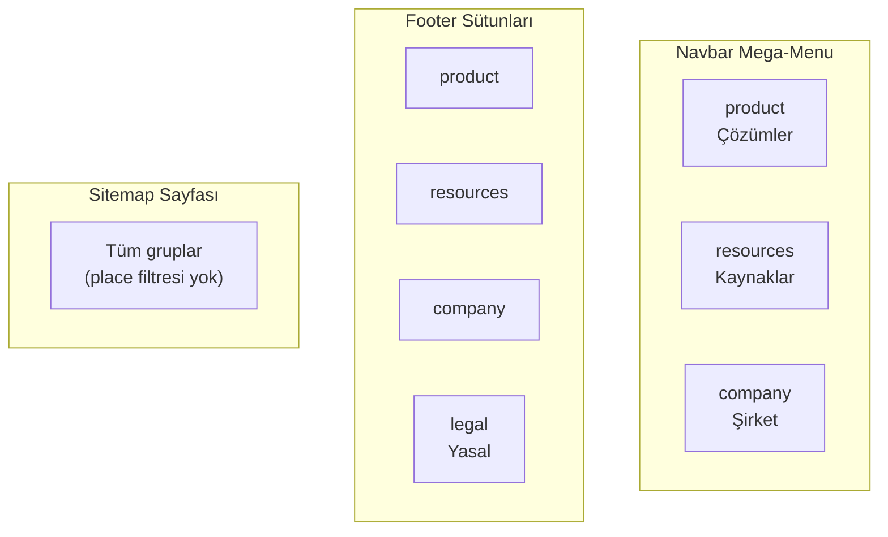

### Türetme Mekanizması

Navbar, Footer ve Sitemap **tek bir kaynak**tan türetilir:

```javascript
// NAV_GROUPS → Navbar mega-menu
export const NAV_GROUPS = [
  { id: 'product', label: { tr: 'Çözümler', en: 'Solutions' } },
  { id: 'resources', label: { tr: 'Kaynaklar', en: 'Resources' } },
  { id: 'company', label: { tr: 'Şirket', en: 'Company' } },
];

// FOOTER_GROUPS → Footer sütunları (NAV_GROUPS + legal)
export const FOOTER_GROUPS = [
  ...NAV_GROUPS,
  { id: 'legal', label: { tr: 'Yasal', en: 'Legal' } },
];

// routesInGroup(groupId, places?) → belirli gruptaki route'lar
routesInGroup('product', ['nav']);  // Navbar'da görünen product route'ları
routesInGroup('legal');            // Legal grubundaki tüm route'lar (sitemap)

// NAV_ITEMS → featured: true olan route'lar (NotFound chip'leri)
export const NAV_ITEMS = ROUTES.filter((r) => r.featured);
```

### Place Değerleri

| Place | Navbar | Footer | Sitemap |
|-------|--------|--------|---------|
| `nav` | ✅ | ✅ | ✅ |
| `footer` | ❌ | ✅ | ✅ |
| `none` | ❌ | ❌ | ✅ |

## Lazy Loading ve Suspense

Her sayfa `React.lazy()` ile yüklenir:

```javascript
// src/app/routes.js — thunk tablosu
export const ROUTE_LOADERS = [
  { index: true, load: () => import('@/pages/Home') },
  { path: 'services', load: () => import('@/pages/Services') },
  // ...
];

// src/app/router.jsx — lazy element'leri oluşturur
const ROUTE_ELEMENTS = ROUTE_LOADERS.map((r) => ({
  ...r,
  Comp: lazy(r.load),  // modül yükleme anında bir kez oluşturulur
}));
```

### Suspense Fallback

Sayfa chunk'ı yüklenirken yapısal bir iskelet gösterilir:

```jsx
// router.jsx — PageFallback
function PageFallback() {
  return (
    <div className="mx-auto max-w-6xl px-6 py-20 lg:py-28" aria-busy="true">
      {/* Eyebrow + başlık + giriş paragrafı iskeleti */}
      <Skeleton className="h-4 w-24" />
      <Skeleton className="h-10 w-3/4" />
      <Skeleton className="h-4 w-full" />
      {/* 3'lü kart grid iskeleti */}
      <CardSkeleton /> <CardSkeleton /> <CardSkeleton />
    </div>
  );
}
```

## Route Prefetch

`src/app/routePrefetch.js` — dahili linklere hover/focus yapıldığında ilgili
chunk'ı önceden yükler. Navigasyon anında geçiş anında olur.

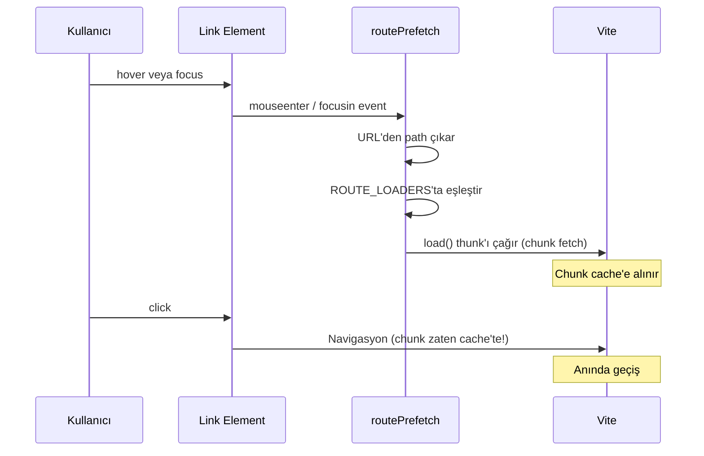

### Save-Data Awareness

`routePrefetch.js`, `navigator.connection.saveData` kontrolü yapar. Save-Data
aktifse prefetch devre dışı kalır — kullanıcının bant genişliğine saygı gösterilir.

## Sayfa Yapısı Kuralları

1. **Tek `<h1>` kuralı** — Her route sayfası tam olarak bir `<h1>` içermelidir. Bu, `src/test/headers.test.js` tarafından test-enforced'dur.
2. **`useDocumentMeta`** — Her sayfa `document.title`'ı `site.js`'teki tanıma göre set eder.
3. **`t` prop pattern** — Sayfalar `useApp()` ile aldıkları `t` (translation dictionary) prop'unu feature section'lara iletir.
4. **Feature section composition** — Sayfalar doğrudan UI yazmaz, feature section bileşenlerini compose eder.

## Admin Route

`/admin` route'u **kasıtlı olarak** normal route akışının dışındadır:

- `routes.js`'te var (lazy chunk olarak yüklenir)
- `site.js` `ROUTES`'ta **yok** → prerender edilmez
- `sitemap.xml`'de **yok**
- Navbar/Footer'da **yok**
- `robots.txt`'de `Disallow: /admin`
- Kendi lazy chunk'ı ile entry bundle'ı büyütmez

---

## İlgili Dokümanlar

- [01 — Architecture Overview](./01-architecture-overview.md)
- [03 — State Management](./03-state-management.md)
- [10 — SEO & Prerender](./10-seo-prerender.md)
- [14 — Accessibility](./14-accessibility.md)


---

# 03 — State Yönetimi (State Management)

> AppProvider, useApp/useI18n hook'ları, tema geçişi (View Transition API),
> accent palette sistemi, localStorage kalıcılığı ve hidrasyon güvenliği.

---

## İçindekiler

- [Genel Bakış](#genel-bakış)
- [AppProvider](#appprovider)
- [State Yapısı (Prefs)](#state-yapısı-prefs)
- [Hidrasyon Güvenliği](#hidrasyon-güvenliği)
- [Tema Geçişi (View Transition API)](#tema-geçişi-view-transition-api)
- [Accent Palette Sistemi](#accent-palette-sistemi)
- [Background Tint](#background-tint)
- [Font Sistemi](#font-sistemi)
- [i18n Entegrasyonu](#i18n-entegrasyonu)
- [Kalıcılık (Persistence)](#kalıcılık-persistence)
- [Hook'lar](#hooklar)
- [CSS Değişkenleri](#css-değişkenleri)
- [İlgili Dokümanlar](#i̇lgili-dokümanlar)

---

## Genel Bakış

Uygulama state'i **tek bir Context** ile yönetilir — üçüncü parti state
kütüphanesi yoktur. `AppProvider` tüm kullanıcı tercihlerini (dil, tema,
fontlar, accent renkleri, arkaplan tonu) tutar, `localStorage`'a persist eder
ve CSS değişkenlerine yansıtır.

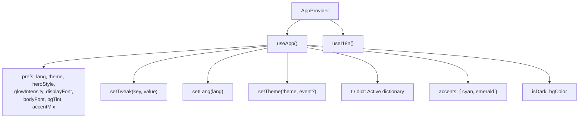

## AppProvider

**Dosya:** `src/app/providers/AppProvider.jsx`

```jsx
export function AppProvider({ children }) {
  const [prefs, setPrefs] = useState(DEFAULTS);
  // ... effects, memoized value
  return <AppContext.Provider value={value}>{children}</AppContext.Provider>;
}
```

### Bileşen Ağacındaki Yeri

```
App.jsx
└── BrowserRouter
    └── AppShell.jsx
        └── AppProvider          ← TÜM state burada
            └── ToastProvider
                └── CustomCursor
                    └── AppRoutes
                        └── MainLayout
                            └── Page → Feature Sections
```

## State Yapısı (Prefs)

```javascript
const DEFAULTS = {
  lang: 'tr',                    // Aktif dil: 'tr' | 'en'
  theme: 'light',               // Tema: 'light' | 'dark'
  heroStyle: 'globe',           // Hero stili (gelecek kullanım)
  glowIntensity: 1,             // Glow efekt yoğunluğu
  displayFont: 'Space Grotesk', // Başlık fontu
  bodyFont: 'Inter',            // Gövde fontu
  bgTint: 'slate',              // Arkaplan tonu
  accentMix: 'cyan-emerald',    // Accent renk paleti
};
```

## Hidrasyon Güvenliği

SSR prerender sırasında server HTML'i ile client'ın ilk render'ı **aynı olmalıdır**.
Bu nedenle `AppProvider` kritik bir strateji izler:

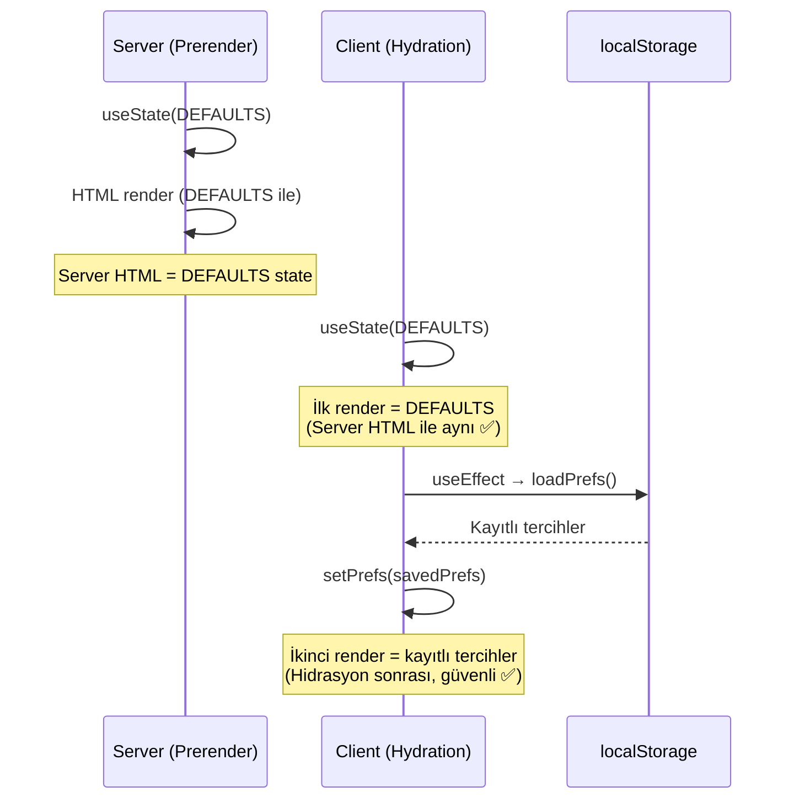

```javascript
useEffect(() => {
  // Post-hydration sync: DEFAULTS ile başla, sonra kayıtlı prefs uygula.
  let next = loadPrefs();
  // ?lang=tr|en query param override
  const q = new URLSearchParams(window.location.search).get('lang');
  if (q === 'tr' || q === 'en') next = { ...next, lang: q };
  // eslint-disable-next-line react-hooks/set-state-in-effect
  if (next !== DEFAULTS) setPrefs(next);
}, []);
```

> **Neden `set-state-in-effect` lint suppress?** Bu kasıtlı bir tek seferlik
> hidrasyon sonrası senkronizasyondur. Effect içinde setState normalde kötü
> pratiktir ama burada server-client uyumu sağlamak için zorunludur.

## Tema Geçişi (View Transition API)

Tema değiştirme, modern tarayıcılarda **View Transition API** ile akıcı bir
clip-path animasyonu çalıştırır:

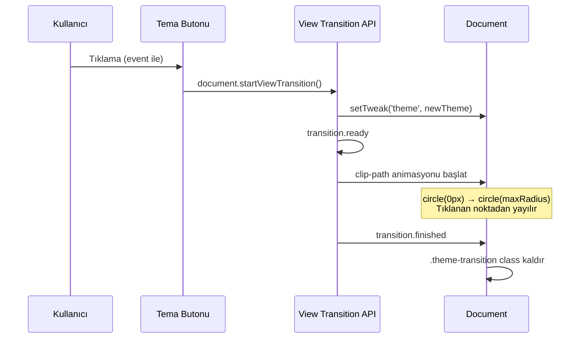

```javascript
setTheme: (v, e) => {
  // Reduced-motion veya API yoksa düz geçiş
  if (!document.startViewTransition || 
      window.matchMedia('(prefers-reduced-motion: reduce)').matches) {
    setTweak('theme', v);
    return;
  }

  document.documentElement.classList.add('theme-transition');
  const transition = document.startViewTransition(() => setTweak('theme', v));

  transition.ready.then(() => {
    const x = e.clientX || window.innerWidth / 2;
    const y = e.clientY || window.innerHeight / 2;
    const endRadius = Math.hypot(
      Math.max(x, window.innerWidth - x),
      Math.max(y, window.innerHeight - y)
    );
    document.documentElement.animate(
      { clipPath: [`circle(0px at ${x}px ${y}px)`, `circle(${endRadius}px at ${x}px ${y}px)`] },
      { duration: 500, easing: 'ease-in-out', pseudoElement: '::view-transition-new(root)' }
    );
  });
},
```

## Accent Palette Sistemi

Dört önceden tanımlı accent paleti:

| Anahtar | Cyan | Emerald | Görünüm |
|---------|------|---------|---------|
| `cyan-emerald` | `#0EA5E9` | `#10B981` | Marka varsayılanı (okyanus + yeşil) |
| `blue-violet` | `#2563EB` | `#7C3AED` | Kurumsal (mavi + mor) |
| `teal-lime` | `#0D9488` | `#65A30D` | Doğa (teal + lime) |
| `sky-rose` | `#0284C7` | `#E11D48` | Enerjik (gök mavi + gül) |

Accent renkler CSS değişkenlerine (`--ec-cyan`, `--ec-emerald`) yansıtılır ve
gradient'ler, 3D globe'lar, chart'lar ve UI bileşenleri tarafından tüketilir.

## Background Tint

Her tema modu için dört arkaplan tonu:

```javascript
export const BG_TINTS = {
  light: {
    slate: '#F8FAFC',  // Varsayılan: soğuk gri
    mint:  '#F4F7F6',  // Nane
    cream: '#F8F6F2',  // Krem
    sky:   '#F4F8FC',  // Gök
  },
  dark: {
    slate: '#0B1220',  // Varsayılan: derin lacivert
    mint:  '#0B1410',  // Koyu nane
    cream: '#13110D',  // Koyu krem
    sky:   '#0A101C',  // Koyu gök
  },
};
```

## Font Sistemi

İki font ekseni bağımsız olarak ayarlanabilir:

| Eksen | CSS Variable | Seçenekler |
|-------|-------------|------------|
| Display (Başlık) | `--font-display` | Space Grotesk, Syne, Sora, DM Sans |
| Body (Gövde) | `--font-body` | Inter, Plus Jakarta Sans, DM Sans, Manrope |

Font değişikliği `AppProvider`'ın `useEffect`'i ile `<html>` elementine CSS
variable olarak uygulanır. Tailwind'in `fontFamily` tanımları bu variable'ları
tüketir.

## i18n Entegrasyonu

`AppProvider`, aktif dile göre sözlüğü seçer:

```javascript
const lang = prefs.lang;
const dict = ECO_I18N[lang] || ECO_I18N.tr;
```

Sözlük, context value'da hem `dict` hem `t` olarak sunulur (kısayol).
Sayfalar `t` prop'unu feature section'lara iletir:

```jsx
// Bir sayfa bileşeni
function ServicesPage() {
  const { t } = useApp();
  return (
    <>
      <HowItWorks t={t} />
      <TechEcosystem t={t} />
      <UseCases t={t} />
      <Dashboard t={t} />
    </>
  );
}
```

## Kalıcılık (Persistence)

Tercihler `localStorage` key'i `ecozyon.prefs` altında JSON olarak saklanır:

```javascript
const STORAGE_KEY = 'ecozyon.prefs';

// Yazma (setTweak içinde)
window.localStorage.setItem(STORAGE_KEY, JSON.stringify(next));

// Okuma (loadPrefs)
const raw = window.localStorage.getItem(STORAGE_KEY);
return raw ? { ...DEFAULTS, ...JSON.parse(raw) } : DEFAULTS;
```

**Güvenlik:** `try/catch` ile sarılıdır — incognito modda veya storage dolu
olduğunda sessizce devam eder.

## Hook'lar

| Hook | Dönüş | Kullanım |
|------|-------|----------|
| `useApp()` | `{ prefs, setTweak, lang, setLang, theme, setTheme, t, dict, accents, isDark, bgColor }` | Tam state erişimi |
| `useI18n()` | `dict` (aktif dil sözlüğü) | Sadece çeviri gerektiğinde |

```javascript
// useApp — tam erişim
export function useApp() {
  const ctx = useContext(AppContext);
  if (!ctx) throw new Error('useApp must be used within <AppProvider>');
  return ctx;
}

// useI18n — sadece sözlük
export function useI18n() {
  return useApp().dict;
}
```

## CSS Değişkenleri

`AppProvider`'ın `useEffect`'i şu CSS değişkenlerini `<html>` elementine yazar:

| CSS Variable | Kaynak | Tüketici |
|-------------|--------|----------|
| `--bg` | `BG_TINTS[theme][bgTint]` | `MainLayout` background |
| `--font-display` | `prefs.displayFont` | Tailwind `font-display` |
| `--font-body` | `prefs.bodyFont` | Tailwind `font-sans`, `font-body` |
| `--ec-cyan` | `ACCENT_PALETTES[accentMix].cyan` | Gradient'ler, globe, chart |
| `--ec-emerald` | `ACCENT_PALETTES[accentMix].emerald` | Gradient'ler, globe, chart |

Ek olarak `<html>` elementine:
- `class="dark"` toggle (Tailwind dark mode)
- `lang="tr"` veya `lang="en"` attribute

---

## İlgili Dokümanlar

- [01 — Architecture Overview](./01-architecture-overview.md)
- [04 — Internationalization](./04-internationalization.md)
- [05 — Design Tokens](./05-design-tokens.md)
- [06 — UI Components](./06-ui-components.md)


---

# 04 — Uluslararasılaştırma (Internationalization — i18n)

> İki dilli (TR/EN) sözlük sistemi, namespace mimarisi, `import.meta.glob` ile
> otomatik keşif ve test-enforced key parity.

---

## İçindekiler

- [Genel Bakış](#genel-bakış)
- [Sözlük Mimarisi](#sözlük-mimarisi)
- [Namespace Dosyaları](#namespace-dosyaları)
- [Otomatik Keşif (import.meta.glob)](#otomatik-keşif-importmetaglob)
- [Kullanım Kalıpları](#kullanım-kalıpları)
- [Key Parity Testi](#key-parity-testi)
- [Yeni Namespace Ekleme](#yeni-namespace-ekleme)
- [Hreflang ve Dil Değiştirme](#hreflang-ve-dil-değiştirme)
- [İlgili Dokümanlar](#i̇lgili-dokümanlar)

---

## Genel Bakış

Ecozyon Tech, kendi üretimi (framework'süz) bir i18n sistemi kullanır:

- İki dil desteklenir: **Türkçe (TR)** ve **İngilizce (EN)**
- Çeviriler namespace bazlı dosyalarda yaşar
- `import.meta.glob` ile otomatik keşfedilir (yeni dosya = yeni namespace)
- TR/EN key eşliği (deep nested dahil) test ile zorunlu tutulur
- Üçüncü parti i18n kütüphanesi **yoktur**

## Sözlük Mimarisi

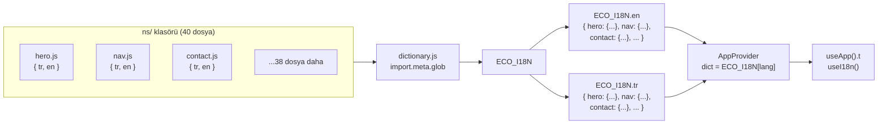

## Namespace Dosyaları

Her namespace dosyası `src/core/i18n/ns/` altında yaşar ve `{ tr, en }` objesi
default export eder:

```javascript
// src/core/i18n/ns/hero.js
export default {
  tr: {
    eyebrow: 'AI + Sürdürülebilirlik + Giyilebilir Teknoloji',
    headline: 'Sürdürülebilir geleceği\nbugünden inşa edin',
    subtext: 'Ecozyon Tech, giyilebilir sensörler ve akıllı AI ile...',
    cta: 'Keşfet',
    ctaSecondary: 'Nasıl Çalışır?',
  },
  en: {
    eyebrow: 'AI + Sustainability + Wearable Technology',
    headline: 'Build a sustainable\nfuture today',
    subtext: 'Ecozyon Tech turns individual and corporate sustainability...',
    cta: 'Explore',
    ctaSecondary: 'How It Works',
  },
};
```

### Tam Namespace Listesi (40 adet)

| Namespace | İçerik | Yaklaşık Anahtar Sayısı |
|-----------|--------|------------------------|
| `a11y` | Erişilebilirlik etiketleri (skip link, back to top) | ~5 |
| `about` | Hakkımızda sayfası (misyon, vizyon, ekip) | ~50+ |
| `accessibility` | Erişilebilirlik beyanı | ~10 |
| `admin` | Admin paneli (login, editor, list) | ~40 |
| `assessment` | Sürdürülebilirlik değerlendirme anketi | ~30 |
| `blog` | Blog listesi ve post sayfası | ~15 |
| `calc` | ROI hesaplayıcı etiketleri | ~15 |
| `careers` | Kariyer sayfası (başvuru, filtre) | ~15 |
| `cases` | Vaka çalışmaları | ~15 |
| `changelog` | Sürüm notları | ~5 |
| `cmd` | Command palette etiketleri (⌘K) | ~10 |
| `compare` | Fiyat karşılaştırma tablosu | ~15 |
| `contact` | İletişim formu (alanlar, hata mesajları) | ~40+ |
| `cookies` | Çerez banner metinleri | ~5 |
| `dash` | Dashboard bölümü etiketleri | ~10 |
| `developers` | API referans sayfası | ~10 |
| `faq` | SSS bölümü | ~15 |
| `footer` | Footer etiketleri | ~10 |
| `glossary` | Sözlük sayfası filtreleri | ~10 |
| `help` | Yardım merkezi | ~10 |
| `hero` | Ana sayfa hero section | ~10 |
| `home` | Ana sayfa ek bölümleri | ~15 |
| `howItWorks` | Nasıl çalışır adımları | ~20 |
| `impactMap` | 3D etki haritası etiketleri | ~25 |
| `integrations` | Entegrasyon sayfası | ~15 |
| `leaderboard` | Liderlik tablosu | ~15 |
| `metrics` | Metrik kartları (sayılar + açıklamalar) | ~20 |
| `nav` | Navigasyon etiketleri | ~5 |
| `press` | Basın odası | ~10 |
| `related` | İlgili içerikler bölümü | ~5 |
| `resources` | Kaynak sayfaları ortak etiketleri | ~20 |
| `roi` | ROI hesaplayıcı sonuçları | ~15 |
| `search` | Arama sayfası etiketleri | ~10 |
| `sitemap` | Site haritası | ~5 |
| `status` | Durum sayfası | ~10 |
| `styleguide` | Tasarım sistemi etiketleri | ~25 |
| `tech` | Teknoloji ekosistemi bölümü | ~30 |
| `testimonials` | Referanslar carousel | ~10 |
| `tour` | Onboarding turu adımları | ~10 |
| `useCases` | Kullanım senaryoları | ~30 |

## Otomatik Keşif (import.meta.glob)

```javascript
// src/core/i18n/dictionary.js
const modules = import.meta.glob('./ns/*.js', { eager: true });

const tr = {};
const en = {};
for (const [path, mod] of Object.entries(modules)) {
  const name = path.slice(path.lastIndexOf('/') + 1, -3);
  tr[name] = mod.default.tr;
  en[name] = mod.default.en;
}

export const ECO_I18N = { tr, en };
```

**Avantaj:** Yeni bir namespace eklemek için sadece `ns/` altına dosya bırakmak
yeterlidir. `dictionary.js` dosyasında hiçbir düzenleme gerekmez.

## Kullanım Kalıpları

### Sayfa Bileşeninde

```jsx
function ServicesPage() {
  const { t } = useApp();
  return (
    <>
      <PageHeader
        eyebrow={t.tech.eyebrow}
        title={t.tech.heading}
        intro={t.tech.intro}
      />
      <HowItWorks t={t} />
    </>
  );
}
```

### Feature Section'da

```jsx
function HowItWorks({ t }) {
  return (
    <section>
      <SectionHeader title={t.howItWorks.title} />
      {t.howItWorks.steps.map((step, i) => (
        <StepCard key={i} title={step.title} desc={step.desc} />
      ))}
    </section>
  );
}
```

### İç İçe (Nested) Anahtarlar

Namespace dosyaları nested objeler içerebilir:

```javascript
// ns/contact.js
export default {
  tr: {
    form: {
      name: { label: 'Ad Soyad', placeholder: 'Adınızı girin', error: 'Gerekli' },
      email: { label: 'E-posta', placeholder: 'ornek@sirket.com', error: 'Geçersiz' },
    },
    success: { title: 'Mesajınız alındı!', body: '24 saat içinde dönüş yapacağız.' },
  },
  en: { /* aynı yapı */ },
};
```

## Key Parity Testi

`src/core/i18n/dictionary.test.js` **deep** key parity zorunlu kılar:

```javascript
// Her TR anahtarı EN'de de olmalı ve tersi.
// Nested key'ler dahil (ör. contact.form.name.label)
```

Bu test, bir dile çeviri eklenip diğerine eklenmesinin unutulmasını engeller.
CI pipeline'da çalışır — eksik key varsa build kırılır.

## Yeni Namespace Ekleme

1. `src/core/i18n/ns/` altına yeni bir dosya oluştur (ör. `myFeature.js`)
2. `{ tr, en }` objesi default export et
3. **Otomatik:** `dictionary.js` glob ile yeni dosyayı bulur
4. **Otomatik:** `dictionary.test.js` key parity'yi doğrular
5. Bileşende `t.myFeature.someKey` ile kullan

**Ekleme adımında düzenlenmesi gereken dosya: SIFIR.**

## Hreflang ve Dil Değiştirme

### URL-based Dil Override

`?lang=en` query parametresi, kaydedilmiş dili geçersiz kılar:

```javascript
// AppProvider useEffect (hidrasyon sonrası)
const q = new URLSearchParams(window.location.search).get('lang');
if (q === 'tr' || q === 'en') next = { ...next, lang: q };
```

### Hreflang Etiketleri

Prerender, her route için TR/EN/x-default hreflang etiketleri yazar:

```html
<link rel="alternate" hreflang="tr" href="https://ecozyon.tech/services" />
<link rel="alternate" hreflang="en" href="https://ecozyon.tech/services?lang=en" />
<link rel="alternate" hreflang="x-default" href="https://ecozyon.tech/services" />
```

Aynı yapı `sitemap.xml`'de de tekrarlanır.

---

## İlgili Dokümanlar

- [03 — State Management](./03-state-management.md)
- [10 — SEO & Prerender](./10-seo-prerender.md)
- [11 — Testing Strategy](./11-testing-strategy.md)


---

# 05 — Design Token Sistemi (Design Tokens)

> Renk, tipografi, motion, gradient token'ları ve CSS değişkenleriyle
> entegrasyonunun detaylı açıklaması.

---

## İçindekiler

- [Genel Bakış](#genel-bakış)
- [Renk Token'ları (tokens.js)](#renk-tokenları-tokensjs)
- [Motion Token'ları (motion.js)](#motion-tokenları-motionjs)
- [CSS Custom Properties](#css-custom-properties)
- [Tailwind Entegrasyonu](#tailwind-entegrasyonu)
- [Gradient Sistemi](#gradient-sistemi)
- [Token Akışı](#token-akışı)
- [İlgili Dokümanlar](#i̇lgili-dokümanlar)

---

## Genel Bakış

Ecozyon Tech, tasarım değerlerini **tek bir kaynaktan** (single source of truth)
yönetir. Token'lar JS modülleri olarak tanımlanır ve hem Tailwind hem CSS
custom properties hem de runtime JS (globe, chart, OG card) tarafından tüketilir.

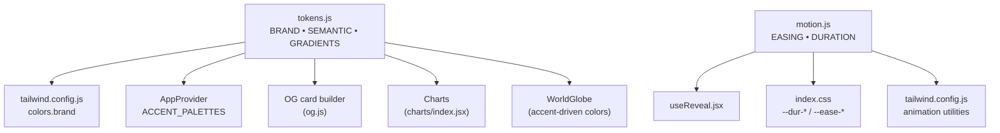

## Renk Token'ları (tokens.js)

**Dosya:** `src/core/tokens.js`

### BRAND — Marka Accent Renkleri

```javascript
export const BRAND = {
  cyan:    '#0EA5E9',  // Ana marka accent (okyanus mavisi)
  emerald: '#10B981',  // İkincil marka accent (yeşil)
};
```

Bu iki renk tüm marka görselliğinin temelidir. Gradient'ler, globe renkleri,
chart vurguları ve OG card arka planları buradan türetilir.

### SEMANTIC — Sabit Anlamsal Renkler

```javascript
export const SEMANTIC = {
  amber:    '#F59E0B',  // Uyarı / sarı vurgu
  rose:     '#E11D48',  // Hata / kırmızı vurgu
  violet:   '#7C3AED',  // Mor vurgu
  slate900: '#0F172A',  // Koyu metin
  slate400: '#94A3B8',  // Soluk metin
};
```

Semantic renkler accent değişikliklerinden **bağımsızdır** — accent palette
değiştirildiğinde bile bu renkler sabit kalır.

### GRADIENTS — Kanonik Gradient'ler

```javascript
export const GRADIENTS = {
  // Başlık text gradient (.eco-gradient-text CSS utility)
  brand: `linear-gradient(110deg, ${BRAND.cyan} 0%, ${BRAND.emerald} 100%)`,
  // CTA buton dolgusu (farklı açı)
  cta:   `linear-gradient(120deg, ${BRAND.cyan} 0%, ${BRAND.emerald} 100%)`,
  // Panel arkaplanı (düşük opaklık)
  panel: 'linear-gradient(120deg, rgba(14,165,233,.08), rgba(16,185,129,.08))',
};
```

> **Kural:** Inline `linear-gradient()` kullanmak yasaktır — her zaman
> `GRADIENTS.cta`, `GRADIENTS.panel` veya `.eco-gradient-text` kullanılmalıdır.

## Motion Token'ları (motion.js)

**Dosya:** `src/core/motion.js`

### EASING — Hareket Eğrileri

```javascript
export const EASING = {
  out:   'cubic-bezier(.16, 1, .3, 1)',   // Yavaşlayan — reveal / enter
  inOut: 'cubic-bezier(.65, 0, .35, 1)',  // Simetrik — move / toggle
};
```

### DURATION — Süre Token'ları

```javascript
export const DURATION = {
  fast:   180,  // Hızlı UI geçişleri (ms)
  base:   280,  // Standart geçişler
  slow:   480,  // Yavaş geçişler
  reveal: 700,  // Scroll-in reveal animasyonları
};
```

### prefersReducedMotion()

SSR-güvenli, tek seferlik azaltılmış hareket kontrolü:

```javascript
export function prefersReducedMotion() {
  if (typeof window === 'undefined' || !window.matchMedia) return false;
  return window.matchMedia('(prefers-reduced-motion: reduce)')?.matches ?? false;
}
```

OS ayarı değişikliklerine reaktif bir alternatif: `useReducedMotion()` hook'u
(`src/shared/ui/useReducedMotion.js`).

## CSS Custom Properties

Token'lar `src/index.css` `:root`'ta CSS custom properties olarak yansıtılır:

```css
:root {
  --dur-fast: 180ms;
  --dur-base: 280ms;
  --dur-slow: 480ms;
  --dur-reveal: 700ms;
  --ease-out: cubic-bezier(.16, 1, .3, 1);
  --ease-in-out: cubic-bezier(.65, 0, .35, 1);
}
```

**Runtime'da `AppProvider` tarafından yazılan ek CSS variables:**

| Variable | Kaynak | Açıklama |
|----------|--------|----------|
| `--bg` | `BG_TINTS[theme][bgTint]` | Sayfa arkaplan rengi |
| `--font-display` | `prefs.displayFont` | Başlık font ailesi |
| `--font-body` | `prefs.bodyFont` | Gövde font ailesi |
| `--ec-cyan` | `ACCENT_PALETTES[mix].cyan` | Aktif accent cyan |
| `--ec-emerald` | `ACCENT_PALETTES[mix].emerald` | Aktif accent emerald |

## Tailwind Entegrasyonu

`tailwind.config.js` token'ları doğrudan import eder:

```javascript
import { BRAND } from './src/core/tokens.js';

export default {
  theme: {
    extend: {
      colors: {
        brand: { cyan: BRAND.cyan, emerald: BRAND.emerald },
        background: 'var(--background)',
        foreground: 'var(--foreground)',
      },
      fontFamily: {
        sans:    ['var(--font-body)', 'Inter', ...],
        display: ['var(--font-display)', '"Space Grotesk"', ...],
      },
      animation: {
        enter:       'fadeUp var(--dur-base) var(--ease-out) both',
        'enter-fast': 'fadeUp var(--dur-fast) var(--ease-out) both',
        drawCheck:   'drawCheck 420ms var(--ease-out) forwards',
        leave:       'leave var(--dur-fast) var(--ease-out) both',
        countdown:   'countdown 4s linear forwards',
      },
    },
  },
};
```

### Keyframe'ler

| Keyframe | Kullanım |
|----------|----------|
| `fadeUp` | Genel giriş animasyonu (8px yukarı + fade) |
| `float` | Yüzen element efekti (6s cycle) |
| `marquee` | Yatay kayan metin (42s) |
| `shake` | Form hata titreşimi (320ms) |
| `drawCheck` | Başarı onay çizimi (stroke-dashoffset) |
| `leave` | Toast çıkış (sağa kayar + solma) |
| `countdown` | Toast auto-dismiss ilerleme çubuğu |

## Gradient Sistemi

### .eco-gradient-text

CSS utility, accent-var odaklı başlık gradient'i:

```css
.eco-gradient-text {
  background: linear-gradient(110deg, var(--ec-cyan) 0%, var(--ec-emerald) 100%);
  -webkit-background-clip: text;
  -webkit-text-fill-color: transparent;
  background-clip: text;
}
```

Accent palette değiştiğinde gradient de otomatik güncellenir (CSS var'lar üzerinden).

## Token Akışı

```mermaid
flowchart TD
    A["tokens.js<br/>BRAND.cyan = #0EA5E9"] -->|import| B["tailwind.config.js<br/>colors.brand.cyan"]
    A -->|import| C["AppProvider<br/>ACCENT_PALETTES"]
    C -->|CSS var| D["--ec-cyan"]
    D -->|var()| E[".eco-gradient-text"]
    D -->|var()| F["Tailwind utilities"]
    D -->|getComputedStyle| G["WorldGlobe<br/>accent renkleri"]
    A -->|import| H["og.js<br/>OG card arka plan"]

    I["motion.js<br/>DURATION.base = 280"] -->|literal| J["index.css<br/>--dur-base: 280ms"]
    I -->|import| K["useReveal.jsx<br/>IntersectionObserver"]
    J -->|var()| L["Tailwind animate-enter"]
```

---

## İlgili Dokümanlar

- [03 — State Management](./03-state-management.md)
- [06 — UI Components](./06-ui-components.md)
- [07 — 3D Globe Engine](./07-3d-globe-engine.md)


---

# 06 — UI Bileşen Kütüphanesi (UI Components)

> 60+ paylaşılan UI bileşeninin kataloğu: primitives, etkileşim bileşenleri,
> görsel efektler, chart'lar ve özel hook'lar.

---

## İçindekiler

- [Genel Bakış](#genel-bakış)
- [Primitives (primitives.jsx)](#primitives-primitivesjsx)
- [Etkileşim Bileşenleri](#etkileşim-bileşenleri)
- [Görsel Efekt Bileşenleri](#görsel-efekt-bileşenleri)
- [Chart Bileşenleri](#chart-bileşenleri)
- [Overlay Bileşenleri](#overlay-bileşenleri)
- [Dev-Only Bileşenler](#dev-only-bileşenler)
- [Custom Hook'lar](#custom-hooklar)
- [Bileşen Kuralları](#bileşen-kuralları)
- [İlgili Dokümanlar](#i̇lgili-dokümanlar)

---

## Genel Bakış

Tüm paylaşılan UI bileşenleri `src/shared/ui/` altında yaşar. Bunlar feature'lardan
bağımsız, yeniden kullanılabilir yapı taşlarıdır. Çoğu unit test'e sahiptir.

**Dosya:** `src/shared/ui/`
**Bileşen sayısı:** 60+ dosya (bileşenler + hook'lar + testler)

## Primitives (primitives.jsx)

**Dosya:** `src/shared/ui/primitives.jsx` (~16 KB, en büyük paylaşılan dosya)

Primitives, projenin her yerinde yeniden kullanılan temel yapı taşlarıdır.
Bu kalıpların satır içi (inline) yeniden yazılması **yasaktır**.

### PageHeader

Per-route sayfa başlığı. Eyebrow Tag + **h1** + giriş paragrafı.

```jsx
<PageHeader
  eyebrow={t.tech.eyebrow}     // Tag bileşeni ile sarılır
  title={t.tech.heading}        // <h1> olarak render edilir
  intro={t.tech.intro}          // Giriş paragrafı
/>
```

### SectionHeader

Feature section başlığı. Varsayılan **h2**, `as` prop'u ile değiştirilebilir.

```jsx
<SectionHeader
  title={t.howItWorks.title}    // <h2> olarak render edilir
  subtitle={t.howItWorks.desc}
  as="h3"                       // Opsiyonel: heading seviyesi override
/>
```

### SearchInput

Büyüteç ikonu + pill formlu arama girişi. Blog, Careers, Help sayfalarında kullanılır.

```jsx
<SearchInput
  value={query}
  onChange={setQuery}
  placeholder={t.blog.searchPlaceholder}
/>
```

### FilterPills

Filtreleme pill grubu. `role="group"` + `aria-pressed` toggle satırı.

```jsx
<FilterPills
  items={categories}
  active={activeFilter}
  onChange={setActiveFilter}
  allLabel={t.blog.all}          // İlk pill: "Tümü" (id=null)
>
  {/* Ek özel pill'ler */}
</FilterPills>
```

### EmptyState

Sonuç bulunamadığında gösterilen eco-card kutusu.

```jsx
<EmptyState message={t.blog.noResults} />
```

### ResultCount

Sonuç sayısını gösteren `aria-live` bileşen.

```jsx
<ResultCount count={filteredPosts.length} label={t.blog.results} />
```

### StatusBadge

Accent renkli durum noktası + etiket.

```jsx
<StatusBadge status="active" label="Çalışıyor" />
```

### Diğer Primitives

| Bileşen | Açıklama |
|---------|----------|
| `Tag` | Küçük etiket pill'i |
| `EcoLogo` | Marka logosu bileşeni |
| `ArrowRight` | CTA ok ikonu (`aria-hidden`) |
| `GlowOrb` | Dekoratif parlama efekti |

## Etkileşim Bileşenleri

### Modal (`Modal.jsx`)

Erişilebilir dialog kabuğu:
- Overlay + backdrop
- Focus trap (`useFocusTrap`)
- Escape ile kapatma
- Scroll-lock

```jsx
<Modal open={isOpen} onClose={() => setOpen(false)} title="Başvuru Formu">
  <ApplyForm />
</Modal>
```

**Kullanım yerleri:** Careers başvuru, Hero video.

### Toast (`Toast.jsx`)

Bildirim sistemi. `ToastProvider` context + `useToast()` hook:

```jsx
const { addToast } = useToast();
addToast({ type: 'success', message: 'Mesajınız gönderildi!' });
```

Özellikler:
- Auto-dismiss (countdown animasyonu)
- Çıkış animasyonu (sağa kayma)
- `type`: success / error / info / warning

### Tooltip (`Tooltip.jsx`)

Hover/focus ile gösterilen bilgi kutusu.

### Collapse (`Collapse.jsx`)

Accordion tarzı açılır-kapanır panel. SSS, Help sayfasında kullanılır.

### Tabs (`Tabs.jsx`)

Sekme bileşeni. `role="tablist"` + `role="tab"` + `role="tabpanel"`.

## Görsel Efekt Bileşenleri

### AnimatedNumber (`AnimatedNumber.jsx`)

Sayı animasyonu — görünüme girdiğinde 0'dan hedef değere sayar.

```jsx
<AnimatedNumber value={15000} suffix="+" duration={2000} />
```

### AnimatedIcon (`AnimatedIcon.jsx`)

SVG ikon animasyonu — görünüme girdiğinde stroke-draw efekti.

### RevealText (`RevealText.jsx`)

Metin ortaya çıkma efekti — scroll ile tetiklenen fade-up animasyonu.

### Typewriter (`Typewriter.jsx`)

Daktilosu efekti — karakter karakter metin yazma.

### Marquee (`Marquee.jsx`)

Sonsuz kayan metin bandı (42s döngü).

### SpotlightCard (`SpotlightCard.jsx`)

Mouse izleyici spotlight efektli kart.

### TiltCard (`TiltCard.jsx`)

Mouse hareketine göre 3D eğilme efektli kart.

### CustomCursor (`CustomCursor.jsx`)

Özel mouse imleci (global, AppShell'de mount edilir).

### MouseTrail (`MouseTrail.jsx`)

Mouse izleyici parçacık izi efekti.

### BackToTop (`BackToTop.jsx`)

Scroll yukarı butonu. Belirli bir scroll mesafesinden sonra görünür.

### GridPattern (`GridPattern.jsx`)

Dekoratif grid arka plan deseni.

### Breadcrumbs (`Breadcrumbs.jsx`)

Sayfa hiyerarşi navigasyonu (derin içerik sayfalarında).

### Skeleton (`Skeleton.jsx`)

Yükleme iskeleti. `Skeleton` (çubuk) ve `CardSkeleton` (kart) varyantları.

### Spinner (`Spinner.jsx`)

Dönen yükleme göstergesi.

### SuccessCheck (`SuccessCheck.jsx`)

Animasyonlu onay işareti (stroke-draw efekti).

### NewsletterForm (`NewsletterForm.jsx`)

Bülten abonelik formu bileşeni. `/api/newsletter` endpoint'ine POST yapar.

### SectionNav (`SectionNav.jsx`)

Sayfa içi bölüm navigasyonu (sticky sidebar/top-bar).

## Chart Bileşenleri

**Dosya:** `src/shared/ui/charts/`

| Dosya | İçerik |
|-------|--------|
| `index.jsx` | BarChart, PieChart, DonutChart bileşenleri |
| `geometry.js` | SVG geometri yardımcıları (arc hesaplama, çubuk konumlandırma) |
| `geometry.test.js` | Geometri fonksiyon testleri |
| `charts.test.jsx` | Chart render testleri |

Chart'lar saf SVG ile çizilir — D3 veya üçüncü parti chart kütüphanesi
kullanılmaz. Token'lardan renk alır (`BRAND`, `SEMANTIC`).

## Overlay Bileşenleri

### CommandPalette (`CommandPalette.jsx`)

⌘K / Ctrl+K ile açılan komut paleti:
- Lazy-loaded (idle-mount, entry chunk dışında)
- Tüm content registry'den arama yapar
- Hızlı navigasyon
- Keyboard-first tasarım

```jsx
// MainLayout'ta mount (requestIdleCallback sonrası)
const CommandPalette = lazy(() => import('@/shared/ui/CommandPalette'));
```

### OnboardingTour (`OnboardingTour.jsx`)

İlk ziyaret onboarding turu:
- Lazy-loaded (idle-mount)
- Adım adım rehberlik
- Bir kez gösterilir (localStorage flag)

## Dev-Only Bileşenler

Bu bileşenler **sadece `import.meta.env.DEV` altında** mount edilir, production'a ship edilmez:

| Bileşen | Açıklama |
|---------|----------|
| `DevTweaks` | Tasarım paneli (font, renk, tema değiştirme) |
| `VitalsHud` | Web Vitals overlay |
| `EventsHud` | Telemetry event overlay |

## Custom Hook'lar

### useInView (`useInView.js`)

IntersectionObserver wrapper. Element görünüme girdiğinde tetiklenir.

```javascript
const [ref, isInView] = useInView({ threshold: 0.1 });
```

### useReveal (`useReveal.jsx`)

Scroll-triggered reveal animasyonu. IntersectionObserver + CSS transform.

```jsx
const { ref, style } = useReveal();
return <div ref={ref} style={style} data-reveal>...</div>;
```

### useReducedMotion (`useReducedMotion.js`)

`prefers-reduced-motion` medya sorgusunu dinler. OS ayarı değiştiğinde güncellenir.

```javascript
const prefersReduced = useReducedMotion();
```

### useFocusTrap (`useFocusTrap.js`)

Modal/dialog içinde focus'u hapseder. Tab/Shift+Tab döngüsü.

### usePersistentState (`usePersistentState.js`)

`localStorage` ile senkronize `useState`.

```javascript
const [value, setValue] = usePersistentState('key', defaultValue);
```

### useFilteredList (`useFilteredList.js`)

Liste sayfalarının filter + search state'ini yönetir:

```javascript
const { visible, query, setQuery, active, setActive } = useFilteredList({
  items,
  filterFn: (item, activeFilter) => ...,
  searchFn: (item, query, lang) => ...,
});
```

**Kullanım:** Careers, Help, Glossary sayfaları.

### useReadingProgress (`useReadingProgress.js`)

Okuma ilerleme yüzdesi (blog yazıları için).

### commands.js

CommandPalette komut tanımları ve navigasyon aksiyonları.

## Bileşen Kuralları

1. **Primitives'ı yeniden yazmayın** — `primitives.jsx`'teki kalıpları satır içi kopyalamak yasaktır. Her zaman import edin.
2. **Shared ≠ Feature** — Shared bileşenler feature-agnostik olmalıdır. Feature-specific UI, ilgili `features/` klasöründe yaşar.
3. **Test zorunluluğu** — Her yeni shared bileşen bir `.test.jsx` dosyası ile gelmelidir.
4. **a11y kuralları** — `role`, `aria-*` attribute'ları, keyboard navigasyonu zorunludur.
5. **Motion tokens kullanın** — Hardcoded süre/easing yerine `DURATION`/`EASING` veya CSS `--dur-*`/`--ease-*` kullanın.

---

## İlgili Dokümanlar

- [05 — Design Tokens](./05-design-tokens.md)
- [07 — 3D Globe Engine](./07-3d-globe-engine.md)
- [14 — Accessibility](./14-accessibility.md)
- [15 — Search & Command Palette](./15-search-and-command-palette.md)


---

# 07 — 3D Globe Engine

> Three.js tabanlı iki ayrı globe bileşeni: EcoGlobe (dekoratif) ve WorldGlobe
> (veri odaklı). Scene graph, performans optimizasyonları, coğrafi veri pipeline.

---

## İçindekiler

- [Genel Bakış](#genel-bakış)
- [İki Globe Ayrımı](#i̇ki-globe-ayrımı)
- [WorldGlobe](#worldglobe)
  - [Props Sözleşmesi](#props-sözleşmesi)
  - [Scene Graph](#scene-graph)
  - [Yaşam Döngüsü](#yaşam-döngüsü)
  - [İki Kullanım Modu](#i̇ki-kullanım-modu)
- [EcoGlobe](#ecoglobe)
- [Lazy Loading (LazyGlobes)](#lazy-loading-lazyglobes)
- [Performans Optimizasyonları](#performans-optimizasyonları)
- [Coğrafi Veri Pipeline](#coğrafi-veri-pipeline)
- [Erişilebilirlik](#erişilebilirlik)
- [Invariant'lar](#invariantlar)
- [İlgili Dokümanlar](#i̇lgili-dokümanlar)

---

## Genel Bakış

3D katman tamamen Three.js ile imperatif olarak yazılmıştır. React bileşeni
wrapper görevi görür, asıl render Three.js scene'inde gerçekleşir.

**Dosyalar:**

| Dosya | Boyut | Açıklama |
|-------|-------|----------|
| `src/shared/3d/WorldGlobe.jsx` | ~34 KB | Coğrafi veri globe'u |
| `src/shared/3d/EcoGlobe.jsx` | ~8.4 KB | Dekoratif AI motifli globe |
| `src/shared/3d/LazyGlobes.jsx` | ~1 KB | Lazy Suspense wrapper |

## İki Globe Ayrımı

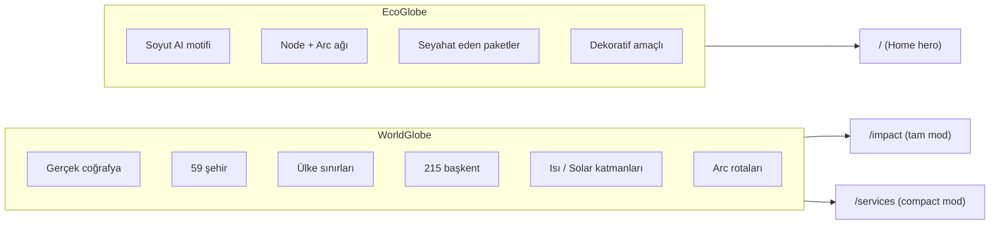

> **ÖNEMLİ:** İki globe kasıtlı olarak ayrı tutulur. Ortak kod paylaşmazlar.
> WorldGlobe üzerinde çalışırken EcoGlobe'a dokunulmamalıdır ve tersi.

## WorldGlobe

### Props Sözleşmesi

```javascript
// WorldGlobe bileşeninin kabul ettiği prop'lar:
{
  // Görünür katmanlar
  layers: {
    active: true,      // Aktif şehir noktaları
    partners: true,    // Partner şehir noktaları
    arcs: true,        // HQ → şehir arc hatları
    heat: false,       // Isı haritası katmanı
    solar: false,      // Solar enerji katmanı
    borders: true,     // Ülke sınırları
    capitals: true,    // 215 başkent noktaları
  },

  // Etkileşim callback'leri
  onHover: (city, screenPos) => {},  // Şehir üzerine gelme
  onSelect: (city) => {},            // Şehir seçme

  // Durum
  selected: cityObject,              // Seçili şehir (flyTo tetikler)
  timeYear: 2025,                    // Zaman kayma çubuğu (2024-2026)
  showTerminator: false,             // Gece/gündüz sınırı

  // Görünüm
  compact: false,                    // true = dashboard mini-globe
  theme: 'light',                    // 'light' | 'dark'
  cyan: '#0EA5E9',                   // Accent renk A
  emerald: '#10B981',                // Accent renk B
}
```

### Scene Graph

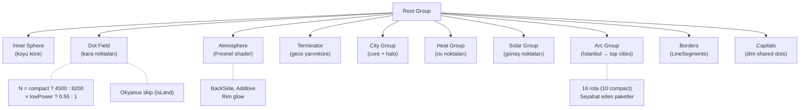

### Dot Field (Kara Noktaları)

Globe yüzeyindeki nokta alanı gerçek coğrafyayı yansıtır:

- `land.json` 1° çözünürlüklü bitfield → `isLand(lat, lon)` O(1) kontrolü
- Okyanus noktaları atlanır → sadece kara üzerinde nokta
- Renk rampası: `accentA → accentB` (cyan → emerald gradient)
- `lowPower` modda %55 daha az nokta

### Fresnel Atmosphere

```javascript
// Fresnel ShaderMaterial — kenar parlama efekti
// BackSide render + Additive blending
const atmosphereMaterial = new THREE.ShaderMaterial({
  uniforms: { color: { value: new THREE.Color(accentA) } },
  vertexShader: /* fresnel vertex */,
  fragmentShader: /* fresnel fragment */,
  side: THREE.BackSide,
  blending: THREE.AdditiveBlending,
  transparent: true,
});
```

### Yaşam Döngüsü

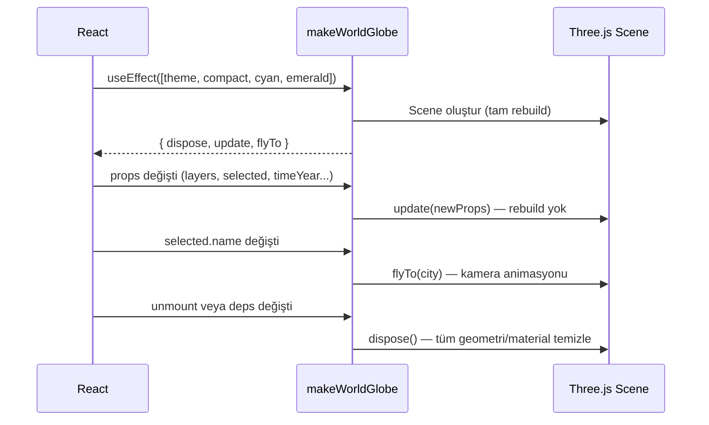

**Rebuild tetikleyiciler** (effect deps): `theme`, `compact`, `cyan`, `emerald` — bu değişiklikler nadir olduğu için tam rebuild kabul edilebilir.

**Hafif güncelleme** (`update()`): `layers`, `selected`, `timeYear`, `showTerminator` — rebuild olmadan güncellenir.

### İki Kullanım Modu

| Özellik | `/impact` (ImpactMap) | `/services` (Dashboard) |
|---------|----------------------|------------------------|
| `compact` | `false` | `true` |
| Katmanlar | Tümü | `active`, `partners`, `arcs` |
| `onHover` | ✅ (tooltip gösterir) | ❌ |
| `onSelect` | ✅ (flyTo + side panel) | ❌ |
| Zoom (wheel) | ✅ | ❌ (scroll hijack engeli) |
| Arc sayısı | 16 | 10 |
| Nokta sayısı | 8200 | 4500 |
| Accent renkleri | Props'tan | Varsayılan |

## EcoGlobe

**Dosya:** `src/shared/3d/EcoGlobe.jsx` — Sadece Home sayfasında kullanılır.

Soyut, dekoratif bir AI motifi globe'u:
- Node + arc ağı (veri noktaları yok)
- Seyahat eden paketler (arc üzerinde hareket eden noktalar)
- WorldGlobe ile **ortak kod paylaşmaz**
- Aynı performans hijyenini paylaşır:
  - IntersectionObserver ile offscreen pause
  - `visibilitychange` ile tab-hidden pause
  - `prefers-reduced-motion` handling
  - Tam `dispose()` cleanup

> **Kural:** EcoGlobe bağımsızdır. WorldGlobe çalışması sırasında dokunulmamalıdır.

## Lazy Loading (LazyGlobes)

Globe'lar Three.js'i kendi lazy chunk'larına çeker:

```jsx
// src/shared/3d/LazyGlobes.jsx
import { lazy, Suspense } from 'react';

export const LazyWorldGlobe = lazy(() => import('./WorldGlobe'));
export const LazyEcoGlobe = lazy(() => import('./EcoGlobe'));

export function GlobeFallback() {
  return <div className="globe-placeholder" aria-busy="true" />;
}
```

Three.js chunk boyutu: **~47 KB gzip** (kod + coğrafi veri dahil).

## Performans Optimizasyonları

### E1 — Offscreen/Tab Pause

```javascript
// IntersectionObserver — görünüm dışında rAF durur
const io = new IntersectionObserver(([entry]) => {
  if (entry.isIntersecting) resume();
  else pause();
});
io.observe(container);

// visibilitychange — sekme arka planda rAF durur
document.addEventListener('visibilitychange', () => {
  document.hidden ? pause() : resume();
});
```

### E1 — Reduced Motion

```javascript
const reduceMotion = prefersReducedMotion();
// reduceMotion === true ise:
// - Auto-rotate hızı = 0
// - Pulse animasyonları = 0
// - Arc seyahat hızı = 0
// - Terminator rotasyonu = 0
```

### E1 — Low Power Tier

```javascript
const lowPower = (navigator.deviceMemory ?? 8) <= 4 || Math.min(w, h) < 420;
// lowPower === true ise:
// - Nokta sayısı × 0.55
// - pixelRatio cap = 1.5
// - Antialiasing kapalı
```

### E1 — Tam Dispose

```javascript
dispose() {
  // Scene traversal — tüm geometri + material free
  scene.traverse((obj) => {
    obj.geometry?.dispose();
    if (obj.material) {
      (Array.isArray(obj.material) ? obj.material : [obj.material])
        .forEach((m) => m.dispose());
    }
  });
  renderer.dispose();
  // IO + visibility listener'ları detach
}
```

## Coğrafi Veri Pipeline

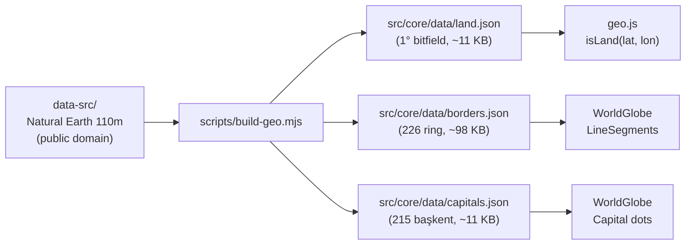

### Veri Dosyaları

| Dosya | Açıklama | Boyut |
|-------|----------|-------|
| `land.json` | 1° çözünürlüklü packed bitfield. `isLand()` O(1) lookup. | ~11 KB |
| `borders.json` | 226 ülke sınır halkası, 0.2° quantized. | ~98 KB |
| `capitals.json` | 215 Admin-0 başkent (isim + koordinat). | ~11 KB |

### Yeniden Üretim

```bash
npm run build:geo  # data-src/ → src/core/data/*.json
# Ardından üç JSON dosyasını commit edin.
```

- `data-src/` gitignored'dur (ham veri)
- `topojson-client` sadece build-time bağımlılığıdır
- Çıktılar **committed** dosyalardır (CI build zincirinde değildir)

## Erişilebilirlik

### Keyboard Navigation

```javascript
// container tabIndex=0, role="application"
container.setAttribute('tabindex', '0');
container.setAttribute('role', 'application');
container.setAttribute('aria-label', 'Interactive 3D globe');

// Keyboard controls:
// ← → : Yatay rotasyon
// ↑ ↓ : Dikey rotasyon
// + - : Zoom in/out
```

### Hover vs Select

- **Hover:** Mouse raycaster ile şehir tespiti → HoverCard tooltip
- **Başkentler:** Hover edilebilir ama **seçilemez** — ürün şehirleri öncelikli
- **Select:** Tıklama → `flyTo()` animasyonu + side panel

## Invariant'lar

Gelecekteki 3D çalışmaları için korunması gereken kurallar:

1. `/services` compact modu hafif ve scroll-güvenli kalmalıdır
2. `/impact` davranışı bozulmamalıdır
3. Yeni görsel/etkileşim özellikleri opt-gated veya davranış koruyucu olmalıdır
4. Prerender ve testler için deterministik kalmalıdır
5. EcoGlobe ve WorldGlobe bağımsız kalmalıdır

---

## İlgili Dokümanlar

- [01 — Architecture Overview](./01-architecture-overview.md)
- [05 — Design Tokens](./05-design-tokens.md)
- [14 — Accessibility](./14-accessibility.md)


---

# 08 — Backend API ve Serverless Fonksiyonlar

> Vercel serverless fonksiyonları, Vite dev middleware, handler mimarisi,
> rate limiting, honeypot spam koruması ve demo-mode fallback.

---

## İçindekiler

- [Genel Bakış](#genel-bakış)
- [Endpoint Haritası](#endpoint-haritası)
- [Handler Mimarisi](#handler-mimarisi)
- [Dev Middleware (Vite)](#dev-middleware-vite)
- [Form İşleme](#form-i̇şleme)
- [Rate Limiting](#rate-limiting)
- [Honeypot Spam Koruması](#honeypot-spam-koruması)
- [E-posta Teslimi (Resend)](#e-posta-teslimi-resend)
- [Telemetry ve Web Vitals](#telemetry-ve-web-vitals)
- [Admin API](#admin-api)
- [Ortam Değişkenleri](#ortam-değişkenleri)
- [İlgili Dokümanlar](#i̇lgili-dokümanlar)

---

## Genel Bakış

Backend, **saf mantık** (pure logic) olarak yazılmıştır — framework'a bağımlı
değildir. Aynı handler fonksiyonları hem Vercel serverless adaptörleri hem Vite
dev middleware tarafından çağrılır. Bu sayede:

- Dev ortamda Vercel CLI gerekmez
- Handler'lar doğrudan unit test edilebilir
- Vercel ↔ lokal davranış %100 aynıdır

## Endpoint Haritası

### Public Endpoints

| Method | Path | Handler | Açıklama |
|--------|------|---------|----------|
| POST | `/api/contact` | `handle('contact', ...)` | İletişim formu |
| POST | `/api/newsletter` | `handle('newsletter', ...)` | Bülten aboneliği |
| POST | `/api/apply` | `handle('apply', ...)` | İş başvurusu |
| GET | `/api/posts` | `handlePosts(...)` | Blog yazıları (DB + static) |
| GET | `/api/jobs` | `handleJobs(...)` | İş ilanları |
| POST | `/api/vitals` | `handleVitals(...)` | Web Vitals ingestion |
| POST | `/api/telemetry` | `handleEvent(...)` | Telemetry event ingestion |

### Admin Endpoints

| Method | Path | Handler | Açıklama |
|--------|------|---------|----------|
| POST | `/api/admin/login` | `handleLogin(...)` | E-posta/şifre ile giriş |
| GET | `/api/admin/me` | `handleMe(...)` | Oturum kontrolü |
| POST | `/api/admin/logout` | `handleLogout()` | Çıkış |
| GET/POST | `/api/admin/posts` | `handleAdminPosts(...)` | Post listele / oluştur |
| GET/PUT/DELETE | `/api/admin/posts/:slug` | `handleAdminPost(...)` | Post oku / güncelle / sil |
| GET | `/api/admin/contacts` | `handleAdminContacts(...)` | İletişim kayıtları listesi |
| DELETE | `/api/admin/contacts/:id` | `handleAdminContacts(...)` | İletişim kaydı sil |
| GET | `/api/admin/careers` | `handleAdminCareers(...)` | Başvuru listesi |
| DELETE | `/api/admin/careers/:id` | `handleAdminCareers(...)` | Başvuru sil |
| GET | `/api/admin/newsletter` | `handleAdminNewsletter(...)` | Abone listesi |
| DELETE | `/api/admin/newsletter/:id` | `handleAdminNewsletter(...)` | Abone sil |

## Handler Mimarisi

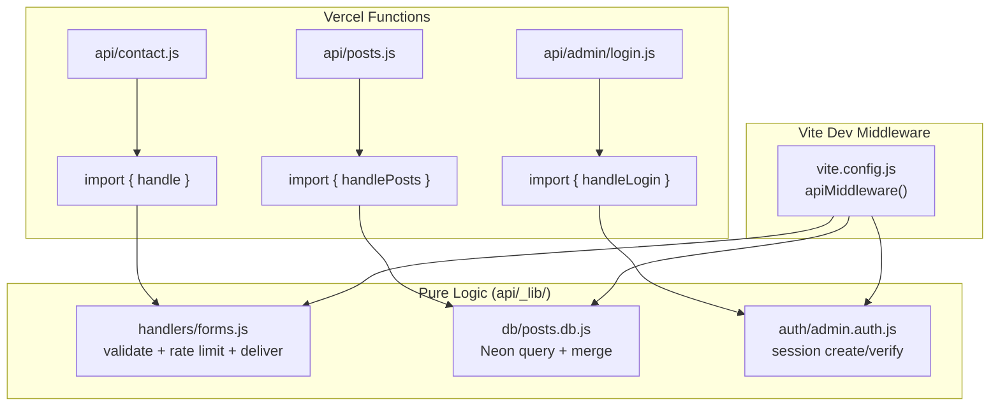

Her Vercel function dosyası minimal bir adaptördür:

```javascript
// api/contact.js (Vercel function)
import { handle } from './_lib/handlers/forms.js';

export default async function handler(req, res) {
  // ... body parse, IP extract
  const result = await handle('contact', req.method, body, process.env, ip);
  res.status(result.status).json(result.body);
}
```

## Dev Middleware (Vite)

`vite.config.js`'teki `apiMiddleware` fonksiyonu, Vercel function'larının aynı
mantığını lokal olarak çalıştırır:

```javascript
function apiMiddleware(req, res, next) {
  const route = req.url?.split('?')[0];

  // Admin route'ları (redirect + cookie yönetimi)
  if (route?.startsWith('/api/admin/')) {
    // ... body parse → handleLogin/handleMe/handleLogout/...
    applyResult(res, result);
    return;
  }

  // Public form route'ları
  const KINDS = {
    '/api/contact': 'contact',
    '/api/newsletter': 'newsletter',
    '/api/apply': 'apply'
  };
  // ... → handle(kind, method, body, env, ip)
}
```

**İki yerde mount edilir:**
- `configureServer` — dev server
- `configurePreviewServer` — preview server (e2e testlerin çalıştığı ortam)

## Form İşleme

### Akış

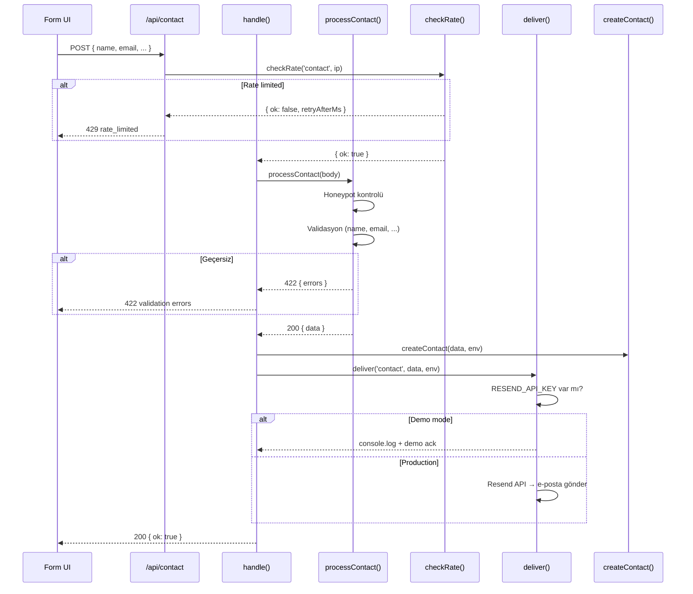

### Validasyon

```javascript
// processContact — alan validasyonu
const name = clamp(input.name, 80);      // Max 80 char
const company = clamp(input.company, 120); // Max 120 char
const email = clamp(input.email, 160);     // Max 160 char
const message = clamp(input.message, 2000); // Max 2000 char

if (name.length < 2) errors.name = 'required';
if (company.length < 1) errors.company = 'required';
if (!EMAIL_RE.test(email)) errors.email = 'invalid';
```

## Rate Limiting

Per-IP sliding window rate limiter:

```javascript
const WINDOWS = {
  contact:    { ms: 60_000, max: 5 },   // 60 saniyede max 5
  newsletter: { ms: 60_000, max: 3 },   // 60 saniyede max 3
  apply:      { ms: 60_000, max: 3 },   // 60 saniyede max 3
};
```

- Module-scoped `Map` kullanır (serverless instance ömrü boyunca yaşar)
- Her 1000 kontrolde expired key'ler temizlenir (memory leak önlemi)
- IP `x-forwarded-for` header'ından alınır
- Vercel'de birden fazla instance döndüğü için %100 garanti değildir
  (best-effort, trafi flood'u engeller)

## Honeypot Spam Koruması

Görünmez `company_website` alanı — CSS ile gizlidir, gerçek kullanıcılar
doldurmaz ama bot'lar doldurur:

```javascript
if (input.company_website) return json(200, { ok: true }); // Sessiz ack
```

Bot'a başarı yanıtı döndürülür, gerçek işlem yapılmaz. Bot fark etmez.

## E-posta Teslimi (Resend)

```javascript
export async function deliver(kind, data, env) {
  // Demo mode: secret yoksa sadece log + ack
  if (!env.RESEND_API_KEY || !env.CONTACT_TO) {
    console.log(`[forms:${kind}] demo-mode, payload:`, data);
    return { delivered: false, demo: true };
  }

  // Production: Resend API ile e-posta gönder
  const res = await fetch('https://api.resend.com/emails', {
    method: 'POST',
    headers: { Authorization: `Bearer ${env.RESEND_API_KEY}` },
    body: JSON.stringify({
      from: env.CONTACT_FROM || 'Ecozyon Site <onboarding@resend.dev>',
      to: env.CONTACT_TO,
      subject: `[Ecozyon] ${kind} — ${data.email}`,
      text: JSON.stringify(data, null, 2),
    }),
  });
  return { delivered: res.ok, demo: false };
}
```

## Telemetry ve Web Vitals

### Web Vitals (`/api/vitals`)

`web-vitals` kütüphanesi CLS, FCP, FID, LCP, TTFB metriklerini toplar.
Beacon olarak `/api/vitals`'a gönderilir.

- `VITALS_WEBHOOK_URL` set ise → webhook'a forward
- Set değilse → demo ack

### Telemetry (`/api/telemetry`)

Cookieless, DNT/GPC-aware event takibi:

```javascript
// src/core/lib/telemetry.js
track('page_view', { path: '/services' });
track('cta_click', { label: 'hero_explore' });
```

- `navigator.doNotTrack === '1'` ise → gönderilmez
- `navigator.globalPrivacyControl === true` ise → gönderilmez
- İsim kasıtlı olarak "telemetry" — content blocker'lar "analytics" içeren URL'leri engeller

### Dev HUD'lar

- `VitalsHud` — Dev modda Web Vitals overlay
- `EventsHud` — Dev modda event stream overlay

## Admin API

Admin endpoint'leri `requireAdmin` middleware ile korunur:

```javascript
// Session kontrolü → HMAC-signed httpOnly cookie
const session = readSession(cookieHeader, env);
if (!session) return json(401, { ok: false });
```

Detaylı admin auth ve CMS sistemi → [09 — Database & CMS](./09-database-cms.md)

## Ortam Değişkenleri

Tüm değişkenler **opsiyoneldir** — hiçbiri olmadan site demo modunda çalışır:

| Variable | Açıklama | Yoksa |
|----------|----------|-------|
| `DATABASE_URL` | Neon Postgres connection string | Static fallback |
| `RESEND_API_KEY` | Resend e-posta API key | Demo ack (log only) |
| `CONTACT_TO` | E-posta alıcısı | Demo ack |
| `CONTACT_FROM` | E-posta göndericisi | Varsayılan Resend |
| `VITALS_WEBHOOK_URL` | Vitals webhook URL | Demo ack |
| `SESSION_SECRET` | HMAC session key | Fallback secret |
| `DEPLOY_HOOK_URL` | Vercel deploy hook | Yeniden build tetiklenmez |
| `LINKEDIN_ACCESS_TOKEN` | LinkedIn UGC Posts API | Demo ack |
| `LINKEDIN_AUTHOR_URN` | LinkedIn author URN | Demo ack |

---

## İlgili Dokümanlar

- [09 — Database & CMS](./09-database-cms.md)
- [12 — CI/CD & Deployment](./12-ci-cd-deployment.md)
- [11 — Testing Strategy](./11-testing-strategy.md)


---

# 09 — Veritabanı ve CMS (Database & Content Management)

> Neon Postgres, DB-optional mimari, admin paneli, blog CMS, oturum yönetimi
> ve sosyal medya paylaşımı.

---

## İçindekiler

- [Genel Bakış](#genel-bakış)
- [DB-Optional Mimari](#db-optional-mimari)
- [Veritabanı Katmanı](#veritabanı-katmanı)
- [Blog CMS](#blog-cms)
- [Oturum Yönetimi (Session)](#oturum-yönetimi-session)
- [Admin Paneli](#admin-paneli)
- [Sosyal Medya Paylaşımı](#sosyal-medya-paylaşımı)
- [Veri Akışı](#veri-akışı)
- [İlgili Dokümanlar](#i̇lgili-dokümanlar)

---

## Genel Bakış

CMS sistemi tamamen **opsiyoneldir**. `DATABASE_URL` environment variable'ı
olmadan site, statik veri dosyalarından (`src/core/data/posts.js`) çalışır.
Veritabanı eklendiğinde ek özellikler aktifleşir ama mevcut davranış
değişmez.

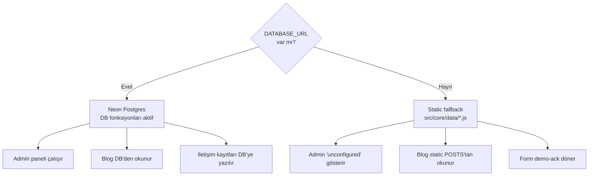

## DB-Optional Mimari

Her veritabanı fonksiyonu `DATABASE_URL` kontrolü yapar:

```javascript
// api/_lib/db/posts.db.js
import { neon } from '@neondatabase/serverless';

function getDb(env = process.env) {
  if (!env.DATABASE_URL) return null;
  return neon(env.DATABASE_URL);
}

export async function listPublished(env) {
  const sql = getDb(env);
  if (!sql) return [];  // DB yok → boş dizi (static fallback)
  const rows = await sql`SELECT * FROM posts WHERE status = 'published' ORDER BY date DESC`;
  return rows.map(mapRow);
}
```

Bu desen tüm DB modüllerinde tutarlıdır:
- `posts.db.js` → `[]` döner
- `contacts.db.js` → sessizce başarısız olur
- `careers.db.js` → sessizce başarısız olur
- `newsletter.db.js` → sessizce başarısız olur

## Veritabanı Katmanı

**Dosyalar:** `api/_lib/db/`

### posts.db.js

| Fonksiyon | Açıklama |
|-----------|----------|
| `listPublished(env)` | Yayınlanmış postları getir |
| `getBySlug(slug, env)` | Slug ile post getir |
| `createPost(data, env)` | Yeni post oluştur |
| `updatePost(slug, data, env)` | Post güncelle |
| `deletePost(slug, env)` | Post sil |
| `dedupBySlug(dbPosts, staticPosts)` | DB + static merge (DB öncelikli) |
| `handlePosts(method, query, env)` | HTTP handler |

**Tablo şeması (posts):**

| Sütun | Tip | Açıklama |
|-------|-----|----------|
| `slug` | text PK | URL slug |
| `status` | text | 'draft' \| 'published' |
| `date` | text | ISO tarih |
| `title` | jsonb | `{ tr: "...", en: "..." }` |
| `excerpt` | jsonb | `{ tr: "...", en: "..." }` |
| `tag` | jsonb | `{ tr: "...", en: "..." }` |
| `author` | jsonb | `{ name: { tr, en }, avatar }` |
| `body` | jsonb | `{ tr: [...blocks], en: [...blocks] }` |
| `terms` | jsonb | İlişkili glossary terim ID'leri |

### contacts.db.js

İletişim formu gönderilerini kaydeder.

### careers.db.js

İş başvurularını kaydeder.

### newsletter.db.js

Bülten abonelerini kaydeder.

### jobs.db.js

İş ilanları CRUD (admin tarafından yönetilir).

## Blog CMS

### Post Body Yapısı

Post body'leri ham HTML değil, **yapılandırılmış blok dizisidir**:

```javascript
body: {
  tr: [
    { h: 'Başlık', id: 'baslik-id' },       // Heading bloku
    'Normal paragraf metni.',                   // String = paragraf
    { h: 'İkinci Başlık', id: 'ikinci' },
    'Başka bir paragraf.',
  ],
  en: [/* aynı yapı */],
}
```

**Neden:** Strict CSP altında raw HTML güvensizdir. Blok yapısı güvenli render sağlar.

### Blog Post Merge Stratejisi

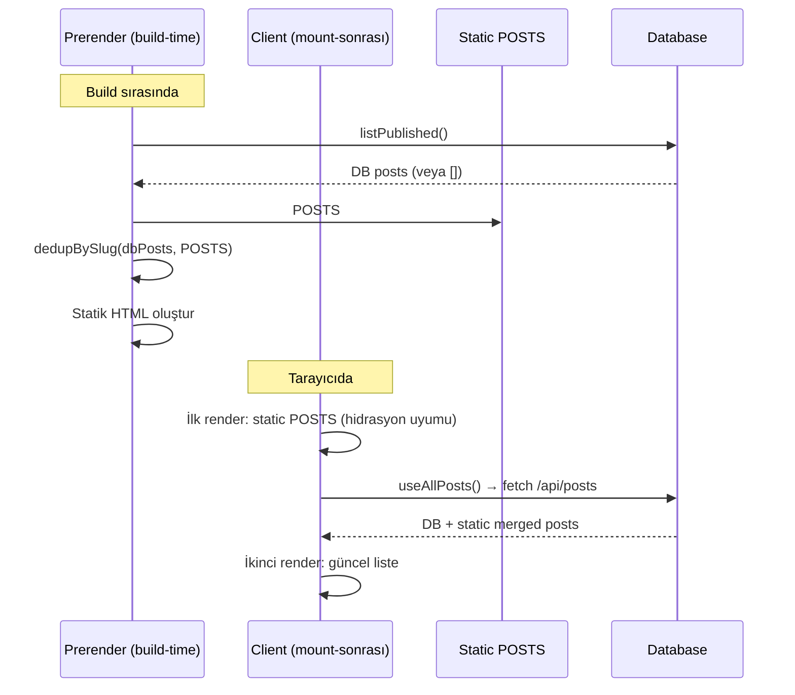

**Hidrasyon güvenliği:** İlk render her zaman static POSTS ile yapılır.
DB verileri mount-sonrası `useAllPosts()` hook'u ile gelir — hidrasyon uyumsuzluğu olmaz.

### Deploy Hook

Bir post yayınlandığında `DEPLOY_HOOK_URL`'ye POST yapılır → Vercel rebuild
tetiklenir → yeni post statik HTML'e bake edilir.

## Oturum Yönetimi (Session)

**Dosya:** `api/_lib/auth/session.js`

HMAC-signed httpOnly cookie tabanlı oturum:

```javascript
// Cookie oluşturma
export function createSession(login, env) {
  const payload = JSON.stringify({ login, ts: Date.now() });
  const signature = hmacSign(payload, env.SESSION_SECRET || FALLBACK);
  return `${payload}.${signature}`;
}

// Cookie doğrulama
export function readSession(cookieHeader, env) {
  const token = parseCookies(cookieHeader)[COOKIE_NAME];
  if (!token) return null;
  const [payload, sig] = token.split('.');
  if (hmacSign(payload, secret) !== sig) return null;  // Geçersiz imza
  return JSON.parse(payload);
}
```

**Özellikler:**
- `httpOnly` — JavaScript erişemez
- HMAC imza — cookie tampering tespiti
- JWT bağımlılığı **yok** — saf crypto
- `SESSION_SECRET` yoksa fallback secret kullanılır (demo mode)

### Admin Auth

**Dosya:** `api/_lib/auth/admin.auth.js`

Basit e-posta/şifre tabanlı giriş:

```javascript
const ADMIN_EMAIL = 'admin@ecozyon.com';
const ADMIN_PASS = 'ecozyon2026';

export function handleLogin(body, env, origin) {
  if (body.email === ADMIN_EMAIL && body.password === ADMIN_PASS) {
    const session = createSession('Ecozyon Admin', env);
    return json(200, { ok: true }, {
      'Set-Cookie': serializeCookie(COOKIE_NAME, session, { maxAge: MAX_AGE })
    });
  }
  return json(401, { ok: false, error: 'invalid_credentials' });
}
```

## Admin Paneli

**Sayfa:** `src/pages/Admin/` (lazy-loaded, ROUTES dışı)

Admin paneli özellikleri:
- E-posta/şifre ile giriş formu
- Blog post listesi (oluştur / düzenle / sil)
- İki dilli blok editör (TR + EN)
- İletişim kayıtları listesi
- Başvuru listesi
- Bülten abone listesi
- İş ilanları yönetimi

**Güvenlik:**
- ROUTES'ta yok → prerender edilmez → SEO'da görünmez
- `robots.txt`'de `Disallow: /admin`
- httpOnly cookie session
- Her admin endpoint `readSession` ile korunur

## Sosyal Medya Paylaşımı

**Dosya:** `api/_lib/handlers/social.js`

### LinkedIn

Post yayınlandığında LinkedIn UGC Posts API üzerinden paylaşım:

```javascript
export async function publishToLinkedIn(post, env) {
  if (!env.LINKEDIN_ACCESS_TOKEN || !env.LINKEDIN_AUTHOR_URN) {
    return { published: false, demo: true };  // Demo ack
  }
  // LinkedIn UGC Posts API → paylaşım oluştur
}
```

### X (Twitter) / Bluesky

Share-intent URL'leri kullanılır (API entegrasyonu yok):

```
https://twitter.com/intent/tweet?url=...&text=...
```

## Veri Akışı

```mermaid
flowchart TD
    subgraph Admin["Admin Paneli"]
        A1["Login"] --> A2["Session Cookie"]
        A2 --> A3["Post Editör"]
        A3 --> A4["POST /api/admin/posts"]
        A4 --> A5["posts.db.js<br/>createPost()"]
        A5 --> A6["Neon Postgres"]
        A4 --> A7["DEPLOY_HOOK_URL<br/>→ Vercel Rebuild"]
    end

    subgraph Public["Public Site"]
        B1["Blog Sayfası"] --> B2["useAllPosts()"]
        B2 --> B3["fetch /api/posts"]
        B3 --> B4["handlePosts()"]
        B4 --> B5["listPublished()"]
        B5 --> B6["Neon Postgres"]
        B4 --> B7["dedupBySlug(db, static)"]
        B7 --> B8["Merged post listesi"]
    end

    subgraph Build["Build Pipeline"]
        C1["prerender.mjs"] --> C2["listPublished()"]
        C2 --> C3["Neon Postgres<br/>(veya [] fallback)"]
        C1 --> C4["dedupBySlug(db, POSTS)"]
        C4 --> C5["Static HTML<br/>per post"]
    end
```

---

## İlgili Dokümanlar

- [08 — Backend API](./08-backend-api.md)
- [10 — SEO & Prerender](./10-seo-prerender.md)
- [12 — CI/CD & Deployment](./12-ci-cd-deployment.md)


---

# 10 — SEO ve Prerender (SSG)

> Custom prerender pipeline, OG card rasterizasyonu, JSON-LD structured data,
> sitemap, robots.txt, RSS feed ve hreflang entegrasyonu.

---

## İçindekiler

- [Genel Bakış](#genel-bakış)
- [Prerender Pipeline](#prerender-pipeline)
- [Entry Points ve Hidrasyon](#entry-points-ve-hidrasyon)
- [Per-Route Head Injection](#per-route-head-injection)
- [OG Card Sistemi](#og-card-sistemi)
- [JSON-LD Structured Data](#json-ld-structured-data)
- [Hreflang Alternates](#hreflang-alternates)
- [Sitemap ve Robots](#sitemap-ve-robots)
- [RSS Feed](#rss-feed)
- [SEO Checklist](#seo-checklist)
- [İlgili Dokümanlar](#i̇lgili-dokümanlar)

---

## Genel Bakış

Proje, **custom SSG (Static Site Generation)** sistemi kullanır. `vite-react-ssg`
uyumsuzdu (React Router 7 + Vite 8), bu yüzden kendi prerender pipeline'ı yazıldı.

Her route, build zamanında tam HTML'e render edilir. Crawler'lar JavaScript
çalıştırmadan tam içeriği görür.

## Prerender Pipeline

**Dosya:** `scripts/prerender.mjs` (~330 satır)

```mermaid
graph LR
    A["npm run build"] --> B["1. vite build<br/>(client → dist/)"]
    B --> C["2. vite build --ssr<br/>(entry-server.jsx<br/>→ dist-server/)"]
    C --> D["3. node prerender.mjs"]

    D --> E["Route listesi oluştur"]
    E --> F["Her route için<br/>render(path) çağır"]
    F --> G["HTML template'e<br/>enjekte et"]
    G --> H["dist/route/index.html"]

    D --> I["OG PNG cards üret"]
    D --> J["sitemap.xml yaz"]
    D --> K["robots.txt yaz"]
    D --> L["feed.xml yaz"]
```

### Adımlar

1. **Route listesi** — `ROUTES` + blog slugları + tag sayfaları + vaka çalışmaları + entegrasyonlar
2. **Her route için:**
   - `render(path)` → React 19 `prerenderToNodeStream` + `StaticRouter`
   - Tüm `Suspense` çözülür (lazy page'ler + globe'lar)
   - Template'teki `<!--ssr-outlet-->` yerine app HTML
   - `<!--ssr-head-->` yerine per-route head etiketleri
   - `<title>` ve `<meta description>` replace
3. **OG cards** — Her post, vaka çalışması, entegrasyon ve sayfa için SVG → PNG
4. **Statik dosyalar** — `sitemap.xml`, `robots.txt`, `feed.xml`

### Render Fonksiyonu

```javascript
// src/entry-server.jsx
export async function render(url) {
  const { prelude } = await prerenderToNodeStream(
    <StaticRouter location={url}>
      <AppShell />
    </StaticRouter>,
  );
  return streamToString(prelude);
}
```

`prerenderToNodeStream` tüm Suspense boundary'lerini çözer — lazy page'ler
ve globe'lar dahil — bu sayede emit edilen HTML **tamamen** ve **indekslenebilir**.

## Entry Points ve Hidrasyon

### Server Entry (`entry-server.jsx`)

```
StaticRouter(url) → AppShell → AppProvider(DEFAULTS) → Routes → Page
```

- `StaticRouter` ile URL bazlı routing
- `DEFAULTS` state → server/client uyumu
- Three.js effect'leri çalışmaz (SSR ortamı)

### Client Entry (`main.jsx`)

```javascript
const root = document.getElementById('root');
if (root.firstElementChild) {
  hydrateRoot(root, tree);   // Prerendered HTML var → hydrate
} else {
  createRoot(root).render(tree);  // Dev mode → render
}
```

`firstElementChild` kontrolü, `<!--ssr-outlet-->` yorum node'unun yanlış
pozitif vermesini engeller.

## Per-Route Head Injection

Her route için `headFor()` fonksiyonu şu etiketleri üretir:

```html
<!-- Canonical URL -->
<link rel="canonical" href="https://ecozyon.tech/services" />

<!-- Open Graph -->
<meta property="og:title" content="Çözümler — Ecozyon Tech" />
<meta property="og:description" content="Ecozyon Tech çözümleri..." />
<meta property="og:url" content="https://ecozyon.tech/services" />
<meta property="og:image" content="https://ecozyon.tech/og/route-services.png" />

<!-- Twitter Card -->
<meta name="twitter:card" content="summary_large_image" />
<meta name="twitter:title" content="Çözümler — Ecozyon Tech" />
<meta name="twitter:description" content="Ecozyon Tech çözümleri..." />
<meta name="twitter:image" content="https://ecozyon.tech/og/route-services.png" />

<!-- Hreflang -->
<link rel="alternate" hreflang="tr" href="https://ecozyon.tech/services" />
<link rel="alternate" hreflang="en" href="https://ecozyon.tech/services?lang=en" />
<link rel="alternate" hreflang="x-default" href="https://ecozyon.tech/services" />

<!-- JSON-LD -->
<script type="application/ld+json">[...]</script>
```

## OG Card Sistemi

**Dosya:** `src/core/lib/og.js`

Her içerik türü için markalı OG kart üretilir:

| Tür | Dosya Adı | Motif |
|-----|-----------|-------|
| Blog post | `og/{slug}.png` | Article çizgileri |
| Vaka çalışması | `og/case-{slug}.png` | Impact globe |
| Entegrasyon | `og/integration-{slug}.png` | Node graph |
| Sayfa (route) | `og/route-{key}.png` | Halkalar |
| Varsayılan | `og.png` | Halkalar |

### Rasterizasyon

SVG → PNG dönüşümü `@resvg/resvg-js` ile yapılır:

```javascript
const svgToPng = (svg) =>
  new Resvg(svg, {
    fitTo: { mode: 'width', value: 1200 },
    font: {
      fontFiles: [
        'SpaceGrotesk_700Bold.ttf',
        'Inter_400Regular.ttf',
        'Inter_600SemiBold.ttf'
      ],
      loadSystemFonts: false,
    },
  }).render().asPng();
```

Font dosyaları bundle'dan gelir → her build machine'de aynı çıktı.

## JSON-LD Structured Data

**Dosya:** `src/core/lib/jsonld.js`

Her route türü için schema.org JSON-LD oluşturulur:

| Route | Schema Türü |
|-------|-------------|
| `/` (Home) | `WebSite` + `SearchAction` |
| `/blog/:slug` | `BlogPosting` (Person byline + tag keywords) |
| `/cases/:slug` | `Article` |
| `/pricing` | `Product` (Offer per tier) + `FAQPage` |
| `/help` | `FAQPage` |
| `/glossary` | `DefinedTermSet` |
| `/blog`, `/cases` | `CollectionPage` + `ItemList` |
| Tüm alt sayfalar | `BreadcrumbList` |

### Builder Fonksiyonları

```javascript
// Her builder saf bir fonksiyondur (unit-tested)
blogPosting({ post, url, site, image, lang, terms });
article({ headline, description, url, site, image, lang });
website(site, lang);
faqPage(faqItems, lang);
product({ name, description, url, site, offers, currency, lang });
breadcrumbList(crumbs, site);
collectionPage({ name, description, url, items, site, lang });
definedTermSet({ name, description, url, terms, site, lang });
ldScript(nodes);  // Birden fazla node'u tek <script> tag'ine saralar
```

## Hreflang Alternates

Her route TR canonical + EN `?lang=en` alternatif olarak sunulur:

```javascript
function hreflangFor(url) {
  const en = `${url}${url.includes('?') ? '&' : '?'}lang=en`;
  return [
    `<link rel="alternate" hreflang="tr" href="${url}" />`,
    `<link rel="alternate" hreflang="en" href="${en}" />`,
    `<link rel="alternate" hreflang="x-default" href="${url}" />`,
  ];
}
```

Aynı yapı hem `<head>` etiketlerinde hem `sitemap.xml`'de tekrarlanır.

## Sitemap ve Robots

### sitemap.xml

```xml
<?xml version="1.0" encoding="UTF-8"?>
<urlset xmlns="http://www.sitemaps.org/schemas/sitemap/0.9"
        xmlns:xhtml="http://www.w3.org/1999/xhtml">
  <url>
    <loc>https://ecozyon.tech/</loc>
    <lastmod>2026-07-14</lastmod>
    <xhtml:link rel="alternate" hreflang="tr" href="https://ecozyon.tech/"/>
    <xhtml:link rel="alternate" hreflang="en" href="https://ecozyon.tech/?lang=en"/>
    <xhtml:link rel="alternate" hreflang="x-default" href="https://ecozyon.tech/"/>
  </url>
  <!-- ... tüm route'lar + blog slugları + vaka çalışmaları -->
</urlset>
```

### robots.txt

```
User-agent: *
Allow: /
Disallow: /admin

Sitemap: https://ecozyon.tech/sitemap.xml
```

## RSS Feed

**Builder:** `src/core/lib/feed.js`

RSS 2.0 formatında blog feed'i:

```xml
<?xml version="1.0" encoding="UTF-8"?>
<rss version="2.0">
  <channel>
    <title>Ecozyon Tech — Blog</title>
    <link>https://ecozyon.tech/blog</link>
    <item>
      <title>...</title>
      <link>https://ecozyon.tech/blog/slug</link>
      <pubDate>...</pubDate>
      <description>...</description>
    </item>
  </channel>
</rss>
```

`index.html`'de RSS keşif bağlantısı:

```html
<link rel="alternate" type="application/rss+xml"
      title="Ecozyon Tech — Blog" href="/feed.xml" />
```

## SEO Checklist

| Öğe | Durum | Açıklama |
|-----|-------|----------|
| Per-route `<title>` | ✅ | `site.js` ROUTES'tan alınır |
| Per-route `<meta description>` | ✅ | Bilingual, route bazlı |
| Canonical URL | ✅ | Her route'ta `<link rel="canonical">` |
| OG tags | ✅ | title, description, url, image |
| Twitter Card | ✅ | `summary_large_image` |
| Hreflang | ✅ | TR + EN + x-default (head + sitemap) |
| JSON-LD | ✅ | Route türüne göre schema.org |
| Sitemap | ✅ | Tüm route'lar + blog + cases |
| Robots.txt | ✅ | Admin disallow |
| RSS feed | ✅ | Blog posts |
| OG images | ✅ | SVG → PNG, per route/post |
| Breadcrumbs | ✅ | Derin içerik sayfalarında |
| Tek h1 kuralı | ✅ | Test-enforced |
| Semantic HTML | ✅ | `<main>`, `<nav>`, `<article>` |

---

## İlgili Dokümanlar

- [01 — Architecture Overview](./01-architecture-overview.md)
- [02 — Routing and Pages](./02-routing-and-pages.md)
- [04 — Internationalization](./04-internationalization.md)
- [12 — CI/CD & Deployment](./12-ci-cd-deployment.md)


---

# 11 — Test Stratejisi (Testing Strategy)

> Vitest unit/integration testler, Playwright e2e testler, coverage hedefleri,
> cross-cutting testler ve visual regression.

---

## İçindekiler

- [Genel Bakış](#genel-bakış)
- [Test Piramidi](#test-piramidi)
- [Vitest Yapılandırması](#vitest-yapılandırması)
- [Coverage Hedefleri](#coverage-hedefleri)
- [Cross-Cutting Testler](#cross-cutting-testler)
- [API Testleri](#api-testleri)
- [Playwright E2E](#playwright-e2e)
- [Visual Regression](#visual-regression)
- [Test Dosyaları Envanteri](#test-dosyaları-envanteri)
- [Test Yazma Kuralları](#test-yazma-kuralları)
- [İlgili Dokümanlar](#i̇lgili-dokümanlar)

---

## Genel Bakış

Proje iki test çalıştırıcısı kullanır:

| Araç | Tür | Ortam | Kapsam |
|------|-----|-------|--------|
| **Vitest** | Unit / Integration | jsdom | Bileşenler, hook'lar, util'ler, API handler'ları |
| **Playwright** | E2E / Visual | Chromium | Gerçek tarayıcı, production build üzerinde |

## Test Piramidi

```mermaid
graph TD
    A["Visual Regression<br/>(Playwright @visual)<br/>Platform-specific, local-only"] --> B
    B["E2E Behavioral<br/>(Playwright)<br/>7 spec dosyası"] --> C
    C["Integration Tests<br/>(Vitest + jsdom)<br/>Pages, routing, a11y"] --> D
    D["Unit Tests<br/>(Vitest)<br/>30+ dosya: utils, hooks,<br/>data, API handlers"]

    style A fill:#fbbf24,stroke:#333
    style B fill:#60a5fa,stroke:#333
    style C fill:#34d399,stroke:#333
    style D fill:#a78bfa,stroke:#333
```

## Vitest Yapılandırması

**Dosya:** `vite.config.js` → `test` bölümü

```javascript
test: {
  environment: 'jsdom',
  globals: true,             // describe, it, expect global
  setupFiles: './src/test/setup.js',
  css: false,                // CSS parse atlanır (hız)
  include: [
    'src/**/*.{test,spec}.{js,jsx}',
    'api/**/*.{test,spec}.js'
  ],
}
```

### Setup Dosyası (`src/test/setup.js`)

```javascript
// @testing-library/jest-dom matchers
import '@testing-library/jest-dom';

// IntersectionObserver mock (jsdom'da yok)
// ResizeObserver mock
// matchMedia mock
// scrollTo mock
```

### JSX Automatic Runtime

```javascript
// vite.config.js
esbuild: { jsx: 'automatic' }
```

Bu ayar, `import React` satırı olmayan dosyaların testlerde çalışmasını sağlar.
**Kaldırılmamalıdır.**

## Coverage Hedefleri

```javascript
coverage: {
  provider: 'v8',
  reporter: ['text', 'html', 'json-summary'],
  thresholds: {
    lines:      88,  // Mevcut: ~89%
    statements: 88,  // Mevcut: ~89%
    functions:  70,  // Mevcut: ~74%
    branches:   73,  // Mevcut: ~78%
  },
}
```

### Coverage Hariç Tutulanlar

| Dışlanan | Neden |
|----------|-------|
| `src/main.jsx` | Entry point, yan etki |
| `src/entry-server.jsx` | SSR entry, build-time only |
| `src/app/App.jsx` | Sadece BrowserRouter wrapper |
| `src/shared/3d/**` | Three.js imperatif, jsdom'da render edilemez |
| `src/features/impact-map/**` | Three.js bağımlı |
| `src/features/dashboard/**` | Three.js bağımlı |
| `src/features/hero/**` | Three.js / visual bileşenler |
| `src/features/dev-tweaks/**` | DEV-only vendored panel |
| `src/core/lib/vitals.js` | Browser-only beacon |
| `src/core/lib/telemetry.js` | Browser-only beacon |
| `src/shared/ui/VitalsHud.jsx` | DEV-only overlay |
| `src/shared/ui/EventsHud.jsx` | DEV-only overlay |

## Cross-Cutting Testler

**Dosya:** `src/test/`

### a11y.test.jsx — Erişilebilirlik

Her sayfa ve navbar mega-menu üzerinde `axe-core` taraması:

```javascript
import { axe } from 'jest-axe';

it('Services sayfası a11y ihlali yok', async () => {
  const { container } = render(<ServicesPage />);
  const results = await axe(container);
  expect(results).toHaveNoViolations();
});
```

### headers.test.js — Tek h1 Kuralı

Her route sayfasında **tam olarak bir `<h1>`** olmasını zorunlu kılar:

```javascript
it('her sayfada tek <h1> var', () => {
  const h1s = container.querySelectorAll('h1');
  expect(h1s.length).toBe(1);
});
```

### pages.test.jsx — Sayfa Render Kontrolü

Tüm sayfaların hatasız render edildiğini doğrular.

### routing.test.jsx — Rota Doğrulama

Route tanımlarının tutarlılığını kontrol eder.

### features.test.jsx — Feature Section Render

Feature section'ların render edildiğini doğrular.

### og-png.test.js — OG Card Doğrulama

OG card SVG builder'larının geçerli SVG ürettiğini test eder.

### pwa.test.js — PWA Doğrulama

Service worker ve manifest yapılandırmasını kontrol eder.

### command-palette.test.jsx

CommandPalette'in açılma/kapanma, arama ve navigasyon işlevlerini test eder.

### contact-form.test.jsx

İletişim formu validasyon ve submission akışını test eder.

### careers-apply.test.jsx

Kariyer başvuru modalı ve form validasyonunu test eder.

## API Testleri

**Dosya:** `api/_lib/` içindeki `*.test.js` dosyaları

| Test Dosyası | Kapsam |
|-------------|--------|
| `forms.test.js` | Validasyon, rate limit, honeypot, deliver |
| `posts-db.test.js` | Blog CRUD, dedupBySlug, mapRow |
| `admin-posts.test.js` | Admin post handler'ları |
| `session.test.js` | HMAC session create/read/verify |
| `social.test.js` | LinkedIn publish + demo fallback |
| `telemetry.test.js` | Event handler |
| `vitals.test.js` | Vitals handler |

## Playwright E2E

**Yapılandırma:** `playwright.config.js`

```javascript
export default defineConfig({
  testDir: './e2e',
  projects: [{ name: 'chromium', use: { ...devices['Desktop Chrome'] } }],
  webServer: {
    command: `npm run preview -- --port 4173`,
    url: `http://localhost:4173`,
  },
});
```

**Hedef:** Production build üzerinde çalışır (`vite preview`). Gerçek client
routing, lazy chunks, service worker, View Transitions test edilir.

### E2E Spec Dosyaları

| Dosya | Kapsam |
|-------|--------|
| `smoke.spec.js` | Temel sayfa yüklenme, navigasyon |
| `forms.spec.js` | İletişim formu gönderimi, validasyon |
| `search.spec.js` | ⌘K palette, /search sayfası |
| `preferences.spec.js` | Tema, dil, accent değiştirme |
| `tools.spec.js` | ROI calculator, assessment |
| `tour.spec.js` | Onboarding turu |
| `visual.spec.js` | Visual regression (@visual tag) |

### Fixtures

```javascript
// e2e/fixtures.js
// Paylaşılan test yardımcıları ve sabitler
```

## Visual Regression

```bash
npm run e2e:visual          # Mevcut baseline ile karşılaştır
npm run e2e:visual:update   # Baseline'ları güncelle
```

- `@visual` tag'i ile işaretlenir
- **Platform-specific:** Font rendering OS'a göre değişir
- **Local-only:** CI'da çalışmaz (snapshot'lar platforma özgü)
- Snapshot'lar `e2e/visual.spec.js-snapshots/` altında

## Test Dosyaları Envanteri

### Unit / Integration (Vitest)

| Kategori | Dosya Sayısı | Konum |
|----------|-------------|-------|
| Cross-cutting | 11 | `src/test/` |
| Shared UI | ~20 | `src/shared/ui/*.test.jsx` |
| Core data | ~15 | `src/core/data/*.test.js` |
| Core lib | ~15 | `src/core/lib/*.test.js` |
| Core config | 1 | `src/core/config/site.test.js` |
| Core tokens | 2 | `src/core/tokens.test.js`, `motion.test.js` |
| Core i18n | 1 | `src/core/i18n/dictionary.test.js` |
| Core content | 1 | `src/core/content/registry.test.js` |
| App | 1 | `src/app/routePrefetch.test.js` |
| API handlers | 7 | `api/_lib/*.test.js` |

### E2E (Playwright)

| Kategori | Dosya Sayısı | Konum |
|----------|-------------|-------|
| Behavioral | 6 | `e2e/*.spec.js` |
| Visual | 1 | `e2e/visual.spec.js` |
| Fixtures | 1 | `e2e/fixtures.js` |

## Test Yazma Kuralları

1. **Her shared UI bileşeninin testi olmalıdır**
2. **Her data modülünün testi olmalıdır**
3. **Her API handler'ın testi olmalıdır**
4. **a11y testleri her yeni sayfa için genişletilmelidir**
5. **Coverage threshold'ları düşürülmemelidir** — sadece yükseltilebilir
6. **Visual regression baseline'ları:** intentional UI değişikliklerinden sonra `e2e:visual:update` ile güncellenmeli

---

## İlgili Dokümanlar

- [12 — CI/CD & Deployment](./12-ci-cd-deployment.md)
- [14 — Accessibility](./14-accessibility.md)
- [08 — Backend API](./08-backend-api.md)


---

# 12 — CI/CD ve Deployment

> GitHub Actions CI pipeline, Vercel deployment, bundle budget,
> güvenlik header'ları ve ortam değişkenleri.

---

## İçindekiler

- [Genel Bakış](#genel-bakış)
- [CI Pipeline (GitHub Actions)](#ci-pipeline-github-actions)
- [Bundle Budget](#bundle-budget)
- [Vercel Deployment](#vercel-deployment)
- [Güvenlik Header'ları](#güvenlik-headerları)
- [Cache Stratejisi](#cache-stratejisi)
- [SPA Fallback](#spa-fallback)
- [Ortam Değişkenleri](#ortam-değişkenleri)
- [İlgili Dokümanlar](#i̇lgili-dokümanlar)

---

## Genel Bakış

Kod, GitHub'a push edildiğinde CI pipeline otomatik çalışır. Tüm kontroller
geçerse Vercel otomatik deploy eder.

```mermaid
graph LR
    A["git push"] --> B["GitHub Actions CI"]
    B --> C{"Tüm kontroller<br/>geçti mi?"}
    C -->|Evet| D["Vercel Auto Deploy"]
    C -->|Hayır| E["❌ Build kırıldı"]
    D --> F["Production<br/>ecozyon.tech"]
```

## CI Pipeline (GitHub Actions)

**Dosya:** `.github/workflows/ci.yml`

İki paralel job çalışır:

### Job 1: `verify`

```yaml
steps:
  - uses: actions/checkout@v4
  - uses: actions/setup-node@v4
    with:
      node-version: 20
      cache: npm
  - run: npm ci            # Bağımlılık kurulumu
  - run: npm run lint      # ESLint (flat config)
  - run: npm run test:coverage  # Vitest + coverage thresholds
  - run: npm run build     # Client + SSR + Prerender
  - run: npm run bundle:check   # Bundle boyut bütçesi
```

### Job 2: `e2e`

```yaml
steps:
  - uses: actions/checkout@v4
  - uses: actions/setup-node@v4
    with:
      node-version: 20
      cache: npm
  - run: npm ci
  - run: npx playwright install --with-deps chromium
  - run: npm run build
  - run: npm run e2e       # Playwright behavioral (visual hariç)
```

### Tetikleyiciler

```yaml
on:
  push:
    branches: ['**']     # Tüm branch'lerde
  pull_request:           # PR'larda
```

### Enforced Kontroller

| Kontrol | Komut | Kırılırsa |
|---------|-------|-----------|
| Lint | `npm run lint` | ESLint hatası |
| Test + Coverage | `npm run test:coverage` | Test başarısız veya coverage threshold altı |
| Build | `npm run build` | Build hatası |
| Bundle Budget | `npm run bundle:check` | Entry chunk > 48 kB |
| E2E | `npm run e2e` | Playwright test başarısız |

## Bundle Budget

**Dosya:** `scripts/check-bundle.mjs`

Entry chunk boyutunu kontrol eder:

```javascript
// Budget: entry chunk ≤ 48 kB gzip
const ENTRY_BUDGET_KB = 48;
```

Mevcut entry chunk: ~38 kB gzip. Budget'ın altında kalmak, CommandPalette
ve OnboardingTour'un lazy-load ile entry dışında tutulmasıyla sağlanır.

### Chunk Dağılımı

| Chunk | İçerik | Strateji |
|-------|--------|----------|
| entry | App + Router + MainLayout + Providers | Hemen yüklenir |
| vendor | React + ReactDOM + React Router | Ayrı chunk |
| three | Three.js kütüphanesi | Lazy (LazyGlobes) |
| page-* | Her lazy sayfa | Route navigasyonunda |
| CommandPalette | ⌘K palette + content registry | requestIdleCallback sonrası |
| OnboardingTour | İlk ziyaret turu | requestIdleCallback sonrası |

## Vercel Deployment

**Dosya:** `vercel.json`

```json
{
  "framework": "vite",
  "buildCommand": "npm run build",
  "outputDirectory": "dist"
}
```

### Dosya Sunma Önceliği

1. `dist/services/index.html` → `/services` (prerendered)
2. `dist/blog/slug/index.html` → `/blog/slug` (prerendered)
3. SPA fallback → `dist/index.html` (bilinmeyen route'lar)

## Güvenlik Header'ları

`vercel.json`'da tüm sayfalara uygulanan güvenlik header'ları:

| Header | Değer | Açıklama |
|--------|-------|----------|
| `Content-Security-Policy` | `default-src 'self'; script-src 'self'; style-src 'self' 'unsafe-inline' fonts.googleapis.com; font-src 'self' fonts.gstatic.com; img-src 'self' data: https:; connect-src 'self'; frame-ancestors 'none'; base-uri 'self'; form-action 'self'; object-src 'none'; upgrade-insecure-requests` | XSS koruması |
| `Strict-Transport-Security` | `max-age=63072000; includeSubDomains; preload` | HTTPS zorunluluğu |
| `X-Content-Type-Options` | `nosniff` | MIME sniffing engeli |
| `X-Frame-Options` | `DENY` | Clickjacking koruması |
| `Referrer-Policy` | `strict-origin-when-cross-origin` | Referrer sızıntı kontrolü |
| `Permissions-Policy` | `camera=(), microphone=(), geolocation=(), interest-cohort=()` | API izin kısıtlaması |

## Cache Stratejisi

```json
{
  "source": "/assets/(.*)",
  "headers": [
    { "key": "Cache-Control", "value": "public, max-age=31536000, immutable" }
  ]
}
```

- `/assets/*` → **1 yıl** immutable cache (Vite hash'li dosya adları)
- HTML dosyaları → cache yok (her zaman güncel)

## SPA Fallback

```json
{
  "rewrites": [
    { "source": "/(.*)", "destination": "/index.html" }
  ]
}
```

Vercel, önce dosya sisteminide arar (prerendered HTML), bulamazsa `index.html`'e
yönlendirir (SPA fallback). Bu sayede:

- Bilinen route'lar → prerendered HTML (SEO + hız)
- Bilinmeyen route'lar → client-side routing (404 sayfası)

> **Caveat:** `npm run preview` (Vite) sadece SPA fallback yapar — prerendered
> dosyaları sunmaz. Prerender çıktısını doğrulamak için `npx serve dist` kullanın.

## Ortam Değişkenleri

Tümü opsiyoneldir — yoksa demo modunda çalışır:

| Variable | Kullanım | Yoksa |
|----------|---------|-------|
| `DATABASE_URL` | Neon Postgres bağlantısı | Static data fallback |
| `RESEND_API_KEY` | E-posta gönderimi | Log + demo ack |
| `CONTACT_TO` | E-posta alıcısı | Demo ack |
| `CONTACT_FROM` | E-posta göndericisi | Varsayılan Resend adresi |
| `SESSION_SECRET` | HMAC oturum imzası | Fallback secret |
| `VITALS_WEBHOOK_URL` | Web Vitals forwarding | Demo ack |
| `DEPLOY_HOOK_URL` | Post publish → rebuild | Rebuild tetiklenmez |
| `LINKEDIN_ACCESS_TOKEN` | LinkedIn paylaşımı | Demo ack |
| `LINKEDIN_AUTHOR_URN` | LinkedIn yazar URN | Demo ack |

---

## İlgili Dokümanlar

- [01 — Architecture Overview](./01-architecture-overview.md)
- [08 — Backend API](./08-backend-api.md)
- [10 — SEO & Prerender](./10-seo-prerender.md)
- [11 — Testing Strategy](./11-testing-strategy.md)


---

# 13 — PWA ve Offline Destek

> Service worker, manifest, precache stratejisi, offline fallback ve
> production-only registration.

---

## İçindekiler

- [Genel Bakış](#genel-bakış)
- [Manifest](#manifest)
- [Service Worker](#service-worker)
- [Precache Listesi](#precache-listesi)
- [Fetch Stratejileri](#fetch-stratejileri)
- [Cache Versioning](#cache-versioning)
- [Registration](#registration)
- [Offline Fallback](#offline-fallback)
- [İlgili Dokümanlar](#i̇lgili-dokümanlar)

---

## Genel Bakış

Ecozyon Tech, kurulabilir (installable) bir PWA olarak yapılandırılmıştır.
El yazması (hand-rolled) bir service worker kullanılır — Workbox bağımlılığı
yoktur.

```mermaid
graph TD
    A["index.html"] --> B["manifest.webmanifest<br/>(PWA metadata)"]
    A --> C["main.jsx<br/>(SW registration)"]
    C --> D["public/sw.js<br/>(Service Worker)"]
    D --> E["Precache:<br/>/, offline.html,<br/>fonts, icons"]
    D --> F["Runtime Cache:<br/>Navigations + Assets"]
```

## Manifest

**Dosya:** `public/manifest.webmanifest`

```json
{
  "name": "Ecozyon Tech",
  "short_name": "Ecozyon",
  "description": "AI + sustainability + wearables",
  "start_url": "/",
  "display": "standalone",
  "background_color": "#f8fafc",
  "theme_color": "#0EA5E9",
  "icons": [
    { "src": "/assets/logo/logo.jpg", "sizes": "192x192", "type": "image/jpeg" },
    { "src": "/assets/logo/logo.jpg", "sizes": "512x512", "type": "image/jpeg" }
  ]
}
```

### HTML Entegrasyonu

```html
<!-- index.html -->
<link rel="manifest" href="/manifest.webmanifest" />
<link rel="apple-touch-icon" href="/assets/logo/logo.jpg" />
<meta name="mobile-web-app-capable" content="yes" />
<meta name="apple-mobile-web-app-status-bar-style" content="black-translucent" />
<meta name="apple-mobile-web-app-title" content="Ecozyon" />
<meta name="theme-color" media="(prefers-color-scheme: light)" content="#f8fafc" />
<meta name="theme-color" media="(prefers-color-scheme: dark)" content="#0b1220" />
```

## Service Worker

**Dosya:** `public/sw.js` (~72 satır)

### Tasarım Kararları

- **Workbox kullanılmıyor** — basitlik ve kontrol
- **El yazması** — navigasyon ve asset stratejileri açıkça tanımlı
- **Cache versioning** — `CACHE` sabitini artırarak tüm cache invalidate edilir

## Precache Listesi

```javascript
const CACHE = 'ecozyon-v2';
const PRECACHE = [
  '/',                              // Ana sayfa
  '/offline.html',                  // Offline fallback
  '/manifest.webmanifest',          // PWA manifest
  '/icon.svg',                      // Uygulama ikonu
  '/favicon.svg',                   // Favicon
  '/fonts/inter-latin.woff2',       // Body font (latin base)
  '/fonts/space-grotesk-latin.woff2', // Display font (latin base)
];
```

Bu dosyalar SW yüklendiğinde hemen cache'e alınır. Offline durumda bile
marka fontları ve temel shell çalışır.

## Fetch Stratejileri

### Navigasyon: Network-First

```mermaid
sequenceDiagram
    participant B as Tarayıcı
    participant SW as Service Worker
    participant N as Ağ
    participant C as Cache

    B->>SW: navigate to /services
    SW->>N: fetch /services
    alt Ağ başarılı
        N-->>SW: 200 HTML
        SW->>C: cache.put (güncelle)
        SW-->>B: 200 HTML
    else Ağ başarısız
        SW->>C: cache.match /services
        alt Cache'te var
            C-->>SW: Cached HTML
            SW-->>B: Cached HTML
        else Cache'te yok
            SW->>C: cache.match /offline.html
            C-->>SW: Offline page
            SW-->>B: Offline page
        end
    end
```

### Asset'ler: Cache-First

```mermaid
sequenceDiagram
    participant B as Tarayıcı
    participant SW as Service Worker
    participant C as Cache
    participant N as Ağ

    B->>SW: GET /assets/chunk-abc.js
    SW->>C: cache.match
    alt Cache'te var
        C-->>SW: Cached asset
        SW-->>B: Cached asset (anında)
    else Cache'te yok
        SW->>N: fetch
        N-->>SW: 200 Asset
        SW->>C: cache.put (ilk kez)
        SW-->>B: 200 Asset
    end
```

### Kapsam Dışı

- Cross-origin istekler (analytics, embeds) → **dokunulmaz**
- GET dışı istekler → **dokunulmaz**

## Cache Versioning

```javascript
const CACHE = 'ecozyon-v2';

// activate event: eski cache'leri temizle
self.addEventListener('activate', (event) => {
  event.waitUntil(
    caches.keys().then((keys) =>
      Promise.all(
        keys.filter((k) => k !== CACHE).map((k) => caches.delete(k))
      )
    ).then(() => self.clients.claim()),
  );
});
```

Cache invalidation: `CACHE` sabitini `'ecozyon-v3'` olarak değiştirmek,
bir sonraki activate'te tüm eski cache'leri siler.

## Registration

**Dosya:** `src/main.jsx`

```javascript
// Production-only: dev'de stale cached asset'ler sorun olur
if (import.meta.env.PROD && 'serviceWorker' in navigator) {
  window.addEventListener('load', () => {
    navigator.serviceWorker.register('/sw.js').catch(() => {});
  });
}
```

- **PROD only** — dev modda SW kayıt edilmez
- **Best-effort** — hata sessizce yutulur (SW kritik değil)
- **load event** — ilk paint'i engellemez

## Offline Fallback

**Dosya:** `public/offline.html`

Minimal, bağımsız bir HTML sayfası:
- Harici bağımlılık yok (inline CSS)
- Marka renkleri ve fontu
- "Çevrimdışısınız" mesajı
- "Tekrar dene" butonu

```html
<!-- Sadece ağ başarısız VE hedef sayfa cache'te olmadığında gösterilir -->
<h1>Çevrimdışısınız</h1>
<p>İnternet bağlantınızı kontrol edin.</p>
<button onclick="location.reload()">Tekrar Dene</button>
```

---

## İlgili Dokümanlar

- [01 — Architecture Overview](./01-architecture-overview.md)
- [12 — CI/CD & Deployment](./12-ci-cd-deployment.md)
- [11 — Testing Strategy](./11-testing-strategy.md)


---

# 14 — Erişilebilirlik (Accessibility — a11y)

> WCAG uyumu, skip link, reduced-motion, aria attribute'ları, keyboard
> navigasyonu, axe test coverage ve heading kuralları.

---

## İçindekiler

- [Genel Bakış](#genel-bakış)
- [Skip Link](#skip-link)
- [Reduced Motion](#reduced-motion)
- [Route Announcer](#route-announcer)
- [Keyboard Navigasyonu](#keyboard-navigasyonu)
- [ARIA Kullanımı](#aria-kullanımı)
- [Heading Hiyerarşisi](#heading-hiyerarşisi)
- [Form Erişilebilirliği](#form-erişilebilirliği)
- [Noscript Fallback](#noscript-fallback)
- [Dark Mode ve Renk Kontrastı](#dark-mode-ve-renk-kontrastı)
- [axe Test Coverage](#axe-test-coverage)
- [Erişilebilirlik Beyanı Sayfası](#erişilebilirlik-beyanı-sayfası)
- [İlgili Dokümanlar](#i̇lgili-dokümanlar)

---

## Genel Bakış

Proje, aşağıdaki erişilebilirlik standartlarını hedefler:

| Alan | Yaklaşım |
|------|----------|
| Skip link | `#main` hedefli, keyboard-only görünür |
| Motion | `prefers-reduced-motion` kontrollü |
| Screen reader | `aria-live` route announcer |
| Keyboard | Tab, Escape, Arrow keys, +/- |
| Forms | Etiketli input'lar, hata durumları |
| Heading | Test-enforced tek `<h1>` |
| Color | Dark/light, accent-independent semantics |
| Test | axe-core her sayfa + mega-menu |

## Skip Link

```jsx
// MainLayout (layouts/Main/index.jsx)
<a href="#main" className="skip-link">
  {t.a11y.skipToContent}
</a>

// Ana içerik
<main id="main" className="flex-grow">
  <Outlet />
</main>
```

CSS ile keyboard-only görünür:

```css
.skip-link {
  position: absolute;
  left: -9999px;
  z-index: 100;
}
.skip-link:focus {
  left: 1rem;
  top: 1rem;
  /* Görünür stil */
}
```

## Reduced Motion

Üç katmanlı reduced-motion desteği:

### 1. CSS Level

```css
@media (prefers-reduced-motion: reduce) {
  * {
    animation-duration: 0.01ms !important;
    transition-duration: 0.01ms !important;
  }
}
```

### 2. JS One-Shot Check

```javascript
// src/core/motion.js
export function prefersReducedMotion() {
  if (typeof window === 'undefined') return false;
  return window.matchMedia('(prefers-reduced-motion: reduce)')?.matches ?? false;
}
```

Kullanım: Three.js globe'larında animasyon hızını sıfırlama.

### 3. React Hook (Reactive)

```javascript
// src/shared/ui/useReducedMotion.js
export function useReducedMotion() {
  const [reduced, setReduced] = useState(false);
  useEffect(() => {
    const mql = window.matchMedia('(prefers-reduced-motion: reduce)');
    setReduced(mql.matches);
    const handler = (e) => setReduced(e.matches);
    mql.addEventListener('change', handler);
    return () => mql.removeEventListener('change', handler);
  }, []);
  return reduced;
}
```

Kullanım: Bileşen seviyesinde animasyon kararları (Reveal, Typewriter, vb.)

### View Transition API

Tema geçişi de reduced-motion'a saygı gösterir:

```javascript
// AppProvider.jsx
if (!document.startViewTransition ||
    window.matchMedia('(prefers-reduced-motion: reduce)').matches) {
  setTweak('theme', v);  // Düz geçiş, animasyon yok
  return;
}
```

## Route Announcer

SPA navigasyonunda screen reader'lar sayfa değişikliğini fark etmez.
`RouteAnnouncer`, yeni sayfa başlığını `aria-live` bölgesine yazar:

```jsx
function RouteAnnouncer() {
  const { pathname } = useLocation();
  const [msg, setMsg] = useState('');

  useEffect(() => {
    // Sayfa title'ının set edilmesini bekle (150ms gecikme)
    const id = setTimeout(() => setMsg(document.title), 150);
    return () => clearTimeout(id);
  }, [pathname]);

  return (
    <div aria-live="polite" aria-atomic="true" className="sr-only">
      {msg}
    </div>
  );
}
```

## Keyboard Navigasyonu

### Genel Keyboard Desteği

| Kısayol | İşlev | Bileşen |
|---------|-------|---------|
| `Tab` / `Shift+Tab` | Focus navigasyonu | Global |
| `Escape` | Modal/Palette kapat | Modal, CommandPalette |
| `⌘K` / `Ctrl+K` | Command Palette aç | Global |
| `←` `→` | Globe yatay döndür | WorldGlobe |
| `↑` `↓` | Globe dikey döndür | WorldGlobe |
| `+` `-` | Globe zoom | WorldGlobe |

### Globe Keyboard Erişilebilirliği

```javascript
// WorldGlobe container
container.setAttribute('tabindex', '0');
container.setAttribute('role', 'application');
container.setAttribute('aria-label', 'Interactive 3D globe');
```

### Focus Trap

Modal ve dialog'larda focus hapsedilir:

```javascript
// useFocusTrap.js
// Tab: sonraki focusable element'e (döngüsel)
// Shift+Tab: önceki focusable element'e (döngüsel)
// Escape: kapatma callback'i
```

## ARIA Kullanımı

### FilterPills

```jsx
<div role="group" aria-label="Filtreler">
  <button aria-pressed={active === null}>Tümü</button>
  <button aria-pressed={active === 'category1'}>Kategori 1</button>
</div>
```

### Tabs

```jsx
<div role="tablist">
  <button role="tab" aria-selected={active === 0} aria-controls="panel-0">
    Sekme 1
  </button>
</div>
<div role="tabpanel" id="panel-0">
  İçerik
</div>
```

### Loading States

```jsx
<div aria-busy="true" aria-label="Yükleniyor">
  <Skeleton />
</div>
```

### ResultCount

```jsx
<span aria-live="polite">{count} sonuç</span>
```

### ArrowRight Icon

```jsx
<ArrowRight aria-hidden="true" />
```

## Heading Hiyerarşisi

### Tek h1 Kuralı

Her route sayfası **tam olarak bir `<h1>`** içermelidir. Bu kural,
`src/test/headers.test.js` tarafından zorlanır:

```
Home       → <h1> Hero başlığı
Services   → <h1> PageHeader başlığı
Blog       → <h1> PageHeader başlığı
Blog/:slug → <h1> Post başlığı
...
```

### Heading Düzeni

```
<h1> Sayfa başlığı (PageHeader)
  <h2> Feature Section 1 (SectionHeader)
    <h3> Alt bölüm
  <h2> Feature Section 2 (SectionHeader)
```

`SectionHeader` varsayılan `<h2>` render eder. `as` prop'u ile override edilebilir.

## Form Erişilebilirliği

- Tüm input'lar `<label>` ile etiketlidir
- `aria-describedby` ile hata mesajları ilişkilendirilir
- `aria-invalid` ile geçersiz durumlar işaretlenir
- Form hataları shake animasyonu ile görsel geri bildirim

## Noscript Fallback

Prerendered `<Reveal>` bileşenleri başlangıçta `opacity: 0` ile render edilir
(client effect animasyon başlatır). JavaScript devre dışıysa içerik görünmez kalır:

```html
<!-- index.html -->
<noscript>
  <style>
    [data-reveal] { opacity: 1 !important; transform: none !important; }
  </style>
</noscript>
```

## Dark Mode ve Renk Kontrastı

- Dark mode `class` stratejisi (`dark` class + Tailwind)
- Accent-independent semantic renkler (SEMANTIC token'ları)
- Arkaplan tonu seçenekleri her iki modda yeterli kontrast sağlar
- Koyu metin üzerinde gradient text kontrastı korunur

## axe Test Coverage

`src/test/a11y.test.jsx` her sayfa ve navbar mega-menu üzerinde `axe-core`
taraması yapar:

```javascript
import { axe, toHaveNoViolations } from 'jest-axe';
expect.extend(toHaveNoViolations);

// Her sayfa için:
const results = await axe(container);
expect(results).toHaveNoViolations();
```

## Erişilebilirlik Beyanı Sayfası

`/accessibility` sayfası WCAG uyum beyanını içerir:
- Hedeflenen uyum seviyesi
- Desteklenen yardımcı teknolojiler
- Bilinen sınırlamalar
- Geri bildirim yolları

---

## İlgili Dokümanlar

- [06 — UI Components](./06-ui-components.md)
- [07 — 3D Globe Engine](./07-3d-globe-engine.md)
- [11 — Testing Strategy](./11-testing-strategy.md)


---

# 15 — İçerik Arama ve Command Palette

> Content registry, arama motoru, ⌘K command palette ve /search sayfası.

---

## İçindekiler

- [Genel Bakış](#genel-bakış)
- [Content Registry](#content-registry)
- [Arama Motoru](#arama-motoru)
- [Command Palette (⌘K)](#command-palette-k)
- [/search Sayfası](#search-sayfası)
- [Highlight Sistemi](#highlight-sistemi)
- [Yeni İçerik Türü Ekleme](#yeni-i̇çerik-türü-ekleme)
- [İlgili Dokümanlar](#i̇lgili-dokümanlar)

---

## Genel Bakış

Proje, tüm içerik türlerinde birleşik arama sağlayan bir içerik kayıt
(registry) sistemi kullanır. Yeni bir içerik türü eklemek "bir kez kaydet"
modelindedir — arama, palette ve 404 sayfası otomatik güncellenir.

```mermaid
graph LR
    subgraph Registry["Content Registry<br/>(registry.js)"]
        A["POSTS"]
        B["HELP"]
        C["GLOSSARY"]
        D["CASES"]
        E["INTEGRATIONS"]
        F["CHANGELOG"]
        G["JOBS"]
    end

    Registry --> H["buildSearchDocs()<br/>(search.js)"]
    H --> I["Flat doc listesi<br/>(pre-folded haystacks)"]
    I --> J["searchDocs(docs, query)"]
    J --> K["Skorlanmış sonuçlar"]

    K --> L["CommandPalette<br/>(⌘K)"]
    K --> M["/search sayfası"]
    K --> N["NotFound<br/>öneriler"]
```

## Content Registry

**Dosya:** `src/core/content/registry.js`

Her aranabilir içerik koleksiyonu kendisini burada kayıt eder:

```javascript
export const COLLECTIONS = [
  {
    type: 'post',
    items: POSTS,
    toDoc: (p, pick, lang) => ({
      id: `post:${p.slug}`,
      title: pick(p.title),        // Dile göre seç
      hint: pick(p.tag),           // Kategori ipucu
      body: [pick(p.excerpt), ...body_blocks].join(' '),
      to: `/blog/${p.slug}`,      // Navigasyon hedefi
    }),
  },
  { type: 'help', items: HELP, toDoc: ... },
  { type: 'term', items: GLOSSARY, toDoc: ... },
  { type: 'case', items: CASES, toDoc: ... },
  { type: 'integration', items: INTEGRATIONS, toDoc: ... },
  { type: 'changelog', items: CHANGELOG, toDoc: ... },
  { type: 'job', items: JOBS, toDoc: ... },
];
```

### Kayıtlı Koleksiyonlar

| Type | Kaynak | Aranabilir Alanlar | Hedef |
|------|--------|-------------------|-------|
| `post` | `POSTS` | title, tag, excerpt + body blocks | `/blog/{slug}` |
| `help` | `HELP` | question, category, answer | `/help#{id}` |
| `term` | `GLOSSARY` | term, category, definition | `/glossary#{id}` |
| `case` | `CASES` | client, city, sector, summary, challenge, approach | `/cases/{slug}` |
| `integration` | `INTEGRATIONS` | name, category, tagline, description, features | `/integrations/{slug}` |
| `changelog` | `CHANGELOG` | title (versioned), change texts | `/changelog` |
| `job` | `JOBS` | title, team, responsibilities, requirements, location | `/careers?job={id}` |

### pick() Fonksiyonu

`pick` fonksiyonu aktif dile göre değeri seçer:

```javascript
const pick = (o) => (o ? o[lang] ?? o.en ?? '' : '');
// pick({ tr: 'Merhaba', en: 'Hello' }) → 'Merhaba' (lang=tr)
```

## Arama Motoru

**Dosya:** `src/core/lib/search.js`

Saf (pure), yan etkisiz, deterministik bir arama motoru.

### buildSearchDocs()

Tüm içeriği düz (flat) bir doc listesine dönüştürür:

```javascript
export function buildSearchDocs({
  routes = [],
  collections = COLLECTIONS,
  lang = 'tr'
} = {}) {
  // 1. Sayfalar (routes) → page doc'ları
  // 2. Her koleksiyon → collection doc'ları
  // Her doc pre-folded haystack'ler taşır (title_f, hint_f, body_f)
  return docs;
}
```

### fold() — Normalizasyon

```javascript
export const fold = (s) =>
  String(s ?? '')
    .toLowerCase()
    .normalize('NFD')
    .replace(/[̀-ͯ]/g, '');  // Combining diacritcs kaldır

// fold('İstanbul') → 'istanbul'
// fold('Sürdürülebilirlik') → 'surdurulebilirlik'
```

Diacritic/case-insensitive eşleştirme sağlar. Türkçe İ/ı, ü/Ü, ö/Ö vb.
düzgün çalışır.

### searchDocs() — Sorgulama

```javascript
export function searchDocs(docs, query, { limit = 40 } = {}) {
  const query_f = fold(query).trim();
  if (!query_f) return [];

  const terms = query_f.split(/\s+/);
  const out = [];

  for (const doc of docs) {
    const score = scoreDoc(doc, terms, query_f);
    if (score > 0) out.push({ ...doc, score });
  }

  // Sırala: skor → tür → başlık
  return out.sort(byScoreThenType).slice(0, limit);
}
```

### scoreDoc() — Skorlama

**AND semantiği:** Tüm terimler en az bir alanda bulunmalıdır.
Bulunamazsa skor = 0 (doc elenir).

```javascript
const W_TITLE = 6;   // Başlık eşleşmesi ağırlığı
const W_HINT  = 3;   // Hint/kategori eşleşmesi
const W_BODY  = 1;   // Body eşleşmesi

export function scoreDoc(doc, terms, query_f) {
  let score = 0;
  for (const term of terms) {
    let best = 0;
    if (doc.title_f.includes(term)) best = W_TITLE;
    else if (doc.hint_f.includes(term)) best = W_HINT;
    else if (doc.body_f.includes(term)) best = W_BODY;
    if (best === 0) return 0;  // Terim hiç bulunamadı → drop
    score += best;
  }
  // Başlık tam eşleşme bonusu
  if (query_f && doc.title_f.startsWith(query_f)) score += 4;
  return score;
}
```

### Tür Sıralaması

Eşit skorlarda tür önceliği:

```javascript
const TYPE_RANK = {
  page: 0,          // Sayfalar önce
  post: 1,
  help: 2,
  term: 3,
  case: 4,
  integration: 5,
  changelog: 6,
  job: 7,           // İş ilanları son
};
```

## Command Palette (⌘K)

**Dosya:** `src/shared/ui/CommandPalette.jsx` (~10.5 KB)

### Özellikler

- **Tetikleme:** `⌘K` (Mac) / `Ctrl+K` (Windows)
- **Lazy-loaded:** Entry chunk dışında, `requestIdleCallback` sonrası mount
- **Keyboard-first:** Arrow keys navigasyon, Enter seçim, Escape kapatma
- **Anlık arama:** Her tuşa basımda sonuçlar güncellenir
- **Tüm içerik türlerinde arama** (registry üzerinden)

### Mount Stratejisi

```jsx
// MainLayout
const CommandPalette = lazy(() => import('@/shared/ui/CommandPalette'));

// requestIdleCallback sonrası mount
const [overlaysReady, setOverlaysReady] = useState(false);
useEffect(() => {
  const ric = window.requestIdleCallback || ((cb) => setTimeout(cb, 200));
  const id = ric(() => setOverlaysReady(true));
  return () => cic(id);
}, []);

{overlaysReady && (
  <Suspense fallback={null}>
    <CommandPalette />
  </Suspense>
)}
```

**Neden lazy?** CommandPalette, content registry'den tüm koleksiyonları çeker.
Bu import'lar (POSTS, CASES, GLOSSARY, JOBS vb.) büyük veri dosyalarıdır. Entry
chunk'ta olmaları ~38 kB budget'ı aşardı.

### Komut Tanımları

**Dosya:** `src/shared/ui/commands.js`

```javascript
// Navigasyon komutları
// Tema değiştirme komutları
// Dil değiştirme komutları
```

## /search Sayfası

Command Palette'in tam sayfa versiyonu. Dedicated URL (`/search`) ile
erişilebilir, paylaşılabilir.

Aynı arama motorunu (`searchDocs`) ve content registry'yi kullanır ama:
- Tam sayfa UI ile daha fazla sonuç gösterir
- URL'den query parametresi alabilir
- Sonuç highlight'ı destekler

## Highlight Sistemi

**Dosya:** `src/core/lib/search.js` — `highlightSegments()`

Arama terimlerinin sonuçlardaki eşleşmelerini diacritic-safe olarak vurgular:

```javascript
export function highlightSegments(text, query) {
  // 1. Metni fold et (lowercase + diacritic kaldır)
  // 2. Folded index → original index mapping oluştur
  // 3. Her terimin folded haystack'teki konumlarını bul
  // 4. Original karakter pozisyonlarında hit flag'le
  // 5. Ardışık hit/miss bölgelerini segment'lere ayır

  return segments;
  // [{ text: 'Sür', hit: true }, { text: 'dürülebilirlik', hit: false }]
}
```

React'te render:

```jsx
{segments.map((seg, i) =>
  seg.hit
    ? <mark key={i}>{seg.text}</mark>
    : <span key={i}>{seg.text}</span>
)}
```

## Yeni İçerik Türü Ekleme

Yeni bir aranabilir içerik türü eklemek için:

1. **Veri dosyası** oluştur: `src/core/data/myContent.js`
2. **Registry'ye kaydet:** `src/core/content/registry.js`

```javascript
import { MY_CONTENT } from '@/core/data/myContent';

// COLLECTIONS dizisine ekle:
{
  type: 'myContent',
  items: MY_CONTENT,
  toDoc: (item, pick, lang) => ({
    id: `myContent:${item.id}`,
    title: pick(item.title),
    hint: pick(item.category),
    body: pick(item.description),
    to: `/my-content/${item.slug}`,
  }),
},
```

3. **Tamamlandı!** Aşağıdakiler otomatik güncellenir:
   - ⌘K Command Palette araması
   - `/search` sayfası
   - NotFound önerileri
   - Hiçbir düzenleme gerekmez

```mermaid
graph LR
    A["1. Veri dosyası oluştur"] --> B["2. registry.js'e kaydet"]
    B --> C["✅ ⌘K palette"]
    B --> D["✅ /search sayfası"]
    B --> E["✅ NotFound önerileri"]
```

---

## İlgili Dokümanlar

- [06 — UI Components](./06-ui-components.md)
- [02 — Routing and Pages](./02-routing-and-pages.md)
- [04 — Internationalization](./04-internationalization.md)


---

